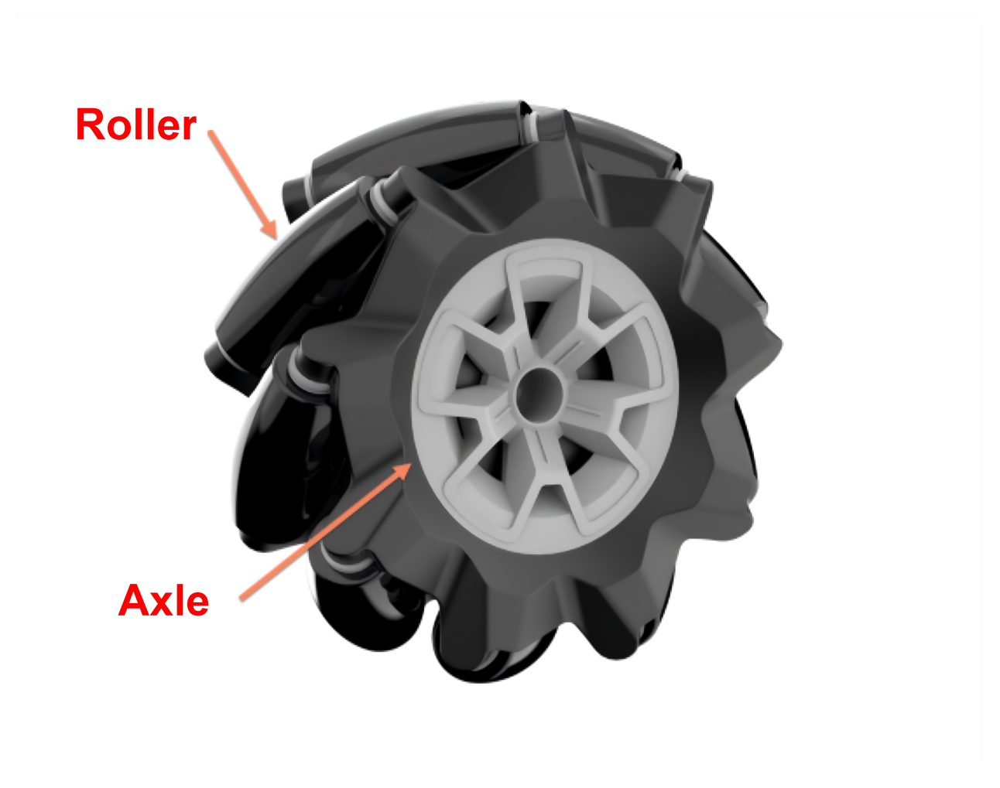
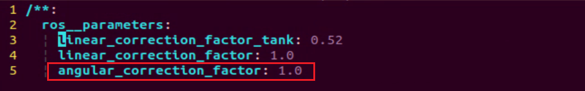
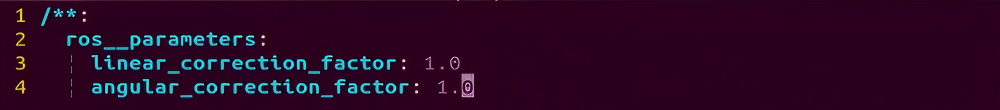
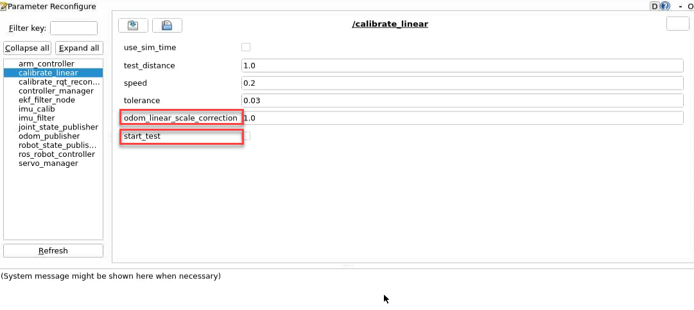
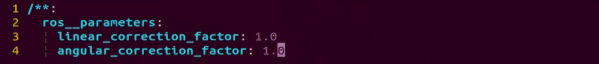
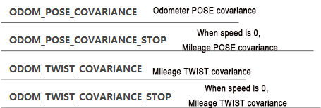

# 2. ROS2-Motion Control Courses

## 2.1 Kinematics Analysis

### 2.1.1 Overview:

JetAuto features a Mecanum wheel chassis. Mecanum wheels use multiple small, freely rotating rollers to support the vehicle's weight. These wheels are typically located at the bottom of the chassis and can rotate independently, allowing the vehicle to turn and maneuver more easily. Mecanum wheel vehicles are commonly used in urban environments and on roads due to their high maneuverability and ease of turning.

### 2.1.2 Mecanum Wheel:

* **Hardware Structure**



The Mecanum wheel comprises rollers and an axle. The axle functions as the main support structure for the entire wheel, with rollers attached to it. The axle axis is positioned at a 45-degree angle to the roller axis. Typically, Mecanum wheels operate in groups of four, with two left wheels and two right wheels. Wheels A and B are symmetrical.

There are various combinations of four Mecanum wheels, such as AAAA, BBBB, AABB, ABAB, BABA. However, not all combinations allow the robot car to move in all directions, including forward, backward, and sideways. The Mecanum-wheel chassis combination is ABAB, enabling omnidirectional movement.


* **Physical Characteristics**

The vehicle achieves omnidirectional motion by summing up the propelling forces of the ground-engaging rollers. This summation can occur in any direction through adjustments in wheel rotation direction and torque magnitude for the four wheels.

Because of the rollers' specific orientation at a certain angle to the wheel circumference, Mecanum wheels have the ability to slip sideways. The generatrix of these small rollers is unique. As the Mecanum wheel rotates around its fixed axle, each small roller's envelope forms a cylindrical surface, allowing the wheel to continuously roll forward.

* **Motion Principle and Formula**

When conducting kinematic analysis, we can consider the kinematic model of Mecanum wheels, which includes the following parameters:


(1) V<sub>x</sub>: Velocity of the Mecanum wheel in the X-axis (typically front and rear direction).

(2) V<sub>y</sub>: Velocity of the Mecanum wheel in the Y-axis (typically left and right direction).

(3) V<sub>ω</sub>: Angular velocity of the Mecanum wheel chassis (rotation speed of the chassis around its own center).

(4) Real-time velocities of the four wheels of the Mecanum wheel.

(5) The motion of the right front wheel in the plane can be decomposed into:

(6) VBx: Velocity of the Mecanum wheel in the X-axis (typically front and rear direction).

(7) VBy: Velocity of the Mecanum wheel in the Y-axis (typically left and right direction).

(8) L: Distance between the centers of the left and right wheels.

(9) H: Distance between the centers of the front and rear wheels.

(10) θ<sub>ω</sub>: Angle formed by the chassis body center and the center of the right front wheel, typically 45°.

(11) With these parameters, we can perform kinematic analysis of the Mecanum wheel chassis. The following are key mathematical formulas:

* **Kinematics Formula:**

To simplify the mathematical model for kinematics, we make the following two idealized assumptions:

(1) Omni-directional wheels do not slip on the ground, and there is sufficient friction with the ground.

(2) The 4 wheels are distributed at the corners of a rectangle or square, with the wheels parallel to each other.

Here, we decompose the rigid body motion of the car into three components linearly. By calculating the velocities of the four wheels when the output Mecanum wheel chassis translates along the X+ and Y+ directions and rotates along the Z+ direction, we can combine these three simple motions using formulas to determine the required speeds of the four wheels.

In the equations, A, B, C, and D represent the rotational speeds of the four wheels, i.e., the motor speeds. VX is the translation speed of the car along the X-axis, VY is the translation speed along the Y-axis, and ω is the rotational speed along the Z-axis. L/2 is half of the car's wheelbase, and H/2 is half of the car's axle distance.

(1) The velocity components of each wheel during the robot's translation along the X-axis can be calculated using the following formulas:


Where,

V<sub>A</sub>,V<sub>B</sub>,V<sub>C</sub>,V<sub>D</sub>：Real-time velocities of the four Mecanum wheels.

V<sub>X</sub>：Velocity of the Mecanum wheel in the X-axis direction.

(2) When the robot translates along the Y-axis, the speed component of each wheel can be calculated using the following formula:


Where,  V<sub>Y</sub> is the velocity of the robot in the Y-axis direction.

(3) When the robot rotates along the Z-axis, the speed component of each wheel can be calculated using the following formulas:


Where，:The angular velocity of the Mecanum wheel chassis (i.e., the speed at which the chassis rotates around its own center)

(4) Combining the velocities in the X, Y, and Z directions allows for the computation of the rotation speeds of the four wheels based on the motion state of the car.


* **Program Outcome**

The program file is saved in: [ros2_ws\src\driver\controller\controller\mecanum.py](../_static/source_code/mecanum.zip).


Mecanum wheel kinematics class, used to calculate wheel speeds and implement Mecanum wheel kinematics.

**Init：**

{lineno-start=12}

```python
    def __init__(self, wheelbase=0.216, track_width=0.195, wheel_diameter=0.097):
        self.wheelbase = wheelbase
        self.track_width = track_width
        self.wheel_diameter = wheel_diameter
```

Initialize the wheel dimensions for convenient subsequent calculations.

**speed_convert:**

{lineno-start=16}

```python
    def speed_covert(self, speed):
        """
        covert speed m/s to rps/s
        :param speed:
        :return:
        """
        # distance / circumference = rotations per second
        return speed / (math.pi * self.wheel_diameter)
```

Convert m/s to rps based on the wheel's parameters.

**set_velocity:**

{lineno-start=25}

```python
    def set_velocity(self, linear_x, linear_y, angular_z):
        """
        Use polar coordinates to control moving
                    x
        v1 motor1|  ↑  |motor3 v3
          +  y - |     |
        v2 motor2|     |motor4 v4
        :param speed: m/s
        :param direction: Moving direction 0~2pi, 1/2pi<--- ↑ ---> 3/2pi
        :param angular_rate:  The speed at which the chassis rotates rad/sec
        :param fake:
        :return:
        """
        # vx = speed * math.sin(direction)
        # vy = speed * math.cos(direction)
        # vp = angular_rate * (self.wheelbase + self.track_width) / 2
        # v1 = vx - vy - vp
        # v2 = vx + vy - vp
        # v3 = vx + vy + vp
        # v4 = vx - vy + vp
        # v_s = [self.speed_covert(v) for v in [v1, v2, -v3, -v4]]
        motor1 = (linear_x - linear_y - angular_z * (self.wheelbase + self.track_width) / 2)
        motor2 = (linear_x + linear_y - angular_z * (self.wheelbase + self.track_width) / 2)
        motor3 = (linear_x + linear_y + angular_z * (self.wheelbase + self.track_width) / 2)
        motor4 = (linear_x - linear_y + angular_z * (self.wheelbase + self.track_width) / 2)
        v_s = [self.speed_covert(v) for v in [motor1, motor2, -motor3, -motor4]]
        data = []
        for i in range(len(v_s)):
            msg = MotorState()
            msg.id = i + 1
            msg.rps = float(v_s[i])
            data.append(msg)
        
        msg = MotorsState()
        msg.data = data
        return msg
```

Based on the input speed parameters, decompose them, calculate the speeds using **speed_convert**, and then publish the calculated radian speeds to the motors.

## 2.2 Motion Control

### 2.2.1 IMU, Linear Velocity and Angular Velocity Calibration

:::{Note}

* The robot has been calibrated before leaving the factory and does not require additional calibration. The information is provided for reference only. If you observe significant deviations during robot movement, such as noticeable drifting to one side when moving forward or an inability to travel straight, you can consult the following tutorial for calibration.

* Calibration aims to minimize deviations, but actual hardware variations are inherent. Hence, adjust the calibration to a level that reasonably suits your requirements.

  :::

If the robot exhibits deviations during operation, it may require IMU calibration. Once the calibration process is completed, the robot can resume normal operation.

* **IMU Calibration**

IMU (Inertial Measurement Unit) is a device that measures the three-axis attitude angles (angular velocity) and acceleration of an object. The gyroscope and accelerometer are the main components of the IMU, providing a total of 6 degrees of freedom to measure the angular velocity and acceleration of the object in three-dimensional space. Upon receiving the first IMU message, the node will prompt you to maintain the IMU in a specific orientation and press Enter to record the measurement values. After completing measurements in all 6 directions, the node will calculate calibration parameters and write them to the specified YAML file. The specific steps are as follows:


After the node receives the first IMU message, it will prompt you to hold the IMU in a specific direction and then press Enter to record the measurement. After completing all 6 directions, the node will calculate the calibration parameters and write them to the specified YAML file. The specific steps are as follows:

:::{Note}

The input command is case-sensitive, and keywords can be completed using the Tab key.

:::

(1) Start the robot, and access the robot system desktop using VNC.

(2) Click-on  to initiate the command-line terminal.

(3) Execute the command to disable the app auto-start service.

```bash
~/.stop_ros.sh
```

(4) Run the command and hit Enter key to enable chassis control node:

```bash
ros2 launch ros_robot_controller ros_robot_controller.launch.py
```

(5) Open a new command-line terminal, then input the following command, and hit Enter key to initiate IMU calibration:

```bash
ros2 run imu_calib do_calib --ros-args -r imu:=/ros_robot_controller/imu_raw --param output_file:=/home/ubuntu/ros2_ws/src/calibration/config/imu_calib.yaml
```

(5) When the command-line terminal shows the following prompt, you can start calibrating the IMU's X-axis angular velocity offset. Place the robot in the orientation depicted in the image below, making sure the tilt direction and angle match. Press Enter to proceed.


After each direction is successfully calibrated, you will see the following prompt:


(6) When the command-line terminal displays the following prompt, you can start calibrating the IMU's X-axis negative angular velocity offset. Place the robot in the orientation shown in the image below (make sure the tilt direction and angle match the image). Press Enter to proceed.


(7) Next, when the terminal displays the following prompt, you can begin calibrating the IMU's Y-axis positive angular velocity offset. Position the robot as shown in the image below with the correct upward orientation (ensure the direction and angle match the image). Press Enter to continue.


(8) When the terminal shows the following prompt, you can start calibrating the IMU's Y-axis negative angular velocity offset. Place the robot in the downward orientation as shown in the image below (ensure the direction and angle match the image). Press Enter to execute.


(9) When the terminal displays the following prompt, you can begin calibrating the IMU's Z-axis positive angular velocity offset. Hold the robot upright with the top facing up, stabilize the robot, and then press Enter. Position the robot as shown in the image below (ensure the direction and angle match the image). Press Enter to proceed.


(10) Finally, when the terminal shows the following prompt, you can start calibrating the IMU's Z-axis negative angular velocity offset. Place the robot in the orientation shown in the image below (ensure the direction and angle match the image). Press Enter to complete the calibration.


(11) When the following prompt appears, it indicates that the calibration is complete. Press 'Ctrl+C' in all currently open command line terminals to stop the program.


(12) Execute the following command, and hit Enter key to initiate STM32 control node.

```bash
ros2 launch peripherals imu_view.launch.py
```


* **Angular Velocity Calibration**

To calibrate the angular velocity, the robot needs to perform a full rotation independently. During testing, it's crucial to mark the robot's orientation to facilitate the observation of any deviations. The specific steps are outlined below:

:::{Note}

The input command is case-sensitive, and keywords can be completed using the Tab key.

:::

(1) Position the robot on a flat surface and place a piece of tape or another marker directly in the center, just in front of the robot.

(2) Start the robot, and connect it to the robot system desktop using VNC.

(3) Click-on  to initiate the command-line terminal.

(4) Run the command and hit Enter to disable the app auto-start service.

```bash
~/.stop_ros.sh
```

(5) Before starting the calibration, navigate to the calibration configuration file directory and open the configuration file:

```bash
cd ~/ros2_ws/src/driver/controller/config && vim calibrate_params.yaml
```

(6) Change the angular velocity parameter to `1.0`, then proceed with the calibration.


(7) After making the changes, press the **"ESC"** key, type **":wq"**, and press Enter to save and exit.

(8) Next, enter the following command and press Enter to start the chassis control node:

```bash
ros2 launch ros_robot_controller ros_robot_controller.launch.py
```

(9) Open a new command-line terminal, enter the following command, and press Enter to start the angular velocity calibration:

```bash
ros2 launch calibration angular_calib.launch.py
```

Click on **"calibrate_angular"** on the left side. The calibration interface will appear as shown.


The meanings of the parameters on the left side of the interface are as follows:

The first parameter, `test_angle` is for testing the rotation angle, with a default value of 360°.

The second parameter, `speed` is the linear speed, with a default value of 0.15 meters per second.

The third parameter, `tolerance` is the error value. The smaller the error value, the greater the robot's jitter after reaching the target position.

The fourth parameter, `odom_angle_scale_correction` is the odometer angle scale correction.

The fifth parameter, `start_test` is the button to start testing the odometer angle scale correction.


Place the robot in a horizontal position and check "**start_test (start test)**." The robot will then rotate in place for one full circle.

If the rotation does not complete a full circle and there is a deviation, you need to adjust the "**odom_angle_scale_correction (motor rotation scale correction)**" value. This value adjusts the scaling ratio of the motor during rotation. **It is recommended to adjust by increments of 0.01 each time and test until the robot can complete a full circle. Record this value.**


(10) After calibration is complete, enter the following command to navigate to the calibration configuration file directory and update it with the calibrated parameter values.

```bash
cd ~/ros2_ws/src/driver/controller/config && vim calibrate_params.yaml
```

Press 'I' key to navigate to the editing mode, and modify the value of "**angular_correctqion_factor**" to the adjusted value of "**odom_angule_scale_correction**".



(11) After modification, press the **"ESC"** key, enter **":wq"** to exit and save the changes.

* **Linear Velocity Calibration**

:::{Note}

The input command is case-sensitive, and keywords can be completed using the Tab key.

:::

Position the robot on a flat and open surface. Mark the starting point with tape or any other indicator in front of the robot, and position the endpoint tape or another marker 1 meter ahead of the robot.

(1) Start the robot, and access the robot system desktop using VNC.

(2) Click-on  to open the command-line terminal.

(3) Execute the command and hit Enter to disable the app auto-start service.

```bash
~/.stop_ros.sh
```

(4) Before starting the calibration, navigate to the calibration configuration file directory and open the configuration file.

```bash
cd ~/ros2_ws/src/driver/controller/config && vim calibrate_params.yaml
```

(5) Change the linear velocity parameter `linear_correction_factor` to `1.0`, then proceed with the calibration.



(6) After making the change, press **"ESC",** type **":wq"**, and press Enter to save and exit.

(7) Next, enter the following command and press Enter to start the chassis control node:

```bash
ros2 launch ros_robot_controller ros_robot_controller.launch.py
```

(8) Open a new command-line terminal, enter the following command, and press Enter to start the linear velocity calibration:

```bash
ros2 launch calibration linear_calib.launch.py
```

(9) Once the calibration program starts, click on **"calibrate_linear"** on the left side. The calibration interface will appear as shown.


The meanings of the parameters on the left side of the interface are as follows:

The first parameter `test_distance`, is for testing the distance, with a default value of 1 meter.

The second parameter`speed` is the linear speed, with a default value of 0.2 meters per second.

The fourth parameter`tolerance`is the error value. The smaller the error value, the greater the robot's jitter after reaching the target position.

The fifth parameter `odom_linear_scale_correction` is the odometer linear scale correction.

The sixth parameter`start_test` is the button to start testing the odometer linear scale correction.


(10) If there is a deviation, you need to adjust the value of **odom_linear_scale_correction**. This value controls the scaling factor for the motor's forward movement. It is recommended to adjust the value in increments of 0.01.



(11) After completing the calibration, enter the following command to navigate to the calibration configuration file directory and update it with the calibrated parameter values:

```bash
cd ~/ros2_ws/src/driver/controller/config && vim calibrate_params.yaml
```

(12) Press the **'i'** key to enter edit mode, and update the value of `linear_correction_factor` (forward correction factor) to match the adjusted `odom_linear_scale_correction` value.



(13) After making the changes, press the **"ESC"** key, type **":wq"**, and press Enter to save and exit.

(14) To stop this functionality, press 'Ctrl+C' in the terminal. If it does not stop immediately, try pressing the keys repeatedly.

###  2.2.2 Publish IMU and Odometer Data

In robot navigation, accurately calculating real-time position is essential. Normally, we obtain odometer information using motor encoders and the robot's kinematic model. However, in specific situations, like when the robot's wheels rotate in place or when the robot is lifted, it may move a distance without the wheels actually turning.

To address wheel slip or accumulated errors in such cases, combining IMU and odometer data can yield more precise odometer information. This improves mapping and navigation accuracy in scenarios where wheel slip or cumulative errors may occur.

* **Introduction to IMU and Odometer**

The IMU (Inertial Measurement Unit) is a device that measures the three-axis attitude angles (angular velocity) and acceleration of an object. It consists of the gyroscope and accelerometer as its main components, providing a total of 6 degrees of freedom to measure the object's angular velocity and acceleration in three-dimensional space.

An odometer is a method used to estimate changes in an object's position over time using data obtained from motion sensors. This method is widely applied in robotic systems to estimate the distance traveled by the robot relative to its initial position.

There are common methods for odometer positioning, including the wheel odometer, visual odometer, and visual-inertial odometer. In robotics, we specifically use the wheel odometer. To illustrate the principle of the wheel odometer, consider a carriage where you want to determine the distance from point A to point B. By knowing the circumference of the carriage wheels and installing a device to count wheel revolutions, you can calculate the distance based on wheel circumference, time taken, and the number of wheel revolutions.

While the wheel odometer provides basic pose estimation for wheeled robots, it has a significant drawback: accumulated error. In addition to inherent hardware errors, environmental factors such as slippery tires due to weather conditions contribute to increasing odometer errors with the robot's movement distance.

Therefore, both IMU and odometer are essential components in a robot. These two components are utilized to measure the three-axis attitude angles (or angular velocity) and acceleration of the object, as well as to estimate the distance, pose, velocity, and direction of the robot relative to its initial position.

To address these errors, we combine IMU data with odometer data to obtain more accurate information. IMU data is published through the **"/imu**" topic, and odometer data is published through **"/odom**". After obtaining data from both sources, the data is fused using the "**ekf**" package in ROS, and the fused localization information is then republished.

*  **IMU Data Publishing**

(1) Initiate Service

:::{Note}

When entering commands, it is essential to strictly distinguish between uppercase and lowercase letters, and keywords can be autocompleted using Tab key.

:::

① Start the robot, and access the robot system desktop using VNC.

② Click-on  to open the command-line terminal.

③ Execute the command, and hit Enter to disable the app auto-start service.

```bash
~/.stop_ros.sh
```

④ Execute the following command to enable the chassis control node.

```bash
ros2 launch ros_robot_controller ros_robot_controller.launch.py
```

⑤ Run the command and press Enter to publish the IMU data.

```bash
ros2 launch peripherals imu_filter.launch.py
```

(2) Data Viewing

① Open a new command-line terminal, and run the following command to check the current topic:

```bash
ros2 topic list
```


② Enter the command to view the type, publisher, and subscribers of the "**/imu**" topic. You can replace "**/imu**" with the topic you want to view. The type of this topic is "**sensor_msgs/msg/Imu**".

```bash
ros2 topic info /imu
```


③ Use the following command to display the content of the topic message. Feel free to replace '**imu**' with the name of the topic you wish to view.

```bash
ros2 topic echo /imu
```


The terminal will display the data from the three axes of the IMU.

* **Odometer Data Publishing**

(1) Initiate Service

:::{Note}

When entering commands, it is essential to strictly distinguish between uppercase and lowercase letters, and keywords can be autocompleted using Tab key.

:::

① Start the robot, and access the robot system desktop using VNC.

② Double-click  to open the command line terminal.

③ Execute the command, and hit Enter to disable app auto-start service.

```bash
~/.stop_ros.sh
```

④ Run the command to publish the odometer data.

```bash
ros2 launch controller odom_publisher.launch.py
```

* **Data Viewing**

(1) Open a new command-line terminal, and run the command below to check the current topic.

```bash
ros2 topic list
```


(2) Enter the command to view the type, publisher, and subscribers of the "**/odom_raw**" topic. You can replace "**/odom_raw**" with the topic you want to view. The type of this topic is "**nav_msgs/msg/Odometry**".

```bash
ros2 topic info /odom_raw
```


(3) Enter the command to print the topic message contents. You can replace the topic you want to view as needed.

```bash
ros2 topic echo /odom_raw
```


The message content includes acquired pose and velocity data.

### 2.2.3 Robot Speed Control

Speed control is achieved by adjusting the linear velocity parameter.

* **Program Logic**

Based on the robot's movement characteristics, control the active wheels to achieve forward, backward, and turning movements.

In the program, subscribe to the `/controller/cmd_vel`movement control topic to obtain the set linear and angular velocities. Then, analyze and calculate based on these velocities to determine the car's movement speed.

The source code for this program can be found at : [/home/ubuntu/ros2_ws/src/driver/controller/controller/odom_publisher_node.py](../_static/source_code/odom_publisher_node.zip)

<p id="anchor_2_2_3_2"></p>

* **Disable APP Service and Initiate Speed Control**

:::{Note}

When entering commands, it is essential to strictly distinguish between uppercase and lowercase letters, and keywords can be autocompleted using Tab key.

:::

(1) Start the robot, and access the robot system desktop using VNC.

(2) Click-on  to open the command-line terminal.

(3) Execute the command and hit Enter to disable the app auto-start service.

```bash
~/.stop_ros.sh
```

(4) Enter the command to enable motion control service.

```bash
ros2 launch controller controller.launch.py
```

(5) Open a new ROS2 command-line terminal, then enter the following command to enable the speed control.

```bash
ros2 topic pub /controller/cmd_vel geometry_msgs/Twist "linear:

x: 0.0

y: 0.0

z: 0.0

angular:

x: 0.0

y: 0.0

z: 0.0"
```


In this context,  `linear`  represents the set linear velocity, considering the robot's viewpoint where the X-axis points forward without any influence from the Y or Z directions.

On the other hand,  `angular` pertains to the set angular velocity. A positive Z-value induces a left turn in the robot, while a negative Z-value causes the robot to turn right. This configuration has no impact on the X and Y directions.

:::{Note}

* MIn this scenario, the linear velocity (x) is measured in meters per second, and it is advisable to maintain it within the range of "**-0.6 to 0.6**".

* The angular velocity (z) denotes the turning speed and is determined by the formulas V=ωR (linear velocity equals angular velocity times radius) and tanΦA=D/R (where z=ω, D=0.213, and ΦA represents the turning angle). The angle ΦA should be within the range of 0 to 36 degrees.

:::

(6) Use the arrow keys to navigate and modify the relevant parameters. For example, to make the robot move forward, adjust the linear velocity (X) to 0.1, and then press Enter to execute the action.


(7) If you need to stop the car, open a new terminal and change the previously modified linear velocity back to "**0.0**", then press Enter.


(8) To close this feature, press **"Ctrl+C"** in each terminal interface.

:::{Note}

To bring the robot car to a stop, please create a new terminal and adjust the linear velocity. Using the 'Ctrl+C' shortcut alone may not effectively halt the robot car.

:::

* **Change Forward Speed**

By modifying the linear velocity value (X), the robot can achieve forward movement at variable speeds. For instance, to make the robot shift diagonally to the left front, during step (5) in [**Disable App Service and Initiate Speed Control**](#anchor_2_2_3_2), set X to '**X: 0.3**'.


Upon pressing Enter, the robot will move forward at a speed of 0.3 meters per second in a straight direction.

* **Program Outcome**

After the game starts, the robot will go forward at the speed of 0.3m/s.

* **Program Analysis**


**controller.launch** is the **launch** file, **calibrate_params.yaml** is the configuration file, and **odom_publisher.py** is the program script.

When starting up, the launch file is executed first. It loads the YAML configuration file and passes the parameters to the ROS node. The node then reads these parameters from the ROS parameter server, initializes accordingly, and communicates with other nodes to collaboratively achieve the desired functionality.

(1) Launch File


The launch file is located in: [/home/ubuntu/ros2_ws/src/driver/controller/launch/controller.launch.py](../_static/source_code/controller.launch.zip)

① Set the storage path

Retrieve the paths for the three packages: peripherals, controller, and servo_controller.

{lineno-start=34}

```python
    if compiled == 'True':
        peripherals_package_path = get_package_share_directory('peripherals')
        controller_package_path = get_package_share_directory('controller')
        servo_controller_package_path = get_package_share_directory('servo_controller')
    else:
        peripherals_package_path = '/home/ubuntu/ros2_ws/src/peripherals'
        controller_package_path = '/home/ubuntu/ros2_ws/src/driver/controller'
        servo_controller_package_path = '/home/ubuntu/ros2_ws/src/driver/servo_controller'

    odom_publisher_launch = IncludeLaunchDescription(
        PythonLaunchDescriptionSource([os.path.join(controller_package_path, 'launch/odom_publisher.launch.py')
        ]),
        launch_arguments={
            'namespace': namespace,
            'use_namespace': use_namespace,
            'imu_frame': imu_frame,
            'frame_prefix': frame_prefix,
            'base_frame': base_frame,
            'odom_frame': odom_frame
        }.items()
    )
```

② Initiate other Launch files

{lineno-start=43}

```python
    odom_publisher_launch = IncludeLaunchDescription(
        PythonLaunchDescriptionSource([os.path.join(controller_package_path, 'launch/odom_publisher.launch.py')
        ]),
        launch_arguments={
            'namespace': namespace,
            'use_namespace': use_namespace,
            'imu_frame': imu_frame,
            'frame_prefix': frame_prefix,
            'base_frame': base_frame,
            'odom_frame': odom_frame
        }.items()
    )
```

odom_publisher_launch Odometer launch

imu_filter_launch IMU launch

③ Initiate Node

Launch the EKF fusion node.

{lineno-start=66}

```python
    ekf_filter_node = Node(
        package='robot_localization',
        executable='ekf_node',
        name='ekf_filter_node',
        output='screen',
        parameters=[ekf_param, {'use_sim_time': use_sim_time}],
        remappings=[
            ('/tf', 'tf'),
            ('/tf_static', 'tf_static'),
            ('odometry/filtered', 'odom'),
            ('cmd_vel', 'controller/cmd_vel')
        ],
        condition=IfCondition(enable_odom),
    )

    servo_controller_launch = IncludeLaunchDescription(
        PythonLaunchDescriptionSource([os.path.join(servo_controller_package_path, 'launch/servo_controller.launch.py')
        ]),
        launch_arguments={
            'base_frame': base_frame,
        }.items()
    )
```

(2) Python Program


The Python program is saved in: [/home/ubuntu/ros2_ws/src/driver/controller/controller/odom_publisher_node.py](../_static/source_code/odom_publisher_node.zip)

① Import Library

{lineno-start=1}

```python
#!/usr/bin/env python3
# -*- coding: utf-8 -*-
import os
import math
import time
import rclpy
import signal
import threading
from rclpy.node import Node
from controller import mecanum
from std_srvs.srv import Trigger
from nav_msgs.msg import Odometry
from ros_robot_controller_msgs.msg import MotorsState, BusServoState, SetBusServoState 
from geometry_msgs.msg import Pose2D, Pose, Twist, PoseWithCovarianceStamped, TransformStamped
```

② Main Function

{lineno-start=239}

```python
def main():
    node = Controller('odom_publisher')
    rclpy.spin(node)  # 循环等待ROS2退出
```

The controller class is invoked here, and wait for the node to exit.

③ Global Parameter

{lineno-start=16}

```python
ODOM_POSE_COVARIANCE = list(map(float, 
                        [1e-3, 0, 0, 0, 0, 0, 
                        0, 1e-3, 0, 0, 0, 0,
                        0, 0, 1e6, 0, 0, 0,
                        0, 0, 0, 1e6, 0, 0,
                        0, 0, 0, 0, 1e6, 0,
                        0, 0, 0, 0, 0, 1e3]))

ODOM_POSE_COVARIANCE_STOP = list(map(float, 
                            [1e-9, 0, 0, 0, 0, 0, 
                             0, 1e-3, 1e-9, 0, 0, 0,
                             0, 0, 1e6, 0, 0, 0,
                             0, 0, 0, 1e6, 0, 0,
                             0, 0, 0, 0, 1e6, 0,
                             0, 0, 0, 0, 0, 1e-9]))

ODOM_TWIST_COVARIANCE = list(map(float, 
                        [1e-3, 0, 0, 0, 0, 0, 
                         0, 1e-3, 0, 0, 0, 0,
                         0, 0, 1e6, 0, 0, 0,
                         0, 0, 0, 1e6, 0, 0,
                         0, 0, 0, 0, 1e6, 0,
                         0, 0, 0, 0, 0, 1e3]))

ODOM_TWIST_COVARIANCE_STOP = list(map(float, 
                            [1e-9, 0, 0, 0, 0, 0, 
                              0, 1e-3, 1e-9, 0, 0, 0,
                              0, 0, 1e6, 0, 0, 0,
                              0, 0, 0, 1e6, 0, 0,
                              0, 0, 0, 0, 1e6, 0,
                              0, 0, 0, 0, 0, 1e-9]))
```



④ Function

{lineno-start=48}

```python
def rpy2qua(roll, pitch, yaw):
    cy = math.cos(yaw*0.5)
    sy = math.sin(yaw*0.5)
    cp = math.cos(pitch*0.5)
    sp = math.sin(pitch*0.5)
    cr = math.cos(roll * 0.5)
    sr = math.sin(roll * 0.5)
    
    q = Pose()
    q.orientation.w = cy * cp * cr + sy * sp * sr
    q.orientation.x = cy * cp * sr - sy * sp * cr
    q.orientation.y = sy * cp * sr + cy * sp * cr
    q.orientation.z = sy * cp * cr - cy * sp * sr
    return q.orientation

def qua2rpy(x, y, z, w):
    roll = math.atan2(2 * (w * x + y * z), 1 - 2 * (x * x + y * y))
    pitch = math.asin(2 * (w * y - x * z))
    yaw = math.atan2(2 * (w * z + x * y), 1 - 2 * (z * z + y * y))
  
    return roll, pitch, yaw
```

The function `rpy2qua` is used to convert Euler angles to quaternions.

The function `qua2rpy` is used to convert quaternions to Euler angles.

(3) Analysis of the Controller Class

① Define ROS parameters:

{lineno-start=89}

```python
        self.declare_parameter('pub_odom_topic', True)
        self.declare_parameter('base_frame_id', 'base_footprint')
        self.declare_parameter('odom_frame_id', 'odom')
        self.declare_parameter('linear_correction_factor', 1.00)
        self.declare_parameter('angular_correction_factor', 1.00)
        self.declare_parameter('machine_type', os.environ['MACHINE_TYPE'])
        
        self.pub_odom_topic = self.get_parameter('pub_odom_topic').value
        self.base_frame_id = self.get_parameter('base_frame_id').value
        self.odom_frame_id = self.get_parameter('odom_frame_id').value
        
        self.linear_factor = self.get_parameter('linear_correction_factor').value
        self.angular_factor = self.get_parameter('angular_correction_factor').value
```

The function `self.declare_parameter` is used to define a certain parameter.

The function `self.get_parameter` is used to obtain a certain parameter.

`pub_odom_topic`: Whether to publish the odometry node

`base_frame_id`: Robot footprint ID

`odom_frame_id`: Robot odometry ID

`linear_correction_factor`: Linear velocity correction factor

`angular_correction_factor`: Angular velocity correction factor

`machine_type`: Type of robot

② Publish odometer:

{lineno-start=149}

```python
    def set_odom(self, msg):
        self.odom = Odometry()
        self.odom.header.frame_id = self.odom_frame_id
        self.odom.child_frame_id = self.base_frame_id
        
        self.odom.pose.covariance = ODOM_POSE_COVARIANCE
        self.odom.twist.covariance = ODOM_TWIST_COVARIANCE
        self.odom.pose.pose.position.x = msg.x
        self.odom.pose.pose.position.y = msg.y
        self.pose_yaw = msg.theta
        self.odom.pose.pose.orientation = rpy2qua(0, 0, self.pose_yaw)
        
        self.linear_x = 0
        self.linear_y = 0
        self.angular_z = 0
        
        pose = PoseWithCovarianceStamped()
        pose.header.frame_id = self.odom_frame_id
        pose.header.stamp = self.clock().now().to_msg()
        pose.pose.pose = self.odom.pose.pose
        pose.pose.covariance = ODOM_POSE_COVARIANCE
        self.pose_pub.publish(pose)
```

The `pub_odom_topic` parameter determines whether to publish odometry data. If publishing is required, the node will be initialized, the corresponding parameters will be set, and odometry data will be published using the `self.create_publisher` function, with updates handled by the `self.cal_odom_fun` function.

③ Topic Publishing:

{lineno-start=121}

```python
        self.get_logger().info('\033[1;32m%f %f\033[0m' % (self.linear_factor, self.angular_factor))
        self.motor_pub = self.create_publisher(MotorsState, 'ros_robot_controller/set_motor', 1)
        self.servo_state_pub = self.create_publisher(SetBusServoState, 'ros_robot_controller/bus_servo/set_state', 1)
        self.pose_pub = self.create_publisher(PoseWithCovarianceStamped, 'set_pose', 1)
        self.create_subscription(Pose2D, 'set_odom', self.set_odom, 1)
        self.create_subscription(Twist, 'controller/cmd_vel', self.cmd_vel_callback, 1)
        self.create_subscription(Twist, 'cmd_vel', self.app_cmd_vel_callback, 1)
        self.create_service(Trigger, 'controller/load_calibrate_param', self.load_calibrate_param)
```

The function `self.create_subscription` is used to receive topics.

The function `self.create_service` is used to create services.

self.motor_pub publishes the motor control topic `ros_robot_controller/set_motor`, with the message type MotorsState.

self.servo_state_pub publishes the servo control topic `ros_robot_controller/bus_servo/set_state`, with the message type SetBusServoState.

self.pose_pub publishes the servo control topic `set_pose`, with the message type PoseWithCovarianceStamped.

Publishes the topic `set_odom`, with the message type Pose2D, and the callback function self.set_odom.

Publishes the topic `controller/cmd_vel`, with the message type Twist, and the callback function self.cmd_vel_callback.

Publishes the topic `cmd_vel`, with the message type Twist, and the callback function self.set_app_cmd_vel_callback.

Publishes the service `controller/load_calibrate_param`, with the service type Trigger, and the callback function self.load_calibrate_param.

Publishes the service `~/init_finish`, with the service type Trigger, and the callback function self.get_node_state.

④ Explanation of Controller Class Functions:


