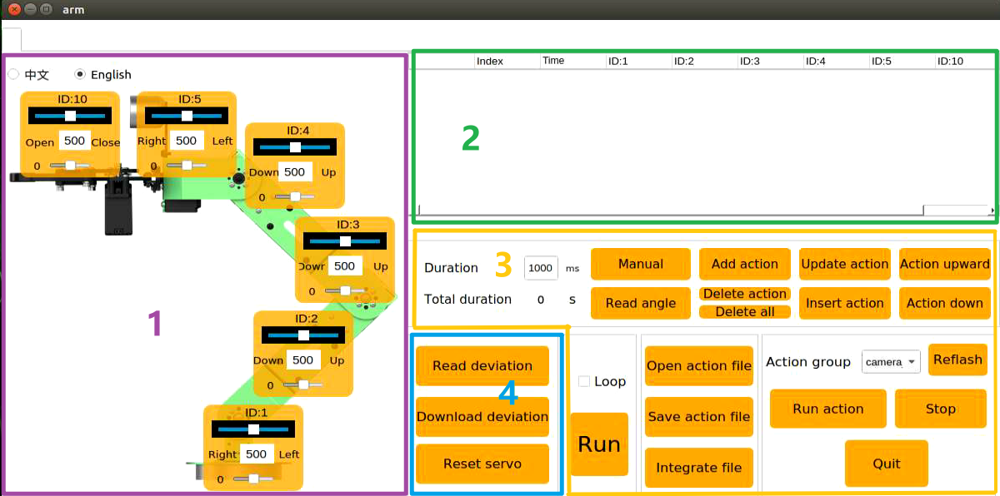
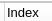
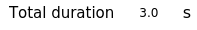
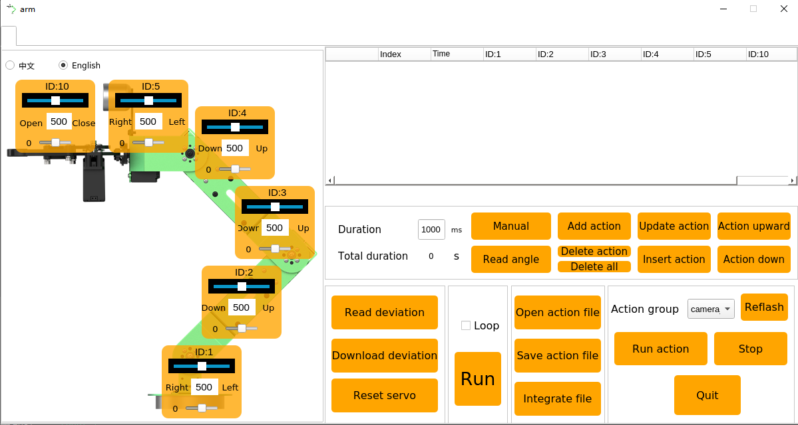
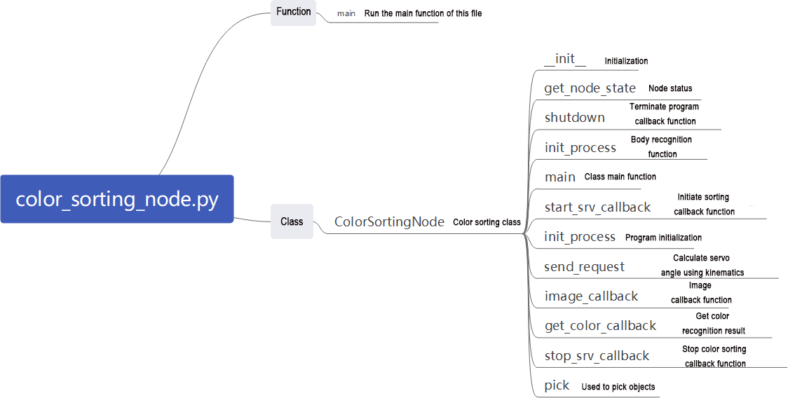
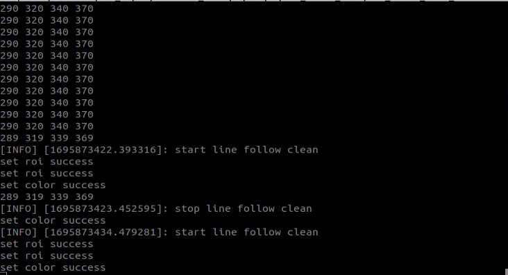
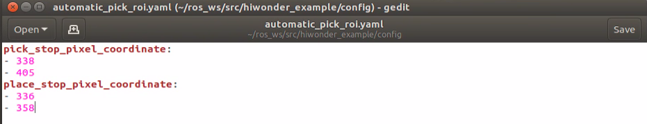

# 8. ROS2-Robot Arm Control Course

## 8.1 Robotic Arm Basic Control

### 8.1.1 Get to Know Robotic Arm

This small vehicle is a 6-degree-of-freedom robotic arm composed of intelligent bus servos and metal sheet metal connections, enabling it to move to any feasible position in space. It consists of six degrees of freedom: X-axis movement, Y-axis movement, Z-axis movement, X-axis rotation, Y-axis rotation, and Z-axis rotation. It performs actions such as extension, rotation, and lifting. Additionally, it is equipped with a monocular camera for tasks such as hand-following, color block recognition and sorting, color block tracking, line patrolling and obstacle clearance, garbage classification, and precise navigation and handling.

The below table illustrates the relevant parameters of the robotic arm:

<table  class="docutils-nobg" style="margin:0 auto" border="1">
<colgroup>
<col style="width: 21%" />
<col style="width: 33%" />
<col style="width: 22%" />
<col style="width: 22%" />
</colgroup>
<tbody>
<tr>
<td style="text-align: center;">Name</td>
<td style="text-align: center;">Instruction</td>
<td style="text-align: center;">Name</td>
<td style="text-align: center;">Instruction</td>
</tr>
<tr>
<td style="text-align: center;">Servo Composition</td>
<td style="text-align: center;">HTD-35H*3(robot) + HTS-20H*1(pan-tilt) + HTS-21H*1(gripper)+HX-12H serial bus servo(wrist)</td>
<td style="text-align: center;">Servo Accuracy</td>
<td style="text-align: center;"><p>HTD-45H bus servos (3 units), HTS-20H bus servo, and HTS-21H bus servo have a precision of 0.2°;</p>
<p>HX-12H bus servo has a precision of 0.3°</p></td>
</tr>
<tr>
<td style="text-align: center;">Material</td>
<td style="text-align: center;">Anodized aluminium alloy</td>
<td style="text-align: center;">Control Method</td>
<td style="text-align: center;">UART serial port command</td>
</tr>
<tr>
<td style="text-align: center;">Degree of Freedom</td>
<td style="text-align: center;">6DOF</td>
<td style="text-align: center;">Communication Baud Rate</td>
<td style="text-align: center;">115200</td>
</tr>
<tr>
<td style="text-align: center;">Load</td>
<td style="text-align: center;">500g (gripping and transporting weight)</td>
<td style="text-align: center;">Servo Memory</td>
<td style="text-align: center;">User settings Power-off protection</td>
</tr>
<tr>
<td style="text-align: center;">Wingspan</td>
<td style="text-align: center;">410mm</td>
<td style="text-align: center;">Read-back Function</td>
<td style="text-align: center;">Support angle value read-back</td>
</tr>
<tr>
<td style="text-align: center;">Effective Gripping Range</td>
<td style="text-align: center;">Radius≤30cm</td>
<td style="text-align: center;">Servo Protection</td>
<td style="text-align: center;">Locked protection/ over-heat protection</td>
</tr>
<tr>
<td style="text-align: center;">Camera Name</td>
<td style="text-align: center;">GC0308 HD camera</td>
<td style="text-align: center;">Parameter feedback</td>
<td style="text-align: center;">Temperature, voltage, position</td>
</tr>
<tr>
<td style="text-align: center;">Pixel</td>
<td style="text-align: center;">2 megapixel</td>
<td style="text-align: center;">System</td>
<td style="text-align: center;">Support windows, Linux and Openwrt</td>
</tr>
<tr>
<td style="text-align: center;">Resolution</td>
<td style="text-align: center;">1920×1080</td>
<td style="text-align: center;">Frame Rate</td>
<td style="text-align: center;">60FPS</td>
</tr>
<tr>
<td style="text-align: center;">Connection</td>
<td style="text-align: center;">USB driver-free</td>
<td style="text-align: center;">Focusing Method</td>
<td style="text-align: center;">Auto-focusing</td>
</tr>
</tbody>
</table>


:::{Note}

- Prior to shipment, our company has completed the debugging of the robotic arm, eliminating the need for users to adjust.

- This instruction facilitates users in restoring the robotic arm’s status after make modification.

- The robotic arm is equipped with 6 joints, where the first joint controls the overall horizontal rotation of the robotic arm. During adjustment, it should be ensured that the robotic arm faces forward in relation to the vehicle, avoiding left or right deviation as much as possible.

- Whether there is deviation in the robotic arm servo can be referenced from the side view and top view diagrams provided in this document.

  :::

###  8.1.2 Intelligent Bus Servos and Considerations

The servo is the main control component of the robotic arm in this product. We primarily use the HTD-35H serial bus servo, a commonly used serial bus servo controlled via serial commands at a baud rate of 115200. Users can control the servo's rotation or read its information by sending corresponding commands according to our communication protocol. Before controlling the servo, it's necessary to set its parameters and ID.

This servo features a half-duplex UART asynchronous serial interface, where the signal line can both transmit and receive signals. Depending on the ID, different commands can be sent via the serial port to independently control the servo. Widely applied, this servo is primarily used in joint designs for various types of biomimetic robots.


* **Structure & Specification Parameters**

The structural dimensions of the HTD-35H bus serial servo are shown in the figure below:


|    Operating Voltage    |                 DC 9-12.6V                  |
| :---------------------: | :-----------------------------------------: |
|     Rotation Speed      |           0.18sec/60°（DC 11.1V）           |
|         Torque          |             35kg.cm（DC 11.1V）             |
|  Static Maximum Torque  |             35kg.cm（DC 11.1V）             |
|     Rotation Range      |                   0~ 240°                   |
|     No-load Current     |                    100mA                    |
|      Stall Current      |                     3A                      |
|     Servo Accuracy      |                    0.2°                     |
|   Control Angle Range   |      0-1000, corresponding to 0~ 240°       |
|     Control Method      |             UART serial command             |
| Communication Baud Rate |              115200 Baud Rate               |
|    Storage Capacity     |      Power-off User Settings Retention      |
|        Servo ID         | User-configurable from 0-253, default is 1  |
|    Feedback Function    |           Supports Angle Feedback           |
|   Protection Function   |    Stall Protection/Overheat Protection     |
|   Parameter Feedback    | Temperature, Voltage, and Position Feedback |
|     Operating Mode      |       Servo Mode and Gear Motor Mode        |
|        Gear Type        |                 Metal Gears                 |
|       Wire Length       |        20cm, other lengths available        |
|       Plug Model        |                PH2.0-3P Plug                |
|     Product Weight      |                     64g                     |
|          Size           |          54.38mm\*20.14mm\*45.5mm           |
|      Applicable to      |         Various bionic robot joints         |

* **Servo Feature**

(1) High voltage servo, more power saving:

Compared with the traditional 7.4V servo, the 11.1V high-voltage servo can reduce the current by more than 60%, which greatly improves the battery life of the robot.

(2) Serial bus interface:

There is an I/O port on the controller board for connecting to the serial bus servo. The servos are connected through the three connectors, which makes the project have clean wiring and beautiful outlook.

(3) ID identification and bus communication

Each servo can be set the ID number for the identification. The default ID number for each servo is 1 which is modifiable. The communication method of controller and servo is single-bus communication and its baud rate is 115200. User can set a corresponding ID number to each servo. The command from controller includes ID information so that only the servo matching the ID number can receive the corresponding command completely and then perform actions according to the commands.

(4) High-precision potentiometer:

The servo uses imported high-precision potentiometer as angle feedback. Excellent precision and linearity of the servo make robot run more table and greatly extend the service life of servo.

(5) Strong Torque

35KG strong torque builds up your robot.

(6) Position, temperature and voltage feedback:

With position, temperature and voltage feedback, you can get the internal data of the servo in real time to protect the servo.

(7) Two Operation Modes:

Support servo mode and geared motor mode.

① Under servo mode, servo can rotate to the specific angle within 240°.

② Under geared motor mode, servo can rotate within 360° and the direction and speed of rotation can be controlled.


(8) Metal Gear:

The high-precision inlay of the gears reduces the noise caused by the friction.

(9) Metal Shell:

Green oxidation metal shell improves heat dissipation ability.

* **Installation**

Servo horn aims red **“+”** to install, please refer to the following picture.


The interface distribution and instruction refer to the below diagram and table:


| **PIN** |                     **PIN Instruction**                      |
| :-----: | :----------------------------------------------------------: |
|   GND   |                             GND                              |
|   VIN   |                         Power input                          |
|   SIG   | Signal terminal, half-duplex UART asynchronous serial interface |

### 8.1.3 PC Software Layout Instruction

* **PC Software Instruction**

The PC computer corresponds to PLC computer, and is used to send instructions to PLC computer (robot) and receive feedback data from PLC computer. In general, we control PLC computer through running software on PC computer.

Only when PC software realizes serial port communication, it can send instructions to and receive feedback data from the robot. Serial port can be considered as USB interface. PC connects to robot through USB interface, and PC software communicate with robot also through USB interface.

The introduction to the PC software functions is given below.

* **Open PC Software**

(1) Open through Robotic Icon

① Double-click  to open the command line terminal. To adjust the deviation and the position of the robotic arm, first stop the app's auto-start service.

```
~/.stop_ros.sh
```

② Click-on  to launch the PC software.

(2) Open through Command

① Double-click  to open the command line terminal. To adjust the deviation and the position of the robotic arm, first stop the app's auto-start service.

```
~/.stop_ros.sh
```

② Input the following command to navigate the directory containing the PC software.

```
cd software/arm_pc
```

③ Input the command to open the PC software.

```
python3 main.py
```

:::{Note}

Once the related servo nodes are activated (such as mapping and navigation), PC software or servo tool cannot be opened because the serial port is already occupied.

:::

(3) PC Software Interface Layout

The interface under “**normal mode**” is as follow.


You can switch to **“Servo Debug Tool”** through the options on the upper left corner. Prior to the shipment, all the robots have been debugged, eliminating the need for the user to debug. If any issues require the use of this tool, it is mandatory to operate under the guidance of our support team, as improper use may result in robotic arm malfunctions.

The interface of the normal mode is divided into below areas:



**①：Servo control area**

Servo control area displays the icon of the selected servo. You can adjust the servo value by dragging the corresponding slider.

|                           **Icon**                           |                         **Function**                         |
| :----------------------------------------------------------: | :----------------------------------------------------------: |
|  |                      ID number of servo                      |
|  |            Adjust servo position from 0 to 1000.             |
|  |           Adjust servo deviation from -125 to 125.           |
|  | After setting the robot's position and orientation information for x, y, z, and pitch, execute the movement. |

**②：Action list**

The running time and servo data of the current action are displayed on the action list.


|                                                              |                                                              |
| :----------------------------------------------------------: | :----------------------------------------------------------: |
|                           **Icon**                           |                         **Function**                         |
|  |                     Action group number                      |
|  | Running time of the action that is time taken to complete this action |
|  | Servo value. Double click the figure below  to revise. |

**③： Action group setting**

<table  class="docutils-nobg" style="margin:0 auto" border="1">
<colgroup>
<col style="width: 34%" />
<col style="width: 65%" />
</colgroup>
<tbody>
<tr>
<td style="text-align: center;"><strong>Icon</strong></td>
<td style="text-align: center;"><strong>Function</strong></td>
</tr>
<tr>
<td style="text-align: center;"></td>
<td style="text-align: center;">Action running duration time. Directly click  to modify.</td>
</tr>
<tr>
<td style="text-align: center;"></td>
<td style="text-align: center;">Total running time taking for all the actions in an action group</td>
</tr>
<tr>
<td style="text-align: center;"></td>
<td style="text-align: center;">If you click this button, joints of robot become loose, and you can drag servos to design any posture</td>
</tr>
<tr>
<td style="text-align: center;"></td>
<td style="text-align: center;">Read the servo angle you have designed before. This button should be used with </td>
</tr>
<tr>
<td style="text-align: center;"></td>
<td style="text-align: center;">Add the servo value as a action to the last line of the action list</td>
</tr>
<tr>
<td style="text-align: center;"></td>
<td style="text-align: center;"><p>Delete action: delete the action selected in the action list</p>
<p>Delete all: delete all the action in action list</p></td>
</tr>
<tr>
<td style="text-align: center;"></td>
<td style="text-align: center;">Replace the angle value of the action selected in the action list with the servo value in the servo control area. And update the running time as the time set in “<strong>Time</strong>”</td>
</tr>
<tr>
<td style="text-align: center;"></td>
<td style="text-align: center;">Insert a new action above the selected action. The running time of this new action is the time set in “<strong>Time</strong>” and angle value is the current value in servo control area.</td>
</tr>
<tr>
<td style="text-align: center;"></td>
<td style="text-align: center;">Move the selected action up one line</td>
</tr>
<tr>
<td style="text-align: center;"></td>
<td style="text-align: center;">Move the selected action down one line</td>
</tr>
<tr>
<td style="text-align: center;"></td>
<td style="text-align: center;"><p>Click to run all the actions on the action list once</p>
<p>(If "<strong>Loop</strong>" is ticked, JetAuto Pro will repeat the action.)</p></td>
</tr>
<tr>
<td style="text-align: center;"></td>
<td style="text-align: center;">Load the data of the saved action group to the action list</td>
</tr>
<tr>
<td style="text-align: center;"></td>
<td style="text-align: center;">Save the current actions in the action list into the designated path.</td>
</tr
>
<tr>
<td style="text-align: center;"></td>
<td style="text-align: center;">Firstly, open one action group, then click this button, and then open other action group. And these two action groups will be integrated into one.</td>
</tr>
<tr>
<td style="text-align: center;"></td>
<td style="text-align: center;">Display the saved action groups. You can select the action to run.</td>
</tr>
<tr>
<td style="text-align: center;"></td>
<td style="text-align: center;">Refresh action group drop-down menu.</td>
</tr>
<tr>
<td style="text-align: center;"></td>
<td style="text-align: center;">Run the selected action group once.</td>
</tr>
<tr>
<td style="text-align: center;"></td>
<td style="text-align: center;">Stop running the action group.</td>
</tr>
<tr>
<td style="text-align: center;"></td>
<td style="text-align: center;">Exit PC software interface</td>
</tr>
</tbody>
</table>


**④：Servo deviation setting area**

|                           **Icon**                           |                      **Function**                      |
| :----------------------------------------------------------: | :----------------------------------------------------: |
|  |        Click to read the saved servo deviation.        |
|  | Click to download the adjusted deviation to the robot. |
|  | Click to return all the servos to the mid point(500).  |

### 8.1.4 Action Calling

* **What is “Action Calling”?**

Action calling is to directly call the edited action group via PC software to let robot perform this action.

JetAuto has built-in action groups, and its action group files are stored in “**ubuntu/software/arm_pc/ActionGroups**”. You can check and call built-in actions via PC software or command.

The specific operation steps are as follow:

:::{Note}

Only if action files are saved in “**ubuntu/software/arm_pc/ActionGroups**”, can the files be called.

:::


* **Operation Steps**

(1) Double click  to enter PC software interface.



(2) Click “**Open action file**” button.


(3) Select action group you want, then click “**Open**”.


(4) Running time of each action and servo values are displayed on the action list


(5) You can first select number “**1**” and click “**Run**” button to run the selected action in action list. If you want to make robot repeat this action group, you can tick “**Loop**” and click “Run”.


### 8.1.5 Action Editing

* **Introduction**

Adjust the angles of corresponding servos based on the target motion to achieve that motion. Multiple actions are combined into an action group.

Edit several actions to form a action group so as to make robotic arm pick the block at left.

* **Action Realization**

(1) Design Action

① Double-click  to open the normal mode of the upper computer editing interface.


② Click “**Reset servo**” to make servo return back to mid-point.


③ Drag the slider to set servo values as pictured to make robot arm bend to left.


④ Click “**Add Action**” to add current action to action list.


⑤ Align robot arm with the block. Adjust value of corresponding servos as follow.


⑥ Set the time as **“2000ms”**. Click “**Add Action**” to update NO.2 action.


⑦ Add another transitional action. Set the time as 200ms and click “**Add Action**”.


⑧ Adjust NO.10 servo to let robot arm pick the block. Set times as 500ms, then click “**Add Action**”


⑨ Add a transitional action again. Set the time as **“200ms”**, and click “**Add action**” to form NO.5 action.


⑩ Adjust servo value to make robot arm pick the block to specific height. Set the time as 2000 ms, and click “**Add action**”.


⑪ After NO.6 action is edited, action group of “**picking block at left**” is complete.


⑫ Next, let robot arm run the whole action group. Select NO.1 action, then click “**Run**”. If you want to repeat this action, tick “**Loop**” box.


(2) Save Action

:::{Note}

The name of action group cannot contain **“Space”**, otherwise the file cannot be saved in later debugging.

:::

In case of future debugging and management, save the edited action group. Click **“Save action file”** and select this path, **ubuntu/software/arm_pc/ActionGroups.**

Here takes the name of “**font_pick**” as example, and then click “**Save**” to save the action group.


###  8.1.6 Integrate Action Files

* **Introduction**

A chained action file connects two action group files in sequence, creating a new, combined action group. This allows for seamless merging of actions, enabling the robotic arm to move according to the order defined in the chained file.

* **Operation Steps**

(1) Double-click  to open the editing interface in normal mode.


(2) Click “**Integrate file**” button, and select the following path.


(3) Select and open “**place_left.d6a**” on the pop-up window.


(4) This action group is added to the action list.


(5) Click “**Integrate action files**” button again. Select and open “**place_right.d6a**”. After that, this action group is added to the end of the first action group.


(6) Click NO.1 action, then click “**Run**” to let robot arm perform this integrated action.


(7) Click “**Save action files**” button to save this new action group in case of future debugging.


(8) Name this new action group, for example “**left_right**”.

:::{Note}

Action group name cannot contain **“Space”**.

:::


### 8.1.7 Export and Import Action Files

*  **Introduction**

This section explains how to export action group files edited on the PC software and import them into similar devices. This allows you to transfer action files between different devices.

* **Export Action**

This section illustrates the export and import of the "**pick.d6a**" action group file as an example.

(1) Click 

(2) Find “**pick.d6a**” file.


(3) Directly drag the action file to the computer desktop to export this file.


* **Import Action**

Importing and exporting actions follow the same steps: simply drag and drop the action group file into the designated path.

(1) Drag and drop the '**pick.d6a**' action group file onto your desktop.

(2) Use the SSH remote connection tool MobaXterm   to drag and drop or copy and paste the 'pick.d6a' file into the specified directory. For detailed instructions on using MobaXterm, please refer to [1.Quick Start Guide(JetAuto User Manual)/1.6 Development Environment Setup and Configuration]()’.


(3) Double click  to enter PC software interface.


(4) Click “**Open action files**” button. Find the file you just import, and open it.


(5) Next, select the action group you want to execute from the list, and then click '**Open**'.


Or directly select the imported action group in this drop-down menu.


(6) Click “**Run**” button to let robot arm execute this action group.


###  8.1.8 Position and Orientation of the Robotic Arm in 3D Space

(1) Double-click  to initiate the command-line terminal, and enter the following command to terminate the app auto-start service.

```
~/.stop_ros.sh
```

(2) Click-on  to launch the PC software.

(3) Position and orientation of the robotic arm in 3D space:


(4) X, Y, Z: These parameters specify the 3D coordinates of the robotic arm's end effector.

X: Position along the horizontal plane, from front to back

Y: Position along the horizontal plane, from left to right.

Z: Position along the vertical axis.pitch

(5) Pitch: This is the tilt angle of the end effector, indicating its rotation about the horizontal axis. It determines whether the end effector tilts upward or downward. For example, a pitch of -90.0° means the end effector is tilted 90 degrees upward, while a pitch of 0.0° means it is parallel to the ground.

(6) Pitch_min and Pitch_max: These define the minimum and maximum limits for the pitch angle of the robotic arm, which are -180 degrees and 180 degrees, respectively."

(7) Set the values for X, Y, Z, and pitch as needed. Once you've made the adjustments, click 'Run' to move the robotic arm to the specified position and orientation in 3D space.


## 8.2 Robot Arm Deviation Adjustment (Optional) 

As the robotic arm is used over time, the mechanical angle deviation of the servos on the arm will gradually increase. If the joints of the robotic arm cannot reach the specified target points during operation, you will need to manually adjust the servo deviations according to the instructions in this document.

:::{Note}

Before leaving the factory, the servo deviations of the robotic arm on the car have been fully adjusted. No servo deviation adjustment is required for the initial use or within a short period after receiving the product. Only if you notice significant deviations that affect normal functionality, should you refer to this document to adjust the servo deviations of the robotic arm.

:::

### 8.2.1 Introduction to Robot Arm

This car features a 6-degree-of-freedom robotic arm, constructed with intelligent bus servos and metal sheet components, allowing it to move to any position within its operational space. It has six degrees of freedom: X movement, Y movement, Z movement, X rotation, Y rotation, and Z rotation, enabling it to perform actions such as extension, rotation, and lifting. Additionally, it is equipped with a camera that can be used in conjunction with the robotic arm for various functions, including hand-following color block recognition and sorting, color tracking, line-following obstacle clearance, waste sorting, and fixed-point navigation and transport.


The robot arm features 6-degree-of-freedom, composed of intelligent bus servos and metal sheet components.

<p style="margin:0 auto 24px;width:100%">


</p>


The robot's 6-degree-of-freedom robotic arm consists of six intelligent bus servos: HTD-35H\*3 (body), HTS-20H\*1 (pan-tilt), HTS-21H\*1 (claw), and HX-12H bus servo (wrist).

The bus servos use serial communication to connect multiple servos through a single bus control system. This allows multiple servos to be connected through a single I/O port, providing higher precision compared to digital servos, albeit at a slightly higher cost.

The interface distribution and description are exemplified by one of the HTD-35H servos, as shown below:


| **PIN** |                       **Description**                       |
| :-----: | :---------------------------------------------------------: |
|   GND   |                        Power Ground                         |
|   VIN   |                         Power Input                         |
|   SIG   | Signal End (Half-Duplex UART Asynchronous Serial Interface) |

### 8.2.2 Adjustment Steps

* **Adjustment Standard**

Before adjusting the servo offsets, it's important to understand and identify the function of each servo on the robotic arm, specifically their ID numbers, which will be used during the adjustment process.


Servo 1 controls the gimbal, servos 2, 3, and 4 control the robotic arm joints, servo 5 controls the wrist, and servo 10 controls the gripper. Altogether, six servos manage the robotic arm's movements. Over time, these servos may develop slight offsets, so they should be adjusted according to the standard center positions of the robotic arm.

When adjusting servo offsets, refer to the standard adjustment diagram. The robotic arm can only be considered correctly calibrated if both of the following conditions are met:


Standard (1): Servos 1, 2, 3, 4, and 5 on the robotic arm should be aligned horizontally and vertically relative to the chassis when in the neutral position. As shown in the diagram, the servos are positioned on the central servo plate, and the reference line connecting the screws in the center of the servo plate should pass vertically through these servos.


Standard 2: The claw on the robotic arm must maintain an opening distance of 2-3 cm (this represents the mid-position standard for the claw servo). This can be measured using two fingers (index and middle), which should fit snugly within the gap.

* **Instructions**

After understanding the adjustment standards, you can now adjust the deviation of the robotic arm according to these standards. Taking the deviation adjustment of Servo 3 of the robot's arm as an example, as shown in the diagram below, Servo 3 has a deviation, causing misalignment in the positions of Servos 4, 5, and 10. Therefore, adjustment needs to be made using the robot's upper computer software at this time.


The detailed instructions are as below:

(1) Access the robot system. Click-on  to open the ROS1 terminal.

(2) Execute the following command to disable the auto-start service.

```
~/.stop_ros.sh
```

(3) Double-click the **"arm"** icon on the desktop to enter the interface of the robotic arm's PC software, as shown in the following image:


For details about the interface and related content of the **"arm"** software, please refer to the **"Basic Control"** document. This document focuses specifically on adjusting servo deviations.

(4) Clicking the "**Reset Servo**" button, it was found that Servo 3 of the robotic arm has a deviation.


(5) Click the "**Read Deviation**" button to obtain the current deviation values for the servos installed on the robotic arm.


(6) After the "**Read Deviation Successful**" popup appears, click the "**OK**" button.


(7) Check the deviation value for Servo ID: 3, as shown in the diagram below. In this diagram, each servo is identified by its respective ID number. The slider above indicates the current position, the middle number displays its position value, and the bottom slider represents the set deviation value for the servo.


(8) You can see that the deviation value for Servo ID: 3 is -18. When Servo 3 has such a deviation, adjustment should be made in the opposite direction until it reaches the "Standard (1)" state specified in the "[8.2.2 Adjustment Steps->Adjustment Standard]()."


Now you can see that the deviation value for Servo ID: 3 has been adjusted to **"2"**, bringing the robotic arm's status to the "Standard (1)" state as specified in the "[8.2.2 Adjustment Steps->Adjustment Standard]()". This completes the setting for adjusting the deviation of Servo 3. Next, you need to save the current value to the local computer of the robot. After the robot is restarted, it will use these saved values for servo control. The procedure for reading other servo IDs is the same.

(9) Click-on **‘Download Deviation’** button.


(10) Wait for the prompt **"Download Deviation Successful"** to appear, then click **"OK"** to exit the window.


This completes the adjustment of Servo 3's deviation.

(11) When we need the robotic arm to return to its initial state, we can select **"camera"** within the action group range.


(12) Choose **‘init’**.


(13) Click **"Execute Action"** to have the robotic arm perform the **"init"** action group.


After clicking, the robot's status is as shown in the following image:


After completing the above steps, Servo 3 of the robot's arm has been adjusted. If other bus servos on the robot show deviations that do not meet the judgment criteria, you will need to repeat the 2.2 adjustment steps to adjust the corresponding servo deviations. It is important to note that during adjustment, you should adjust the lower slider and then download the deviation for it to take effect. The specific position is indicated by the green box in the following image:


### 8.2.3 FAQ

(1) When adjusting the position of the gripper, I found that no matter how much I adjusted it beyond a certain point, the gripper on the robotic arm did not respond?

Ans：Our company has implemented mechanical limits on the gripper of the robotic arm, specifically Servo 10 corresponding to the mechanical gripper. When the position set through the PC software exceeds 700, it reaches the mechanical limit of the gripper, preventing it from further tightening. Exceeding this limit may risk damaging the servo. In such cases, simply adjust in the opposite direction.


It is recommended to adjust Servo 10 within the range of \[200, 700\] during this adjustment.

(2) After clicking **"Read Deviation,"** the software interface freezes

Ans：Because the bus servos communicate via serial communication, if the auto-start service is not disabled after the robot starts, it can block message transmission, causing the software interface to freeze. The solution is to disable the auto-start service by following the steps outlined in the **2.2 adjustment procedure**.

## 8.3 Vision Application 

### 8.3.1 Application Overview


The diagram above illustrates the structure of "Robotic Arm Vision Applications" functionality, including hand tracking, color recognition and sorting, color tracking, line-following clearance, waste sorting, navigation and transportation. The following content will be written based on this diagram.

### 8.3.2 Hand Tracking

* **Program Logic**

What is the application scenario of the hand tracking?

(1) Virtual realization hand tracking technology can be used in virtual realization games, enabling players to control game characters' movements, attacks, and other actions through gestures.

(2) Medical hand tracking technology can be used in rehabilitation training to help patients regain hand functionality.

(3) Educational hand tracking technology can be used in the field of education, allowing students to engage in interactive learning through gestures.

(4) Smart home hand tracking technology can be used in smart homes, allowing users to control home devices' switches, adjustments, and other operations through gestures.

(5) Industrial production hand tracking technology can be used in industrial production, allowing workers to control robots' operations through gestures, thus improving production efficiency.

The hand feature detection algorithm used by this car is based on MediaPipe, an open-source multimedia machine learning framework. MediaPipe runs cross-platform on mobile devices, workstations, and servers, with support for mobile GPU acceleration. It also supports inference engines like TensorFlow and TF Lite, allowing any TensorFlow or TF Lite model to be used within MediaPipe. Additionally, on mobile and embedded platforms, MediaPipe leverages the device’s own GPU for acceleration.

First, you need to build a hand recognition model and subscribe to the camera node’s published topics to receive image data. Then, process the images (e.g., flipping) and detect hand information. Using the connections between hand keypoints, determine the position of the hand’s center point. Finally, control the robotic arm to move up and down, following the hand’s center point. The source code for this program can be found at:

The source code of the program is located in:[/home/ubuntu/ros2_ws/src/example/example/hand_track/hand_track_node.py]()

* **Operation Steps**

:::{Note}

The entered command should be case sensitive and **“Tab”** key can be used to complement the key words.

:::

(1) Start JetAuto and connect it to VNC.

(2) Double click on  to open the command line terminal.

(3) Input the command and press Enter to disable the app service.

```
~/.stop_ros.sh
```

(4) Input the command to start the program.

```
ros2 launch example hand_track_node.launch.py
```

(5) To exit this mode, press '**Ctrl+C**' in the terminal. If it fails to close, you can open a new terminal and enter the command to stop all running ROS processes.

```
~/.stop_ros.sh
```

*  **Outcome**

After the game starts, the robotic arm will restore its initial posture. Place your hand in front of the camera of the robotic arm. When you move your hand up and down, robotic arm will move with your hand.

:::{Note}

This mode may cause the program to freeze when displaying the feedback screen, so the feedback screen will not be shown during execution. If you need to view the feedback screen, you can open a new command line terminal, enter the command "rqt," and select /hand_detect/image_result.

:::


* **Program Analysis**

(1) Launch Analysis:


The program is saved in: [ros2_ws/src/example/example/hand_track/hand_track_node.launch.py]()

{lineno-start=1}

```
import os
from ament_index_python.packages import get_package_share_directory

from launch_ros.actions import Node
from launch import LaunchDescription, LaunchService
from launch.substitutions import LaunchConfiguration
from launch.conditions import IfCondition, UnlessCondition
from launch.launch_description_sources import PythonLaunchDescriptionSource
from launch.actions import IncludeLaunchDescription, OpaqueFunction, GroupAction, DeclareLaunchArgument

def launch_setup(context):
    compiled = os.environ['need_compile']
    use_depth_cam = LaunchConfiguration('use_depth_cam', default='true')
    use_depth_cam_arg = DeclareLaunchArgument('use_depth_cam', default_value=use_depth_cam)
    if compiled == 'True':
        peripherals_package_path = get_package_share_directory('peripherals')
        controller_package_path = get_package_share_directory('controller')
        kinematics_package_path = get_package_share_directory('kinematics')
    else:
        peripherals_package_path = '/home/ubuntu/ros2_ws/src/peripherals'
        controller_package_path = '/home/ubuntu/ros2_ws/src/driver/controller'
        kinematics_package_path = '/home/ubuntu/ros2_ws/src/driver/kinematics'
```

① Read the package path

Read the paths of the peripherals, controller, and kinematics packages.

{lineno-start=15}

```
    if compiled == 'True':
        peripherals_package_path = get_package_share_directory('peripherals')
        controller_package_path = get_package_share_directory('controller')
        kinematics_package_path = get_package_share_directory('kinematics')
    else:
        peripherals_package_path = '/home/ubuntu/ros2_ws/src/peripherals'
        controller_package_path = '/home/ubuntu/ros2_ws/src/driver/controller'
        kinematics_package_path = '/home/ubuntu/ros2_ws/src/driver/kinematics'
```

② Initiate other Launch files

`depth_camera_launch`: Used to initiate the depth camera.

`usb_cam.launch.py` : Used to initiate the Monocular camera.

`controller_launch`: Used to initiate base control, servo control, etc.

`kinematics_launch`: Used to initiate kinematic algorithms.

{lineno-start=24}

```
    hand_track_group = GroupAction([
        IncludeLaunchDescription(
            PythonLaunchDescriptionSource(
                os.path.join(peripherals_package_path, 'launch/depth_camera.launch.py')),
            condition=IfCondition(use_depth_cam)),

        IncludeLaunchDescription(
            PythonLaunchDescriptionSource(
                os.path.join(peripherals_package_path, 'launch/usb_cam.launch.py')),
            condition=UnlessCondition(use_depth_cam)),

        IncludeLaunchDescription(
            PythonLaunchDescriptionSource(
                os.path.join(controller_package_path, 'launch/controller.launch.py'))),

        IncludeLaunchDescription(
            PythonLaunchDescriptionSource(
                os.path.join(kinematics_package_path, 'launch/kinematics_node.launch.py'))),
```

③ Initiate Node

`hand_detect_node`: Used to launch hand detection

`hand_track_node`: Used to launch hand tracking

{lineno-start=43}

```
        Node(
            package='example',
            executable='hand_detect',
            output='screen'),

        Node(
            package='example',
            executable='hand_track',
            output='screen')
    ])
```

(2) Source Code Analysis:


The program is saved in:[ros2_ws/src/example/example/hand_track/hand_track_node.py]()

① Main Function

{lineno-start=127}

```
def main():
    node = HandTrackNode('hand_track')
    executor = MultiThreadedExecutor()
    executor.add_node(node)
    executor.spin()
    node.destroy_node()
```

The main function is used to invoke the hand recognition class startup node.

② HandTrackNode Class

**init_process:**

{lineno-start=}

```
    def init_process(self):
        self.timer.cancel()

        self.init_action()

        threading.Thread(target=self.main, daemon=True).start()
        self.create_service(Trigger, '~/init_finish', self.get_node_state)
        self.get_logger().info('\033[1;32m%s\033[0m' % 'start')
```

Initialize the action and start the main function ‘main’ to publish the initialization status of the current node.

**send_request：**

{lineno-start=77}

```
    def send_request(self, client, msg):
        future = client.call_async(msg)
        while rclpy.ok():
            if future.done() and future.result():
                return future.result()
```

Used to publish the recognized hand position to the kinematic node and obtain the servo angle of the kinematic feedback.

**get_hand_callback：**

{lineno-start=83}

```
    def get_hand_callback(self, msg):
        if msg.width != 0:
            self.center = msg
        else:
            self.center = None
```

Utilized to get the current hand recognition result.

**main：**

{lineno-start=89}

```
    def main(self):
        while self.running:
            if self.center is not None:
                t1 = time.time()
                self.pid_y.SetPoint = self.center.width / 2
                self.pid_y.update(self.center.width - self.center.x)
                self.y_dis += self.pid_y.output
                if self.y_dis < 200:
                    self.y_dis = 200
                if self.y_dis > 800:
                    self.y_dis = 800

                self.pid_z.SetPoint = self.center.height / 2
                self.pid_z.update(self.center.y)
                self.z_dis += self.pid_z.output
                if self.z_dis > 0.46:
                    self.z_dis = 0.46
                if self.z_dis < 0.36:
                    self.z_dis = 0.36

                msg = set_pose_target([self.x_init, 0.0, self.z_dis], 0.0, [-180.0, 180.0], 1.0)
                res = self.send_request(self.kinematics_client, msg)
                t2 = time.time()
                t = t2 - t1
                if t < 0.02:
                    time.sleep(0.02 - t)
                if res.pulse:
                    servo_data = res.pulse
                    set_servo_position(self.joints_pub, 0.02, ((10, 500), (5, 500), (4, servo_data[3]), (3, servo_data[2]), (2, servo_data[1]), (1, int(self.y_dis))))
                else:
                    set_servo_position(self.joints_pub, 0.02, ((1, int(self.y_dis)), ))

            else:
                time.sleep(0.01)
```

Based on the results of hand recognition, control the pan-tilt servo using PID; employ PID to control the required height of the current robotic arm, and derive servo angles through kinematics; finally, publish the current servo parameters to complete the tracking process.

### 8.3.3 Color Recognition and Sorting

* **Program Logic**

With the further development of automation technology, production line in manufacturing enterprises are increasingly moving towards automation and intelligence.As a result, a large number of automated devices are gradually being introduced into the production lines. Among them, in the process if martial color recognition, positioning, and sorting, visual systems are required for tasks such as image acquisition and data analysis to effectively identify and locate the color of the samples. Motion control technology provides effective solutions for visual color recognition, positioning, and sorting to improve the production capacity of enterprises.

The vision detection method using motion control technology features fast detection speed, good reliability, and high efficiency. It can achieve non-contact and non-destructive testing. Machine vision color recognition, positioning, and sorting have good applicability in various industries and have widespread market applications.

First, subscribe to the topic messages published by the color recognition node to obtain recognition color information and images.

Next, invoke the initialization action group file to prepare the robotic arm for the desired posture.

Finally, based on the required color information, match the corresponding sorting actions and then execute the sorting actions to sort the color blocks into the respective areas.

The robot performs sorting tasks after recognizing the colored blocks from its own perspective. Prior to starting, ensure that the blocks required for this game are prepared.

The source code of the program is located in [/home/ubuntu/ros2_ws/src/example/example/color_sorting/color_sorting_node.py]()

* **Operation Steps**

:::{Note}

The entered command should be case sensitive and **“Tab”** key can be used to complement the key words.

:::

(1\) Start JetAuto and access the robot system using VNC.

(2) Double click on  to open the command-line terminal.

(3) Input the command and press Enter to disable the app service.

```
~/.stop_ros.sh
```

(4) Input the command and press Enter to start the program.

```
ros2 launch example color_sorting_node.launch.py
```

(5) The image interface of the camera when the program starts is as follows.


(6) To exit this mode, press **'Ctrl+C'** in the terminal. If that doesn't work, open a new terminal and run the command to stop all active ROS processes.

```
~/.stop_ros.sh
```

* **Outcome**

After activating the mode, the robotic arm turns to its left and enters a standby state, ready for sorting. The screen will show a live feed with a prominent yellow box in the center, marking the area where blocks should be placed for sorting. Simply position the block within this yellow box, and the robot will start identifying and picking it up.

**The robotic arm will then handle the blocks as follows:**

Red block: Moves it to the center directly in front of the robot.

Green block: Places it slightly to the left in front of the robot.

Blue block: Moves it to the right in front of the robot.


* **Program Analysis**

(1) Launch analysis:


The program is saved in [ros2_ws/src/example/example/color_sorting/color_sorting_node.launch.py]()

① Initiate other Launch files

{lineno-start=22}

```
    color_detect_launch = IncludeLaunchDescription(
        PythonLaunchDescriptionSource(
            os.path.join(example_package_path, 'example/color_detect/color_detect_node.launch.py')),
        launch_arguments={
            'use_depth_cam': 'false',
        }.items()
    )
    controller_launch = IncludeLaunchDescription(
        PythonLaunchDescriptionSource(
            os.path.join(controller_package_path, 'launch/controller.launch.py')),
    )
```

`color_detect_launch` is used to launch color recognition.

`controller_launch` is used to launch control of the base, servos, and other components.

② Start Node

{lineno-start=34}

```
    color_sorting_node = Node(
        package='example',
        executable='color_sorting',
        output='screen',
        parameters=[os.path.join(example_package_path, 'config/color_sorting_roi.yaml'), {'start': start}, {'debug': debug}]
    )
```

color_sorting_node is employed to initiate the color sorting node.

(2) Code analysis:



Program path:[ros2_ws/src/example/example/color_sorting/color_sorting_node.py]()

① Main Function

{lineno-start=233}

```
def main():
    node = ColorSortingNode('color_sorting')
    executor = MultiThreadedExecutor()
    executor.add_node(node)
    executor.spin()
    node.destroy_node()
```

The main function calls the hand recognition class to start the node.

② ColorSortingNode

**init_process:**

{lineno-start=64}

```
    def init_process(self):
        self.timer.cancel()

        if self.debug:
            self.pick_roi = [20, 460, 20, 620]
            self.controller.run_action('pick_debug')
            time.sleep(5)
            self.controller.run_action('pick_init')
            time.sleep(2)
        if self.get_parameter('start').value:
            self.start_srv_callback(Trigger.Request(), Trigger.Response())

        threading.Thread(target=self.pick, daemon=True).start()
        threading.Thread(target=self.main, daemon=True).start()
        self.create_service(Trigger, '~/init_finish', self.get_node_state)
        self.get_logger().info('\033[1;32m%s\033[0m' % 'start')
```

Initializes arm movements and starts the pick function and main function in multiple threads, then publishes the current node state.

**get_node_state:**

{lineno-start=81}

```
    def get_node_state(self, request, response):
        response.success = True
        return response
```

Works in conjunction with init_process to initialize the node state.

**shutdown:**

{lineno-start=85}

```
    def shutdown(self, signum, frame):
        self.running = False
```

Callback function to shut down the program; sets the running parameter to false and terminates the program.

**send_request:**

{lineno-start=88}

```
    def send_request(self, client, msg):
        future = client.call_async(msg)
        while rclpy.ok():
            if future.done() and future.result():
                return future.result()
```

Publishes the recognized hand position to the kinematics node and receives servo angle feedback from kinematics.

**start_srv_callback:**

{lineno-start=94}

```
    def start_srv_callback(self, request, response):
        self.get_logger().info('\033[1;32m%s\033[0m' % "start color sorting")
        roi = ROI()
        roi.x_min = self.pick_roi[2] - 20
        roi.x_max = self.pick_roi[3] + 20
        roi.y_min = self.pick_roi[0] - 20
        roi.y_max = self.pick_roi[1] + 20
        msg = SetCircleROI.Request()
        msg.data = roi

        res = self.send_request(self.set_roi_client, msg)
        if res.success:
            self.get_logger().info('\033[1;32m%s\033[0m' % 'set roi success')
        else:
            self.get_logger().info('\033[1;32m%s\033[0m' % 'set roi fail')
        
        msg = SetColorDetectParam.Request()
        msg_red = ColorDetect()
        msg_red.color_name = 'red'
        msg_red.detect_type = 'circle'
        msg_green = ColorDetect()
        msg_green.color_name = 'green'
        msg_green.detect_type = 'circle'
        msg_blue = ColorDetect()
        msg_blue.color_name = 'blue'
        msg_blue.detect_type = 'circle'
        msg.data = [msg_red, msg_green, msg_blue]
        res = self.send_request(self.set_color_client, msg)
        if res.success:
            self.get_logger().info('\033[1;32m%s\033[0m' % 'set color success')
        else:
            self.get_logger().info('\033[1;32m%s\033[0m' % 'set color fail')
        self.start = True
         
        response.success = True
        response.message = "start"
        return response
```

Upon invocation, reads ROI parameters, sets the desired color for picking, publishes color information to the color recognition node, and starts the sorting process.

**stop_srv_callback:**

{lineno-start=132}

```
    def stop_srv_callback(self, request, response):
        self.get_logger().info('\033[1;32m%s\033[0m' % "stop color sorting")
        self.start = False
        res = self.send_request(self.set_color_client, SetColorDetectParam.Request())
        if res.success:
            self.get_logger().info('\033[1;32m%s\033[0m' % 'set color success')
        else:
            self.get_logger().info('\033[1;32m%s\033[0m' % 'set color fail')

        response.success = True
        response.message = "stop"
        return response  
```

Upon invocation, stops the current program and publishes empty information to the color recognition node to halt recognition.

**get_color_callback:**

{lineno-start=145}

```
    def get_color_callback(self, msg):
        data = msg.data
        if data != []:
            if data[0].radius > 10:
                self.center = data[0]
                self.color = data[0].color
            else:
                self.color = ''
        else:
            self.color = ''
```

Upon invocation, reads the color of the knife recognized by the color recognition node.

**pick:**

{lineno-start=156}

```
    def pick(self):
        while self.running:
            if self.start_pick:
                self.stop_srv_callback(Trigger.Request(), Trigger.Response())
                self.get_logger().info('\033[1;32mcolor: %s\033[0m' % self.target_color)
                if self.target_color == 'red':
                    self.controller.run_action('pick')
                    self.controller.run_action('place_center')
                elif self.target_color == 'green':
                    self.controller.run_action('pick')
                    self.controller.run_action('place_left')
                elif self.target_color == 'blue':
                    self.controller.run_action('pick')
                    self.controller.run_action('place_right')
                self.start_pick = False
                self.controller.run_action('pick_init')
                time.sleep(0.5)
                self.start_srv_callback(Trigger.Request(), Trigger.Response())
            else:
                time.sleep(0.01)
```

Upon invocation, uses action groups for gripping, runs different action groups based on recognized colors, and places objects in three different positions.

**main:**

{lineno-start=177}

```
    def main(self):
        count = 0
        while self.running:
            try:
                image = self.image_queue.get(block=True, timeout=1)
            except queue.Empty:
                if not self.running:
                    break
                else:
                    continue
            if self.color in ['red', 'green', 'blue'] and self.start:
                if self.pick_roi[2] < self.center.x < self.pick_roi[3] and self.pick_roi[0] < self.center.y < self.pick_roi[1] and not self.start_pick and not self.debug:
                    self.count += 1
                    if self.count > 30:
                        self.count = 0
                        self.target_color = self.color
                        self.start_pick = True
                elif self.debug:
                    count += 1
                    if count > 50:
                        count = 0
                        self.pick_roi = [self.center.y - 10, self.center.y + 10, self.center.x - 10, self.center.x + 10]
                        data = {'/**': {'ros__parameters': {'roi': {}}}}
                        roi = data['/**']['ros__parameters']['roi']
                        roi['x_min'] = self.pick_roi[2]
                        roi['x_max'] = self.pick_roi[3]
                        roi['y_min'] = self.pick_roi[0]
                        roi['y_max'] = self.pick_roi[1]
                        common.save_yaml_data(data, os.path.join(
                            os.path.abspath(os.path.join(os.path.split(os.path.realpath(__file__))[0], '../..')),
                            'config/color_sorting_roi.yaml'))
                        self.start_srv_callback(Trigger.Request(), Trigger.Response())
                        self.debug = False
                    self.get_logger().info(str([self.center.y - 10, self.center.y + 10, self.center.x - 10, self.center.x + 10]))
                    cv2.rectangle(image, (self.center.x - 25, self.center.y - 25,), (self.center.x + 25, self.center.y + 25), (0, 0, 255), 2)
                else:
                    count = 0
            if image is not None:
                if not self.start_pick and not self.debug:
                    cv2.rectangle(image, (self.pick_roi[2] - 25, self.pick_roi[0] - 25), (self.pick_roi[3] + 25, self.pick_roi[1] + 25), (0, 255, 255), 2)
                cv2.imshow('image', image)
                key = cv2.waitKey(1)
                if key == ord('q') or key == 27:  # 按q或者esc退出
                    self.running = False
        self.controller.run_action('init')
        rclpy.shutdown()
```

Upon invocation, determines whether sorting should begin based on required colors and ROI.

**image_callback:**

{lineno-start=224}

```
    def image_callback(self, ros_image):
        cv_image = self.bridge.imgmsg_to_cv2(ros_image, "bgr8")
        rgb_image = np.array(cv_image, dtype=np.uint8)
        if self.image_queue.full():
            # 如果队列已满，丢弃最旧的图像
            self.image_queue.get()
            # 将图像放入队列
        self.image_queue.put(rgb_image)
```

Upon invocation, receives camera data and places it in a queue for easy access.

* **Gripping Calibration**

The default recognition and gripping area of the program is located in the middle. In normal circumstances, no adjustment is necessary. However, due to differences in camera parameters, there may be situations where the robot arm cannot grip the blocks. This can be addressed by adjusting the position of this area through program instructions. The specific steps are as follow:

(1) Start JetAuto and access the robot system using VNC.

(2) Double click on  to open the command line terminal.

(3) Input the command and press Enter to disable the app auto-start service.

```
~/.stop_ros.sh
```

(4) Execute the command to initiate the testing program.

```
ros2 launch example color_sorting_node.launch.py debug:=true
```

(5) After the robotic arm moves to the gripping position, place the color block at the center of the gripper. Wait for the arm to reset, marking the position of the recognized box. Then, wait for the arm to perform the gripping action, marking the grip position. Upon calibration completion, the pixel coordinates of the color block in the image and a completion message will be printed in the terminal.


(6) Run the program according to the instructions provided in [8.3.3 Color Recognition -> Operation Steps]().

### 8.3.4 Color Tracking

* **Program Logic**

The first-person view is the perspective of the robot itself. In this game, robot will take the first-person view to complete the color tracking task.

Before starting the game, prepare yourself the required colored blocks.

First of all, subscribe to the topic messages published by color recognition node to obtain the color information.

Subsequently, after matching the target color, obtain the center of the target image.

Finally, by using inverse kinematics, calculate the required angle to align the center position of the screen with the center of the target image. Publish the corresponding topic message, control the servo motion and make the robotic arm follow the movement of the target.

The source code of the program is stored in:[/home/ubuntu/ros2_ws/src/example/example/color_track/color_track_node.py]()

* **Operation Steps**

:::{Note}

the input command should be case sensitive, and the “Tab” key can be used to complement the key words.

:::

(1\) Start JetAuto and access the robot system using VNC.

(2) Double click on  to open the command-line terminal.

(3) Input the command and press Enter to disable the app service.

```
~/.stop_ros.sh
```

(4) Input the command to start the game.

```
ros2 launch example color_track_node.launch.py
```

(5) To deactivate this mode, you can press **"Ctrl+C"** in the terminal interface. If closing fails, you can open a new ROS2 command line terminal and enter a command to shut down all current ROS2 functionalities.

```
~/.stop_ros.sh
```

* **Outcome**

After the game starts, place the red block in front of the camera. The recognized color will be displayed in the image and the robotic arm will follow the movement of the target block.


* **Program Analysis**

(1) Launch analysis:


Program path:[ros2_ws/src/example/example/color_track/color_track_node.launch.py]()

① Initiate other Launch files

{lineno-start=36}

```
    controller_launch = IncludeLaunchDescription(
        PythonLaunchDescriptionSource(
            os.path.join(controller_package_path, 'launch/controller.launch.py')),
    )

    kinematics_launch = IncludeLaunchDescription(
        PythonLaunchDescriptionSource(
            os.path.join(kinematics_package_path, 'launch/kinematics_node.launch.py')),
    )

    color_detect_launch = IncludeLaunchDescription(
        PythonLaunchDescriptionSource(
            os.path.join(example_package_path, 'example/color_detect/color_detect_node.launch.py')),
        launch_arguments={
            'enable_display': enable_display,
            'use_depth_cam': use_depth_cam,
        }.items()
    )
```

`color_detect_launch` is used to launch color recognition.

`controller_launch` is used to launch control of the base, servos, and other components.

`kinematics_launch` starts the kinematics algorithm, calculating the required servo angles for the robotic arm based on the recognized information.

② Start Node

{lineno-start=55}

```
    color_track_node = Node(
        package='example',
        executable='color_track',
        output='screen',
        parameters=[{'start': start}]
    )
```

color_track_node is employed to initiate the color sorting node.

(2) Code analysis:


Program path:[ros2_ws/src/example/example/color_track/color_track_node.py]()

(3) Main Function

{lineno-start=177}

```
def main():
    node = ColorTrackNode('color_track')
    executor = MultiThreadedExecutor()
    executor.add_node(node)
    executor.spin()
    node.destroy_node()
```

The main function calls the hand recognition class to start the node.

(4) ColorTrackNode

**init_process:**

{lineno-start=62}

```
    def init_process(self):
        self.timer.cancel()

        self.init_action()
        if self.get_parameter('start').value:
            self.start_srv_callback(Trigger.Request(), Trigger.Response())
            request = SetString.Request()
            request.data = 'red'
            self.set_color_srv_callback(request, SetString.Response())

        threading.Thread(target=self.main, daemon=True).start()
        self.create_service(Trigger, '~/init_finish', self.get_node_state)
        self.get_logger().info('\033[1;32m%s\033[0m' % 'start')
```

Initializes arm movements and starts the pick function and main function in multiple threads, then publishes the current node state.

**init_action:**

{lineno-start=80}

```
    def init_action(self):
        msg = set_pose_target([self.x_init, 0.0, self.z_dis], 0.0, [-180.0, 180.0], 1.0)
        res = self.send_request(self.kinematics_client, msg)
        if res.pulse:
            servo_data = res.pulse
            set_servo_position(self.joints_pub, 1.5, ((10, 500), (5, 500), (4, servo_data[3]), (3, servo_data[2]), (2, servo_data[1]), (1, servo_data[0])))
            time.sleep(1.8)
        self.mecanum_pub.publish(Twist())
```

Initialize all actions of the robot, returning the robotic arm to the gripping position.

**get_node_state:**

{lineno-start=73}

```
    def get_node_state(self, request, response):
        response.success = True
        return response
```

Works in conjunction with init_process to initialize the node state.

**shutdown:**

{lineno-start=77}

```
    def shutdown(self, signum, frame):
        self.running = False
```

Callback function to shut down the program; sets the running parameter to false and terminates the program.

**send_request:**

{lineno-start=89}

```
    def send_request(self, client, msg):
        future = client.call_async(msg)
        while rclpy.ok():
            if future.done() and future.result():
                return future.result()
```

Publishes the recognized hand position to the kinematics node and receives servo angle feedback from kinematics.

**set_color_srv_callback:**

{lineno-start=95}

```
    def set_color_srv_callback(self, request, response):
        self.get_logger().info('\033[1;32m%s\033[0m' % "set_color")
        msg = SetColorDetectParam.Request()
        msg_red = ColorDetect()
        msg_red.color_name = request.data
        msg_red.detect_type = 'circle'
        msg.data = [msg_red]
        res = self.send_request(self.set_color_client, msg)
        if res.success:
            self.get_logger().info('\033[1;32m%s\033[0m' % 'start_track_%s'%msg_red.color_name)
        else:
            self.get_logger().info('\033[1;32m%s\033[0m' % 'track_fail')
        response.success = True
        response.message = "set_color"
        return response
```

Used to set the target color for recognition, configured through a service.

**start_srv_callback:**

{lineno-start=118}

```
    def start_srv_callback(self, request, response):
        self.get_logger().info('\033[1;32m%s\033[0m' % "start color track")
        self.start = True
        response.success = True
        response.message = "start"
        return response
```

Upon invocation, reads ROI parameters, sets the desired color for picking, publishes color information to the color recognition node, and starts the sorting process.

**stop_srv_callback:**

{lineno-start=118}

```
    def stop_srv_callback(self, request, response):
        self.get_logger().info('\033[1;32m%s\033[0m' % "stop color track")
        self.start = False
        res = self.send_request(ColorDetect.Request())
        if res.success:
            self.get_logger().info('\033[1;32m%s\033[0m' % 'set color success')
        else:
            self.get_logger().info('\033[1;32m%s\033[0m' % 'set color fail')
        response.success = True
        response.message = "stop"
        return response
```

Upon invocation, stops the current program and publishes empty information to the color recognition node to halt recognition.

**get_color_callback:**

{lineno-start=130}

```
    def get_color_callback(self, msg):
        if msg.data != []:
            if msg.data[0].radius > 10:
                self.center = msg.data[0]
            else:
                self.center = None 
        else:
            self.center = None
```

color currently recognized by the color recognition node.

**main:**

{lineno-start=139}

```
    def main(self):
        while self.running:
            if self.center is not None and self.start:
                t1 = time.time()
                center = self.center

                self.pid_y.SetPoint = center.width/2 
                self.pid_y.update(center.x)
                self.y_dis += self.pid_y.output
                if self.y_dis < 200:
                    self.y_dis = 200
                if self.y_dis > 800:
                    self.y_dis = 800

                self.pid_z.SetPoint = center.height/2 
                self.pid_z.update(center.y)
                self.z_dis += self.pid_z.output
                if self.z_dis > 0.46:
                    self.z_dis = 0.46
                if self.z_dis < 0.36:
                    self.z_dis = 0.36
                msg = set_pose_target([self.x_init, 0.0, self.z_dis], 0.0, [-180.0, 180.0], 1.0)
                res = self.send_request(self.kinematics_client, msg)
                t2 = time.time()
                t = t2 - t1
                if t < 0.02:
                    time.sleep(0.02 - t)
                if res.pulse:
                    servo_data = res.pulse
                    set_servo_position(self.joints_pub, 0.02, ((10, 500), (5, 500), (4, servo_data[3]), (3, servo_data[2]), (2, servo_data[1]), (1, int(self.y_dis))))
                else:
                    set_servo_position(self.joints_pub, 0.02, ((1, int(self.y_dis)), ))
            else:
                time.sleep(0.01)

        self.init_action()
        rclpy.shutdown()
```

Upon invocation, it will determine whether to start sorting based on the color to be sorted and the ROI.

* **Extension Function**

The program defaults to recognize red. However, you can change the recognition color to green or blue through modifying the codes in corresponding program. In this section, the default recognition color is changed to green as example. The specific operation steps area as follow:

(1) Start JetAuto and access the robot system desktop using VNC.

(2) Double click on  to start the command line terminal.

(3) Input the command and press Enter to navigate to the program directory.

```
cd /home/ubuntu/ros2_ws/src/example/example/color_track/
```

(4) Input the command and hit Enter key to open the program file.

```
vim color_track_node.py
```

(5) Press the 'I' key to enter edit mode and change the value of the **'request.data'** parameter to **'green'**.


(6) After the modification is completed, enter “:wq” to save and exit the program file.


(7) Operate the game based on “[8.3.4 Color Tracking-> Operation Steps]()”.

### 8.3.5 Line-Following Obstacle Clearance

* **Program Logic**

Line following and obstacle clearing involves the robot moving along a black line while automatically removing color block obstacles on the line.

Before starting, place the black line track and position the robot at the beginning of the line. Ensure there are no other similar-colored objects nearby to avoid interference with recognition. Place color block obstacles along the black line.

First, subscribe to the color recognition and radar nodes to receive color information, images, and Lidar data.

Next, determine the center position of the line in the image, calculate the deviation from the image center, update the PID data, and correct the robot's path.

Finally, when a color block obstacle is detected on the line, activate the obstacle removal action group to use the robotic arm to remove the obstacle.

The source code for this program can be found at:[/home/ubuntu/ros2_ws/src/example/example/line_follow_clean/line_follow_clean_node.py]()

* **Operation Steps**

:::{Note}

The input command should be case sensitive, and the “Tab” key can be used to complement the key words.

:::

(1) Start JetAuto and access the robot system using VNC.

(2) Double click on  to initiate the command line terminal.

(3) Input the command and press Enter to disable the app auto-start service.

```
~/.stop_ros.sh
```

(4) Input the command to start the game.

```
ros2 launch example line_follow_clean_node.launch.py
```

(5) The camera image interface when the program starts is shown below.


(6) To exit this mode, press 'Ctrl+C' in the terminal. If that doesn't work, open a new command line terminal and enter the command to stop all currently running ROS processes.

```
~/.stop_ros.sh
```

* **Outcome**

After the game starts, JetAuto moves alone the recognized black line. When it encounters the colored block obstacles along the way, it will pause, grip the obstacle and place it on the left side. Afterward, it will continue moving forward.

* **Program Analysis**

Launch Analysis:


Program path:[ros2_ws/src/example/example/line_follow_clean/line_follow_clean_node.launch.py]()

- **Starting Other Launch Files**

  {lineno-start=23}

  ```
      lidar_launch = IncludeLaunchDescription(
          PythonLaunchDescriptionSource(
              os.path.join(peripherals_package_path, 'launch/lidar.launch.py')),
      )
  
      color_detect_launch = IncludeLaunchDescription(
          PythonLaunchDescriptionSource(
              os.path.join(example_package_path, 'example/color_detect/color_detect_node.launch.py')),
          launch_arguments={
              'use_depth_cam': 'false',
          }.items()
      )
      controller_launch = IncludeLaunchDescription(
          PythonLaunchDescriptionSource(
              os.path.join(controller_package_path, 'launch/controller.launch.py')),
      )
  ```

`color_detect_launch` is used to start color recognition.

`controller_launch` is used to start control of the base, servos, and other components.

`lidar_launch` starts the lidar.

- **Initiate Node**

  {lineno-start=}

  ```
      line_follow_clean_node = Node(
          package='example',
          executable='line_follow_clean',
          output='screen',
          parameters=[os.path.join(example_package_path, 'config/line_follow_clean_roi.yaml'), {'debug': debug}]
      )
  ```

`line_follow_clean_node` is used to start the line-following sorting node.

**Source code analysis:**


Program path:[/ros2_ws/src/example/example/line_follow_clean/line_follow_clean_node.py]()

- **Main Function**

  {lineno-start=333}
  
  ```
  def main():
      node = LineFollowCleanNode('line_follow_clean')
      executor = MultiThreadedExecutor()
      executor.add_node(node)
      executor.spin()
      node.destroy_node()
  ```

The main function calls the hand recognition class to start the node.

- **LineFollowCleanNode**

**init_process:**

{lineno-start=83}

```
    def init_process(self):
        self.timer.cancel()

        self.mecanum_pub.publish(Twist())
        self.controller.run_action('line_follow_init')
        if self.debug:
            self.controller.run_action('move_object_debug')
            time.sleep(5)
            self.controller.run_action('line_follow_init')
            time.sleep(2)

        self.start_srv_callback(Trigger.Request(), Trigger.Response())

        threading.Thread(target=self.pick, daemon=True).start()
        threading.Thread(target=self.main, daemon=True).start()
        self.create_service(Trigger, '~/init_finish', self.get_node_state)
        self.get_logger().info('\033[1;32m%s\033[0m' % 'start')
```

Initializes the robotic arm actions, starts the pick and main functions in multiple threads, and publishes the current node state.

**get_node_state:**

{lineno-start=101}

```
    def get_node_state(self, request, response):
        response.success = True
        return response
```


Works in conjunction with `init_process` to initialize the node state.

**shutdown:**

{lineno-start=105}

```
    def shutdown(self, signum, frame):
        self.running = False
```

Callback function to shut down the program, sets the `running` parameter to false, and terminates the program.

**send_request:**

{lineno-start=108}

```
    def send_request(self, client, msg):
        future = client.call_async(msg)
        while rclpy.ok():
            if future.done() and future.result():
                return future.result()
```

Publishes the recognized hand position to the kinematics node and receives servo angle feedback.

**start_srv_callback:**

{lineno-start=114}

```
    def start_srv_callback(self, request, response):
        self.get_logger().info('\033[1;32m%s\033[0m' % "start line follow clean")

        line_roi = LineROI()
        line_roi.roi_up.x_min = 0
        line_roi.roi_up.x_max = 640
        line_roi.roi_up.y_min = 200
        line_roi.roi_up.y_max = 210
        line_roi.roi_up.scale = 0.0

        line_roi.roi_center.x_min = 0
        line_roi.roi_center.x_max = 640
        line_roi.roi_center.y_min = 260
        line_roi.roi_center.y_max = 270
        line_roi.roi_center.scale = 0.1

        line_roi.roi_down.x_min = 0
        line_roi.roi_down.x_max = 640
        line_roi.roi_down.y_min = 320
        line_roi.roi_down.y_max = 330
        line_roi.roi_down.scale = 0.9
        msg = SetLineROI.Request()
        msg.data = line_roi
        res = self.send_request(self.set_line_client, msg)
        if res.success:
            self.get_logger().info('set roi success')
        else:
            self.get_logger().info('set roi fail')

        object_roi = ROI()
        object_roi.x_min = 0
        object_roi.x_max = 640
        object_roi.y_min = 0
        object_roi.y_max = 300
        msg = SetCircleROI.Request()
        msg.data = object_roi
        res = self.send_request(self.set_circle_client, msg)
        if res.success:
            self.get_logger().info('set roi success')
        else:
            self.get_logger().info('set roi fail')
```

Upon invocation, reads ROI parameters, sets the desired color for picking, publishes color information to the color recognition node, and starts the sorting process.

**stop_srv_callback:**

{lineno-start=180}

```
    def stop_srv_callback(self, request, response):
        self.get_logger().info('\033[1;32m%s\033[0m' % "stop line follow clean")
        res = self.send_request(self.set_color_client, SetColorDetectParam.Request())
        if res.success:
            self.get_logger().info('set color success')
        else:
            self.get_logger().info('set color fail')

        response.success = True
        response.message = "stop"
        return response
```

Upon invocation, stops the current program and publishes empty information to the color recognition node to halt recognition.

**get_color_callback:**

{lineno-start=192}

```
    def get_color_callback(self, msg):
        line_x = None
        center = None
        for i in msg.data:
            if i.color == self.line_color:
                line_x = i.x
            elif i.color == self.object_blue or i.color == self.object_red or i.color == self.object_green:
                center = i
        self.temp_line_x = line_x
        self.temp_center = center
```

Upon invocation, reads the color currently recognized by the color recognition node.

**pick:**

{lineno-start=}

```
    def pick(self):
        while self.running:
            if self.start_pick:
                self.stop_srv_callback(Trigger.Request(), Trigger.Response())
                self.mecanum_pub.publish(Twist())
                time.sleep(0.5)
                self.controller.run_action('move_object')
                self.controller.run_action('line_follow_init')
                time.sleep(0.5)
                self.start_pick = False
                self.start_srv_callback(Trigger.Request(), Trigger.Response())
            else:
                time.sleep(0.01)
```

Upon invocation, executes the picking and obstacle clearing action groups.

**main:**

{lineno-start=217}

```
    def main(self):
        count = 0
        while self.running:
            try:
                image = self.image_queue.get(block=True, timeout=1)
            except queue.Empty:
                if not self.running:
                    break
                else:
                    continue
            self.line_x = self.temp_line_x
            self.center = self.temp_center
            if self.line_x is not None and not self.start_pick:
                twist = Twist()
                if self.center is not None:
                    if self.center.y > 100 and abs(self.center.x - self.line_x) < 100 and not self.debug:
                        self.pid_x.SetPoint = (self.pick_roi[1] + self.pick_roi[0])/2
                        self.pid_x.update(self.center.y)
                        self.pid.SetPoint = (self.pick_roi[2] + self.pick_roi[3])/2
                        self.pid.update(self.center.x)
                        twist.linear.x = common.set_range(self.pid_x.output, -0.1, 0.1)
                        twist.angular.z = common.set_range(self.pid.output, -0.5, 0.5)
                        if abs(twist.linear.x) <= 0.0065 and abs(twist.angular.z) <= 0.05:
                            self.count += 1
                            time.sleep(0.01)
                            if self.count > 50:
                                self.count = 0
                                self.start_pick = True
                        else:
                            self.count = 0
                    elif self.debug:
                        count += 1
                        if count > 50:
                            count = 0
                            self.pick_roi = [self.center.y - 15, self.center.y + 15, self.center.x - 15, self.center.x + 15]
                            data = {'/**': {'ros__parameters': {'roi': {}}}}
                            roi = data['/**']['ros__parameters']['roi']
                            roi['x_min'] = self.pick_roi[2]
                            roi['x_max'] = self.pick_roi[3]
                            roi['y_min'] = self.pick_roi[0]
                            roi['y_max'] = self.pick_roi[1]
                            common.save_yaml_data(data, os.path.join(
                                os.path.abspath(os.path.join(os.path.split(os.path.realpath(__file__))[0], '../..')),
                                'config/line_follow_clean_roi.yaml'))
                            self.debug = False
                            self.start_srv_callback(Trigger.Request(), Trigger.Response())
                        self.get_logger().info(str([self.center.y - 15, self.center.y + 15, self.center.x - 15, self.center.x + 15]))
                        cv2.rectangle(image, (self.center.x - 25, self.center.y - 25,), (self.center.x + 25, self.center.y + 25), (0, 0, 255), 2)
                    else:
                        self.pid.SetPoint = 320
                        self.pid.update(self.line_x)
                        twist.linear.x = 0.08
                        twist.angular.z = common.set_range(self.pid.output, -0.8, 0.8)
                elif not self.debug:
                    self.pid.SetPoint = 320
                    self.pid.update(self.line_x)
                    twist.linear.x = 0.15
                    twist.angular.z = common.set_range(self.pid.output, -0.8, 0.8)
                if not self.stop:
                    self.mecanum_pub.publish(twist)
                else:
                    self.mecanum_pub.publish(Twist())
            else:
                self.mecanum_pub.publish(Twist())
                time.sleep(0.01)
            if image is not None:
                if not self.start_pick and not self.debug:
                    cv2.rectangle(image, (self.pick_roi[2] - 30, self.pick_roi[0] - 30), (self.pick_roi[3] + 30, self.pick_roi[1] + 30), (0, 255, 255), 2)
                cv2.imshow('image', image)
                key = cv2.waitKey(1)
                if key == ord('q') or key == 27:  # 按q或者esc退出
                    self.running = False
        self.mecanum_pub.publish(Twist())
        self.controller.run_action('line_follow_init')
        rclpy.shutdown()
```

Upon invocation, determines whether to start sorting based on the required colors and ROI.

**image_callback:**

{lineno-start=293}

```
    def image_callback(self, ros_image):
        cv_image = self.bridge.imgmsg_to_cv2(ros_image, "bgr8")
        cv_image = np.array(cv_image, dtype=np.uint8)
        if self.image_queue.full():
            # 如果队列已满，丢弃最旧的图像
            self.image_queue.get()
        # 将图像放入队列
        self.image_queue.put(cv_image)
```

Reads image information and places it in a queue for easy access.

**lidar_callback:**

{lineno-start=302}

```
    def lidar_callback(self, lidar_data):
        # 数据大小 = 扫描角度/每扫描一次增加的角度
        if self.lidar_type != 'G4':
            max_index = int(math.radians(MAX_SCAN_ANGLE / 2.0) / lidar_data.angle_increment)
            left_ranges = lidar_data.ranges[:max_index]  # 左半边数据
            right_ranges = lidar_data.ranges[::-1][:max_index]  # 右半边数据
        elif self.lidar_type == 'G4':
            min_index = int(math.radians((360 - MAX_SCAN_ANGLE) / 2.0) / lidar_data.angle_increment)
            max_index = int(math.radians(180) / lidar_data.angle_increment)
            left_ranges = lidar_data.ranges[::-1][min_index:max_index][::-1] # 左半边数据
            right_ranges = lidar_data.ranges[min_index:max_index][::-1] # 右半边数据

        # 根据设定取数据
        angle = self.scan_angle / 2
        angle_index = int(angle / lidar_data.angle_increment + 0.50)
        left_range, right_range = np.array(left_ranges[:angle_index]), np.array(right_ranges[:angle_index])

        left_nonzero = left_range.nonzero()
        right_nonzero = right_range.nonzero()
        # 取左右最近的距离
        min_dist_left = left_range[left_nonzero].min()
        min_dist_right = right_range[right_nonzero].min()
        if min_dist_left < self.stop_threshold or min_dist_right < self.stop_threshold: 
            self.stop = True
        else:
            self.count_stop += 1
            if self.count_stop > 5:
                self.count_stop = 0
                self.stop = False
```

Reads Lidar information, processes data based on the model, and calculates the nearest position.

* **Gripping Adjustment**

In the program, the recognition and gripping area are located in the middle of the image by default, no need for adjustment. However, due to the discrepancy in camera parameters, there might be cases where the robot arm cannot grip the color black. In such situations, you can adjust the position of this area using commands. Here are the specific steps:

(1) Start JetAuto and access the robot system desktop using VNC.

(2) Double click on  to start the command line terminal.

(3) Run the following command to initiate the testing program.

```
ros2 launch example line_follow_clean_node.launch.py debug:=true
```

(4) In this mode, the robot will terminate line following but retain the block picking action. After JetAuto reaches the gripping position, place the block in the middle of the gripper and wait for robotic arm to restore its initial posture, mark the position of the recognition box, then wait for the robotic arm to perform the gripping action. Once the calibration is complete, it will print out the pixel coordinates of the block on the screen and a completion message in the terminal.



(5) Finally, run the program according to “[8.3.5 Line-Following Obstacle Clearance -> Operation Steps]()”.

### 8.3.6 Waste Sorting

* **Program Logic**

Waste sorting involves the robot recognizing waste cards in front of the camera, and transporting them to the fixed waste card classification areas.

Before the game, prepare the waste cards. You can find the image collection of the waste cards under the same directory and print them out.

First, subscribe to the topic massage published by the YOLOv5 target detection node to obtain the recognized card information and the card images.

Next, match the obtained card information to find out the corresponding waste classification.

Finally, based on the waste classification, execute the corresponding sorting action group to complete the task.

The source code of the program is stored in:[/home/ubuntu/ros2_ws/src/example/example/garbage_classification/garbage_classification.py]()

* **Operation Steps**

:::{Note}

The input command should be case sensitive, and the **“Tab”** key can be used to complement the key words.

:::

(1) Start JetAuto and access the robot system using VNC.

(2) Double click on  to initiate the command-line terminal.

(3) Input the command below and press Enter to disable the app service.

```
~/.stop_ros.sh
```

(4) Enter the command below and press Enter to start the garbage sorting mode:

```
ros2 launch example garbage_classification.launch.py
```

(5) To exit this mode, press **'Ctrl+C'** in the terminal. If that doesn’t work, open a new terminal window and run the command to stop all active ROS processes.

```
~/.stop_ros.sh
```

* **Outcome**

After starting the mode, the robot will identify trash cards in the image. Place the trash cards within the yellow box on the screen, and the robotic arm will pick up the card and transport it to the designated waste category area.

The table below shows the different types of trash cards and their corresponding placement areas from the robot's perspective:

|   **Category**   |            **Placement Area**             |
| :--------------: | :---------------------------------------: |
|    Food Waste    | Place in front of the robot, on the left  |
| Hazardous Waste  |      Place to the left of the robot       |
|   Other Waste    |      Place to the right of the robot      |
| Recyclable Waste | Place in front of the robot, on the right |

* **Program Analysis**

(1) Launch Analysis:


Program path:[/ros2_ws/src/example/example/garbage_classification/garbage_classification.launch.py]()

① Launching Other Launch Files

{lineno-start=33}

```
    controller_launch = IncludeLaunchDescription(
        PythonLaunchDescriptionSource(
            os.path.join(controller_package_path, 'launch/controller.launch.py')),
    )
```

`controller_launch` is used to start control of the base, servos, and other components.

② Starting Node

{lineno-start=52}

```
    garbage_classification_node = Node(
        package='example',
        executable='garbage_classification',
        output='screen',
        parameters=[os.path.join(example_package_path, 'config/garbage_classification_roi.yaml'), {'start': start}, {'debug': debug}, {'broadcast': broadcast}],
    )
```

`garbage_classification_node` is used to start the garbage classification node.

(2) Source Code Analysis:


Program path:[/ros2_ws/src/example/example/garbage_classification/garbage_classification.py]()

① Main Function

{lineno-start=223}

```
def main():
    node = GarbageClassificationNode('garbage_classification')
    executor = MultiThreadedExecutor()
    executor.add_node(node)
    executor.spin()
    node.destroy_node()
    rclpy.shutdown()
```

The main function calls the hand recognition class to start the node.

② GarbageClassificationNode

**init_process:**

{lineno-start=72}

```
    def init_process(self):
        self.timer.cancel()

        self.mecanum_pub.publish(Twist())
        self.controller.run_action('garbage_pick_init')
        if self.debug:
            self.pick_roi = [30, 450, 30, 610]
            self.controller.run_action('garbage_pick_debug')
            time.sleep(5)
            self.controller.run_action('garbage_pick_init')
            time.sleep(2)

        if self.get_parameter('start').value:
            self.start_srv_callback(Trigger.Request(), Trigger.Response())

        threading.Thread(target=self.pick, daemon=True).start()
        threading.Thread(target=self.main, daemon=True).start()
        self.create_service(Trigger, '~/init_finish', self.get_node_state)
        self.get_logger().info('\033[1;32m%s\033[0m' % 'start')
```

Initializes the robotic arm actions, starts the pick and main functions in multiple threads, and publishes the current node state.

**get_node_state:**

{lineno-start=92}

```
    def get_node_state(self, request, response):
        response.success = True
        return response
```

Works in conjunction with `init_process` to initialize the node state.

**play:**

{lineno-start=96}

```
    def play(self, name):
        if self.broadcast:
            voice_play.play(name, language=self.language)
```

Upon invocation, plays the corresponding category of garbage voice prompt.

**shutdown:**

{lineno-start=120}

```
    def shutdown(self, signum, frame):
        self.running = False
```

Callback function to shut down the program; sets the `running` parameter to false and terminates the program.

**send_request:**

{lineno-start=100}

```
    def send_request(self, client, msg):
        future = client.call_async(msg)
        while rclpy.ok():
            if future.done() and future.result():
                return future.result()
```

Publishes the recognized hand position to the kinematics node and receives servo angle feedback.

**start_srv_callback:**

{lineno-start=106}

```
    def start_srv_callback(self, request, response):
        self.get_logger().info('\033[1;32m%s\033[0m' % "start garbage classification")

        self.send_request(self.start_yolov5_client, Trigger.Request())
        response.success = True
        response.message = "start"
        return response
```

Upon invocation, starts YOLOv5 recognition for garbage classification, providing feedback on the current program status.

**stop_srv_callback:**

{lineno-start=114}

```
    def stop_srv_callback(self, request, response):
        self.get_logger().info('\033[1;32m%s\033[0m' % "stop garbage classification")
        self.send_request(self.stop_yolov5_client, Trigger.Request())
        response.success = True
        response.message = "stop"
        return response
```

Upon invocation, stops the current program and halts YOLOv5 recognition.

**image_callback:**

{lineno-start=123}

```
    def image_callback(self, ros_image):
        cv_image = self.bridge.imgmsg_to_cv2(ros_image, "bgr8")
        rgb_image = np.array(cv_image, dtype=np.uint8)
        if self.image_queue.full():
            # 如果队列已满，丢弃最旧的图像
            self.image_queue.get()
        # 将图像放入队列
        self.image_queue.put(rgb_image)
```

Reads image information and places it in a queue for easy access.

**pick:**

{lineno-start=132}

```
    def pick(self):
        while self.running:
            waste_category = None
            if self.start_pick:
                time.sleep(0.2)
                for k, v in WASTE_CLASSES.items():
                    if self.current_class_name in v:
                        waste_category = k
                        break
                self.class_name = None
                self.get_logger().info('\033[1;32m%s\033[0m' % waste_category)
                self.stop_srv_callback(Trigger.Request(), Trigger.Response())
                self.controller.run_action('garbage_pick')
                if waste_category == 'food_waste':
                    self.play('food_waste')
                    self.controller.run_action('place_food_waste')
                elif waste_category == 'hazardous_waste':
                    self.play('hazardous_waste')
                    self.controller.run_action('place_hazardous_waste')
                elif waste_category == 'recyclable_waste':
                    self.play('recyclable_waste')
                    self.controller.run_action('place_recyclable_waste')
                elif waste_category == 'residual_waste':
                    self.play('residual_waste')
                    self.controller.run_action('place_residual_waste')
                self.controller.run_action('garbage_pick_init')
                time.sleep(0.5)
                self.start_pick = False
                self.start_srv_callback(Trigger.Request(), Trigger.Response())
            else:
                time.sleep(0.01)
```

Upon invocation, calls the corresponding action group based on the recognized garbage category.

**get_color_callback:**

{lineno-start=132}

```
    def pick(self):
        while self.running:
            waste_category = None
            if self.start_pick:
                time.sleep(0.2)
                for k, v in WASTE_CLASSES.items():
                    if self.current_class_name in v:
                        waste_category = k
                        break
                self.class_name = None
                self.get_logger().info('\033[1;32m%s\033[0m' % waste_category)
                self.stop_srv_callback(Trigger.Request(), Trigger.Response())
                self.controller.run_action('garbage_pick')
                if waste_category == 'food_waste':
                    self.play('food_waste')
                    self.controller.run_action('place_food_waste')
                elif waste_category == 'hazardous_waste':
                    self.play('hazardous_waste')
                    self.controller.run_action('place_hazardous_waste')
                elif waste_category == 'recyclable_waste':
                    self.play('recyclable_waste')
                    self.controller.run_action('place_recyclable_waste')
                elif waste_category == 'residual_waste':
                    self.play('residual_waste')
                    self.controller.run_action('place_residual_waste')
                self.controller.run_action('garbage_pick_init')
                time.sleep(0.5)
                self.start_pick = False
                self.start_srv_callback(Trigger.Request(), Trigger.Response())
            else:
                time.sleep(0.01)
```

Upon invocation, runs the picking and obstacle clearing action group.

**main:**

{lineno-start=164}

```
    def main(self):
        count = 0
        while self.running:
            try:
                image = self.image_queue.get(block=True, timeout=1)
            except queue.Empty:
                if not self.running:
                    break
                else:
                    continue
            if self.class_name is not None and not self.start_pick and not self.debug:
                self.count += 1
                if self.count > 10:
                    self.current_class_name = self.class_name
                    self.start_pick = True
                    self.count = 0
            elif self.debug and self.class_name is not None:
                count += 1
                if count > 10:
                    count = 0
                    self.pick_roi = [self.center[1] - 15, self.center[1] + 15, self.center[0] - 15, self.center[0] + 15]
                    data = {'/**': {'ros__parameters': {'roi': {}}}}
                    roi = data['/**']['ros__parameters']['roi']
                    roi['x_min'] = self.pick_roi[2]
                    roi['x_max'] = self.pick_roi[3]
                    roi['y_min'] = self.pick_roi[0]
                    roi['y_max'] = self.pick_roi[1]
                    common.save_yaml_data(data, os.path.join(
                        os.path.abspath(os.path.join(os.path.split(os.path.realpath(__file__))[0], '../..')),
                        'config/garbage_classification_roi.yaml'))
                    self.debug = False
                self.get_logger().info(str([self.center[1] - 15, self.center[1] + 15, self.center[0] - 15, self.center[0] + 15]))
                cv2.rectangle(image, (self.center[0] - 45, self.center[1] - 45), (self.center[0] + 45, self.center[1] + 45), (0, 0, 255), 2)
            else:
                self.count = 0
                time.sleep(0.01)
            if image is not None:
                if not self.start_pick and not self.debug:
                    cv2.rectangle(image, (self.pick_roi[2] - 30, self.pick_roi[0] - 30), (self.pick_roi[3] + 30, self.pick_roi[1] + 30), (0, 255, 255), 2)
                cv2.imshow('image', image)
                key = cv2.waitKey(1)
                if key == ord('q') or key == 27:  # 按q或者esc退出
                    self.running = False
        self.mecanum_pub.publish(Twist())
        self.controller.run_action('garbage_pick_init')
```

Upon invocation, determines whether to start sorting based on the required colors and ROI.

**get_object_callback:**

{lineno-start=210}

```
    def get_object_callback(self, msg):
        objects = msg.objects
        if objects == []:
            self.center = None
            self.class_name = None
        else:
            for i in objects:
                center = (int((i.box[0] + i.box[2])/2), int((i.box[1] + i.box[3])/2))
                if self.pick_roi[2] < center[0] < self.pick_roi[3] and self.pick_roi[0] < center[1] < self.pick_roi[1]:
                    self.center = center
                    self.class_name = i.class_name
```

Reads recognition information from YOLOv5.

### 8.3.7 Fixed Point Navigation

* **Program Logic**

First, activate both the camera node subscription and the navigation service.

Then, publish the specific location information to guide the robot to the designated world coordinates. Also, provide the color information for the object and the target placement area so the robot can recognize and manage them.

When the robot reaches the first navigation point, it will automatically begin the alignment and gripping process for the object.

Finally, the robot will navigate to the second navigation point, the target placement area. Upon arrival, it will align the object with the placement area's color and place it accordingly.

* **Operation Steps**

:::{Note}

The input command should be case sensitive, and the **“Tab”** key can be used to complement the key words.

:::

(1) Before starting the game, it’s necessary to complete the mapping task in the field of the navigation and transportation, prepare the colored blocks and mark the placement position in red within the area.

(2) Start JetAuto and access the robot system desktop using VNC.

(3) Click-on  to initiate the command-line terminal.

(4) Input the command and press Enter to disable the app service.

```
~/.stop_ros.sh
```

(5) Input the command to start the game.

```
ros2 launch example navigation_transport.launch.py map:=map_01
```

:::{Note}

By default, after gripping the colored block, the robot will directly place ti down upon reaching the next target point. If you need to place it at a specific target location, you can add “place_without_color:=false” to the end of the command.

:::

(6) If you want to terminate the game, please press “**Ctrl+C**” in the terminal. If the shutdown fails, open a new command line terminal and enter the command to stop all currently running ROS processes.

```
~/.stop_ros.sh
```

* **Outcome**

After opening RVIZ, you need to first check if the position of the robot on the map aligns with its actual potion. If they do not align, manual adjustment may be required. You can utilize the "**2D Pose Estimate**" tool in RVIZ to perform this adjustment.

There are three tools in the menu bar, including 2D Pose Estimate, 2D Nav Goal and Publish Point.


“**2D Pose Estimate**” is used to set the initial position of JetAuto, “**2D Nav Goal**” is used to set a target point and “**Publish Point**” is used to set multiple target points.

Click “**2D Nav Goal**” in the menu bar, and select one point by clicking the mouse as the target destination. After the point is set, JetAuto will automatically generate the route and move toward the point.

  
After navigating to the location with the blue block, the robot will automatically grasp the block upon recognition. Then, it will navigate to the placement area with the red mark. Upon arrival, the robot will automatically place the block, completing the transportation task.

:::{Note}

When the program starts, it can merely complete the entire process once. If you need to perform another gripping and placing cycle, you will need to restart the game.

:::

* **Program Analysis**

(1) Launch analysis:


The source code of this program is located in:[ros2_ws/src/example/example/navigation_transport/navigation_transport.launch.py]()

(2) Start other Launch files

{lineno-start=}


`automatic_pick_launch`: Automatically picks up items based on color alignment.

`navigation_launch`: Launches navigation.

`rviz_launch`: Uses RVIZ to visualize navigation effects.

`bringup_launch`: Initializes actions.

(3) Start the Node

{lineno-start=}


navigation_transport_node: Starts the navigation transport node.

(4) Source Code Analysis


Program path:[ros2_ws/src/example/example/navigation_transport/navigation_transport.py]()

(5) Main Function

{lineno-start=244}

```
def main():
    node = NavigationTransport('navigation_transport')
    executor = MultiThreadedExecutor()
    executor.add_node(node)
    executor.spin()
    node.destroy_node()
```

The main function calls the hand recognition class to start the node.

(6) NavigationTransport

**get_node_state:**

{lineno-start=61}

```
    def get_node_state(self, request, response):
        response.success = True
        return response
```

Works in conjunction with `init_process` to initialize the node state.

**shutdown:**

{lineno-start=}

```
```


Callback function to shut down the program; sets the `running` parameter to false and terminates the program.

**send_request:**

{lineno-start=71}

```
    def send_request(self, client, msg):
        future = client.call_async(msg)
        while rclpy.ok():
            if future.done() and future.result():
                return future.result()
```

Publishes certain recognized information to a specific service

**start_pick_srv_callback:**

{lineno-start=77}

```
    def start_pick_srv_callback(self, request, response):
        self.get_logger().info('start navigaiton pick')

        marker_Array = MarkerArray()
        marker = Marker()
        marker.header.frame_id = self.map_frame
        marker.action = Marker.DELETEALL
        marker_Array.markers.append(marker)

        self.mark_pub.publish(marker_Array)

        markerArray = MarkerArray()
        pose = PoseStamped()
        pose.header.frame_id = self.map_frame
        pose.header.stamp = self.navigator.get_clock().now().to_msg()
        data = request.data
        q = common.rpy2qua(math.radians(data.roll), math.radians(data.pitch), math.radians(data.yaw))
        pose.pose.position.x = data.x
        pose.pose.position.y = data.y
        pose.pose.orientation = q
```

Upon invocation, sets navigation points in RVIZ to begin picking up items based on their location.

**start_place_srv_callback:**

{lineno-start=129}

```
    def start_place_srv_callback(self, request, response):
        self.get_logger().info('start navigaiton place')

        markerArray = MarkerArray()
        pose = PoseStamped()
        pose.header.frame_id = self.map_frame
        pose.header.stamp = self.navigator.get_clock().now().to_msg()
        data = request.data
        q = common.rpy2qua(math.radians(data.roll), math.radians(data.pitch), math.radians(data.yaw))
        pose.pose.position.x = data.x
        pose.pose.position.y = data.y
        pose.pose.orientation = q

        # 用数字标记来显示点(mark the point with number to display)
        marker = Marker()
        marker.header.frame_id = self.map_frame
```

Upon invocation, sets navigation points in RVIZ to begin placing items based on their location.

**goal_callback:**

{lineno-start=173}

```
    def goal_callback(self, msg):
        # 获取要发布的导航点
        self.get_logger().info('\033[1;32m%s\033[0m' % str(msg))

        get_parameters_request = GetParameters.Request()
        get_parameters_request.names = ['status']
        status = self.send_request(self.get_param_client, get_parameters_request).values[0].string_value
        self.get_logger().info('\033[1;32m%s\033[0m' % status)
        if status == 'start' or status == 'place_finish':  # 处于可以pick的状态
            self.pick = True
            self.place = False
            self.get_logger().info('\033[1;32m%s\033[0m' % 'nav pick')

            self.navigator.goToPose(msg)
            self.haved_publish_goal = True
        elif status == 'pick_finish':  # 处于可以place的状态
            self.pick = False
            self.place = True
            self.get_logger().info('\033[1;32m%s\033[0m' % 'nav place')

            self.navigator.goToPose(msg)
            self.haved_publish_goal = True

        if self.haved_publish_goal:
            i = 0
```

Callback function for navigation points; switches between pick and place modes based on the current set navigation points.

(7) Gripping Calibration

The default recognition and gripping area of the program is located in the center of the image. No adjustments are required for the normal circumstance. If the robotic arm fails to grip the colored blocks during the game, you can adjust the position of this area through the program command. The specific steps are as follow:

① Start JetAuto and connect it to VNC remote control software.

② Click on  to open the command line terminal.

③ Input the command to disable the app auto-start service:

```
~/.stop_ros.sh
```

④ Enter the command to start calibrating the gripping position:

```
ros2 launch example automatic_pick.launch.py debug:=true
```

⑤ After the robotic arm reaches the gripping position, place the color block in the center of the gripper. Wait for the arm to return to its initial position and grasp the block again to complete the calibration. Once calibration is complete, the terminal will display the color block's pixel coordinates in the image and a confirmation message.


The data after automatic calibration will be saved in the `/home/ros_ws/src/hiwonder_example/config/automatic_pick_rol.yaml` file.

`pick_stop_pixel_coordinate` refers to the pixel coordinates of the gripping position in the image. The first parameter represents the x-axis coordinate. Decreasing this value shifts the horizontal position to the left, while increasing it shifts the gripping horizontal position to the right. The second parameter represents the y-axis coordinate. Decreasing this value moves the gripping position closer, while increasing it moves the gripping position farther away. Generally, you can rely on automatic calibration results, but you can also adjust it according to your personal preference.

`place_stop_pixel_coordinate` refers the pixel coordinates of the placement position in the image. The first parameter represents the x-axis coordinate. Increasing this value shifts the placement position to the left, while decreasing it shifts the placement position to the right. The second parameter represents the y-axis coordinate. Decreasing this value adjusts the placement position closer, while increasing it moves the gripping position farther away. 

:::{Note}

Automatic calibration solely calibrates the coordinates of the gripping position. The coordinates of the placement position are not automatically calibrated. If a placement target is set and the placement effect is not satisfactory, manual adjustment is required. 

:::




⑥ Upon the completion of the modification, please start the game according to “[8.3.7 Fixed Point Navigation->Operation Steps]()”.