# 9. Voice Control Course

## 9.1 Voice Control Basic Lesson

This document serves as an informational guide, providing an overview of the 6-channel ring microphone array, including its introduction, assembly, and debugging processes. It is specifically designed for single-module use.

### 9.1.1 R818 Noise Reduction Board

* **R818 Noise Reduction Board Introduction**

The R818 noise reduction board serves as a voice front-end solution featuring a multi-microphone array. Powered by a high-performance quad-core edge computing processor, this module internally incorporates iFLYTEK's voice algorithm. Leveraging the spatial filtering characteristics of the microphone array, it uses angle positioning to awaken individuals. This creates a directional pickup beamforming, suppressing noise outside the beam and enhancing far-field audio pickup quality. Specifically designed for human-machine interaction terminals, it integrates a high-performance echo cancellation algorithm to alleviate the challenges of speech and semantic recognition. Developers can seamlessly integrate this module to empower products with functionalities like multi-microphone audio capture, wake-up, noise reduction, and echo cancellation.

* **R818 Noise Reduction Board Specification**

The purpose of the interface on the R818 noise reduction board is outlined below:


| Interface NO. |          Name          |                      Function                      |
| :---------------: | :------------------------: | :----------------------------------------------------: |
|       1       |      Serial port       |           For PC software communication            |
|       2       | Reference signal port  | Power amplifier/echo cancellation reference signal |
|       3       |    Microphone port     |       Connect to 6-channel microphone array        |
|       4       | Independent power port |                  Power input port                  |
|       5       |        UAC port        |                 Audio output port                  |

* **R818 Noise Reduction Board Parameter Description**

(1) Performance Parameter Indicator 

Key parameter:

|      Microphone       |                      SPA1687LR5H-1                       |
| :-----------------------: | :----------------------------------------------------------: |
|      Sensitivity      |                         -3dBV/Pa                         |
| Signal-to-noise ratio |                           65dB                           |
|       PCB size        |                    90mm\*50mm\*1.2mm                     |
|     External port     | Serial port, UAC port, independent power port, reference signal port and microphone port |

Electrical parameter:

<table  class="docutils-nobg" style="text-align: center;" border="1">
  <thead>
    <tr>
      <th>Project</th>
      <th>Project</th>
      <th>Minimum value</th>
      <th>Classic value</th>
      <th>Maximum value</th>
    </tr>
  </thead>
  <tbody>
    <tr>
      <td>Working voltage</td>
      <td>DC5V</td>
      <td>4.75V</td>
      <td>5V</td>
      <td>5.25V</td>
    </tr>
    <tr>
      <td>Working current</td>
      <td>DC5V</td>
      <td>250mA</td>
      <td>300mA</td>
      <td>400mA</td>
    </tr>
    <tr>
      <td rowspan="2">Operating environment</td>
      <td>temperature</td>
      <td>-20℃</td>
      <td>25℃</td>
      <td>70℃</td>
    </tr>
    <tr>
      <td>relative humidness</td>
      <td>/</td>
      <td>/</td>
      <td>95%</td>
    </tr>
  </tbody>
</table>

(2) Structure & Size

Front view:


Back view:


* **6-Channel Ring Microphone Array Introduction**

The 6-Channel Ring Microphone Array is a board designed for microphone pickup, known for its heightened sensitivity and excellent signal-to-noise ratio. It incorporates six analog silicon microphones arranged in a circular pattern. When integrated with the mainboard, it excels in delivering advanced features such as Acoustic Echo Cancellation (AEC), reduction of environmental noise, and factory-level sound pickup capabilities extending up to 10 meters.

(1) Ring 6-Channel Microphone Array Specification

The structure of the ring 6-channel microphone array is as below:

Front： Back：

 


① Signal interface: connects to R818 noise reduction board.

② At the rear, six analog silicon microphones are strategically arranged in a circular pattern to optimize audio reception.


(2)  6-Channel Ring Microphone Array Parameter

① Performance Parameter

Key parameter:

|      Microphone       |     SPA1687LR5H-1      |
| :-----------------------: | :------------------------: |
|      Sensitivity      |        -3dBV/Pa        |
| Signal-to-noise ratio |          65dB          |
|       PCB size        |   115mm\*12mm\*1.2mm   |
|     External port     | Microphone signal port |

Electrical parameter:

<table  class="docutils-nobg" style="text-align: center;" border="1">
  <thead>
    <tr>
      <th>Project</th>
      <th>Project</th>
      <th>Minimum value</th>
      <th>Classic value</th>
      <th>Maximum value</th>
    </tr>
  </thead>
  <tbody>
    <tr>
      <td>Working voltage</td>
      <td>DC5V</td>
      <td>4.75V</td>
      <td>5V</td>
      <td>5.25V</td>
    </tr>
    <tr>
      <td>Working current</td>
      <td>DC5V</td>
      <td>250mA</td>
      <td>300mA</td>
      <td>400mA</td>
    </tr>
    <tr>
      <td rowspan="2">Operating environment</td>
      <td>temperature</td>
      <td>-20℃</td>
      <td>25℃</td>
      <td>70℃</td>
    </tr>
    <tr>
      <td>relative humidness</td>
      <td>/</td>
      <td>/</td>
      <td>95%</td>
    </tr>
  </tbody>
</table>

② Product Structure & Size

Front view:


Back view:


<p id="anchor_9_1_2"></p>

### 9.1.2 Wiring

(1) Please gather the items depicted in the picture below:


(2) Connect the microphone array to the noise reduction board. Be cautious while inserting the connection cable to avoid any forceful insertion that may lead to damage to the port.


(3) Connect the two UAC-to-USB cables to the noise deduction board as below:


(4) Connect the serial port connection cable and UAC cable to the corresponding port on the noise reduction board. First, attach the ring microphone array to the casing. Use the screws to secure it in the three holes highlighted by the red boxes in the image below. Additionally, be sure to align the signal cable connector properly, as shown in the yellow box in the image below. 


(5) Next, connect the noise reduction board, which has already been wired, to the corresponding slots in the casing. Pay attention to the orientation of the noise reduction board, as shown in the image below. Use 3M adhesive to secure the signal cable in place, as indicated by the green box in the image.


Tighten the four screws:


(6) Connect the two USB cables to the laptop and run a test to check if the computer recognizes the port numbers. This completes the wiring and installation of the microphone array.


<p id="anchor_9_1_3"></p>

###  9.1.3 Virtual Machine Installation and Configuration

* **Install VMware Workstation Software**

A virtual machine is essentially a computer generated through software emulation, offering a usage experience similar to that of a physical computer. Popular virtual machine software options include VMware Workstation (often called VMware), VirtualBox, Microsoft Virtual PC, and more. In this section, we'll use the example of installing VMware Workstation, initiating, and configuring a virtual machine for explanation.

(1) Extract the virtual machine software package saved in '**2. Software Tool/ 6. Voice Environment Setup Tool/ Virtual Machine Installation Pack**'.

(2) Find the folder where the virtual machine was extracted, and double-click on the virtual machine executable file.


(3) Follow the images below to complete the virtual machine installation.


* **Import Virtual Machine**

After entering the virtual machine interface, click on **"Open Virtual Machine".**


(1) In the popup window, locate the image file under the directory "**2 Tools/6 Voice Recognition Environment Set Up Tool/6-Channel Microphone Array Image**". Open the image file (the actual name of the image may vary; this image is for reference only).


(2) After opening, you can change the virtual machine's name and local storage path.


* **Upgrade Virtual Machine**

(1) If upgrading the virtual machine is available after selecting it, proceed with the upgrade; otherwise, skip this step.


(2) Pop-up with the following content, click **"Next"**.


(3) Pop-up with the following content, select Virtual Machine 17.5.


(4) Then click **"Next"**.


(5) Choose "**Modify this virtual machine"**, then click **"Next"**.


(6) Click **"Finish"**.

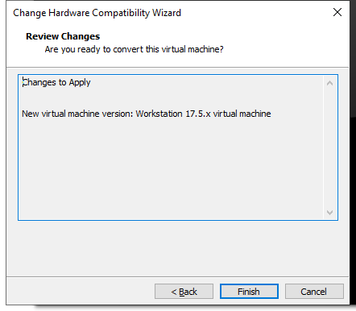

(7) Click **"Close"**.

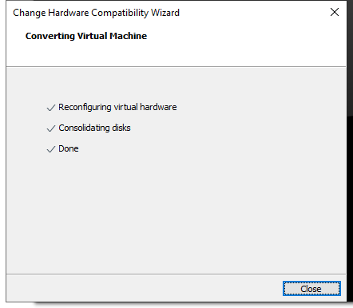

* **Start Virtual Machine**

(1) Click-on **'Power on this virtual machine'.**


(2) After start-up, you will enter the desktop of the virtual machine.


* **Install Dependency**

(1) Click-on  to start the command-line, the execute the following command to install pip:

```bash
sudo apt install pip
```

When you encounter the prompt as shown in the following image, press 'y', then press Enter.


(2) Run the following command to complete the installation.

```bash
sudo apt install serial
```

### 9.1.4 6-Channel Microphone Array Configuration

* **Create Workspace**

(1) Click-on  to open the command-line terminal, and run the following command to create a folder.

```bash
sudo mkdir ros2_ws
```

When the prompt as shown in the following image appears, enter the password **'ubuntu'**.


(2) Execute the following command to create a folder.

```bash
sudo mkdir ros2_ws/src
```

(3) Enter the command to grant folder permissions:

```bash
sudo chmod a+w+x+r ros2_ws/ ros2_ws/src/
```

* **Import Feature Pack**

(1) Click on the location shown in the image below to open the folder.


(2) Drag the files from the same directory into the virtual machine folder.


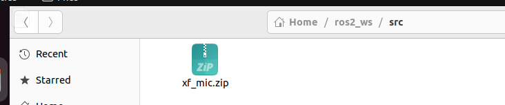

(3) Extract the two files into the current directory.


(4) Enter the extracted folder and move the three folders to /ros2_ws/src.


(5) Delete unnecessary files inside /ros2_ws/src.


(6) Exit the **'src'** folder and return to the **'ros_ws'** folder, then open the command line.

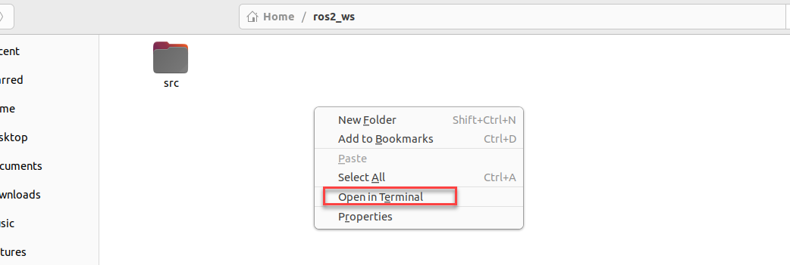

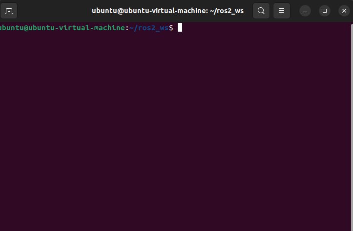

(7) Enter the command to start compiling the package:

```bash
colcon build
```

Compilation completion will be as shown below:


(8) Enter the command to add environment variables:

```bash
echo "source ~/ros2_ws/install/setup.bash" >> ~/.bashrc
```

(9) Enter the command to navigate to the microphone function package:

```bash
cd /home/ubuntu/ros2_ws/src/xf_mic_asr_offline
```

(10) Enter the command to grant permissions:

```bash
sudo find . -name "*.py" -exec chmod +x+w+r {} \
```

* **6-Channel Microphone Array Configuration: Apply for offline voice resources and APPID**

As the robot utilizes offline voice recognition, you will require offline voice resources available exclusively on the iFLYTEC Chinese website. Please note that you need to switch the language to Chinese and follow the provided instructions for the process.

(1) Enter iFLYTEC website, https://www.xfyun.cn/, then click "**sign in**" to create an account.


(2) Choose **"Sign up with phone number"**, and fill in the required information. (select corresponding country code)


(3) After registration, click **'console-\>my application'** to add new application.


(4) Fill in the required information, and click "**Submit**".


(5) Open the application you just added.


(6) Click **"Voice recognition-\>Offline voice command recognition (Latest version)"**


(7) Download Linux AIKit.


:::{Note}

Each new application offers 90-day free trial, and you will be charged if you continue to use it. When free trial expires, you can add new application again, and each person can only request 5 new applications.

:::

(8) Select the username you created and the Linux platform. After making your choices, select the **'Regular Version'** below, check **'Offline Command Word Recognition'** and **'Voice Wakeup'** options, then click **'SDK Download'.**

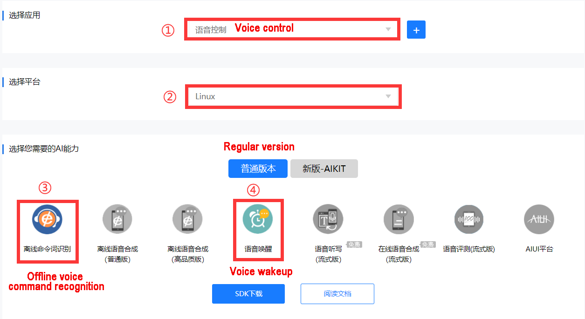

(9) Choose **'OK'** to start downloading.


* **Replace Offline Voice Resources and ID**

(1) Unzip the file below and locate the offline voice resource **'common.jet'**.


(2) Click the icon below.


(3) Drag the Common.jet file into the specified folder within the virtual machine (as illustrated in the image) to complete the replacement.


(4) Navigate to the folder **'ros_ws/src/xf_mic_asr_offline/launch'** and right click the file **'mic_init.launch'** and choose 'Open With Text Editor'.


(5) Replace the existing appid with the one obtained from the iFLYTEC website. Afterward, press 'Ctrl+S' to save the changes. (Note: the offline voice resource should be consistent with the appid)


:::{Note}

If you are still unable to activate voice control for the car after following the steps above, please reach out to our technical support team at <support@hiwonder.com> for assistance.

:::

* **Import Dynamic Library**

Choose the corresponding directory based on your CPU architecture. Here, we take **'x64'** as an example.

:::{Note}

If you are using a Raspberry Pi, you need to choose the 'arm32' folder. If you are using a Jetson Nano, choose the 'arm64' folder. If you are using a PC with Linux or Windows, select the folder based on your system: choose the 'x64' folder for 64-bit systems and the 'x86' folder for 32-bit systems.

:::


(1) Enter the command to open the directory containing the dynamic link library (DLL) files for the x64 architecture:

```bash
cd /home/ubuntu/ros2_ws/src/xf_mic_asr_offline/lib/x64/
```

(2) Enter the command to copy the dynamic link libraries to the user directory:

```bash
sudo cp lib* /usr/lib
```

* **Change User Parameters**

After modifying the APPID, if you wish to make changes to the speech recognition threshold, recording duration, wake-up word, or wake-up speech, you can refer to the methods described below.

(1) Locate the folder **'ros_ws/src/xf_mic_asr_offline/launch'**, and right-click **'mic_init.launch'**, then select **'Open With Text Editor'**.


(2) Set confidence thresholds for speech results and the duration of each voice command entry based on the two parameters highlighted in the red box in the following diagram.

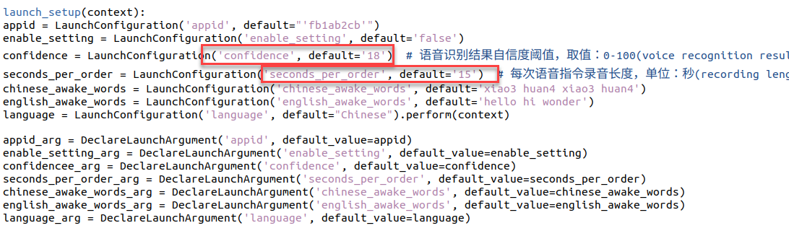

(3) Modify the parameter highlighted in the red box below to change the wake-up word.


English wakeup word format: word1 word2 word3

(1) To change the wakeup language, you can directly change the below parameter.

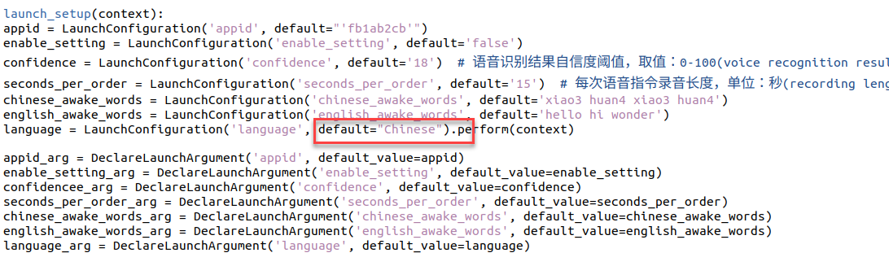

(2) After modification, press **'Ctrl+S'** to save the editing.

* **Configure Microphone Port**

(1) Start the virtual machine.


(2) Press the shortcut key **'Ctrl + Alt + T'** to open the command line terminal, then enter the following command to copy the microphone interface mapping rules into the system:

```bash
sudo cp /home/ubuntu/ros2_ws/src/xf_mic_asr_offline/xf_mic.rules /etc/udev/rules.d/
```

(3) Enter the following three commands one by one to update the USB mapping rules:

```bash
sudo udevadm control --reload-rules
```

```bash
sudo service udev restart
```

```bash
sudo udevadm trigger
```

### 9.1.5 Set Wake-Up Command

(1) Connect the microphone array to the computer according to section ["**9.1.2 Wiring**"](#anchor_9_1_2).


(2) Connect the device to the virtual machine.


(3) Enter the command to start the initialization node of the six-channel microphone array and burn the wake-up word.

```bash
ros2 launch xf_mic_asr_offline mic_init.launch.py enable_seting:=true
```

(4) After initialization is complete, the following content will appear. The initial startup may be slightly slow, and completion will appear as shown below:


(5) If you want to close this node, use short-cut **'Ctrl+C'**.

### 9.1.6 Sound Source Localization and Speech Recognition

* **Start Node**

Enter the command to start the initialization node of the six-channel microphone array:

```bash
ros2 launch xf_mic_asr_offline mic_init.launch.py
```


(1) Voice Wake-up

After starting the microphone node, say 'Hello Hiwonder' into the microphone. The command line will provide recognition feedback:


(2) Voice Recognition

After activating the microphone, speak the specific command to be recognized.


Command location: `ros2_ws/src/xf_mic_asr_offline/config/call.bnf`


(3) Sound Source Localization

Open a new command-line terminal, and run the following command to initiate the microphone array node.

```bash
ros2 topic echo /awake_node/angle
```


After waking up the microphone, it will print the angle of the sound relative to the microphone.

* **FAQ**

(1) 10108 Error Code

Initiating the initialization service for the 6-channel microphone array multiple times may lead to the problem shown in the following image. However, this issue does not impact functionality. To restore normal operation, just repeat the wake-up words "**Hello Hiwonder**".


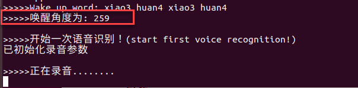

(2) Solution for Unable to Find the Microphone Device

If the error shown in the image below occurs, follow these steps to recover:


Enter the following command to clear the occupation:

```bash
sudo apt remove brltty -y
```

Enter the following three commands one by one to update the USB mapping rules:

```bash
sudo udevadm control --reload-rules
```

```bash
sudo service udev restart
```

```bash
sudo udevadm trigger
```

### 9.1.7 Sound Card Introduction

* **Sound Card Introduction**

As a fundamental component of multimedia systems, a sound card converts analog sound waves into digital signals and vice versa. The primary function of a sound card is to convert raw audio signals from sources such as microphones, tapes, and disks, and output them to various devices such as speakers, headphones, amplifiers, and recorders. Additionally, sound cards can support the playback of the converted audio signals through MIDI interfaces.

Below is about the introduction to USB to audio driver-free sound card.

(1) Sound Card Interface


| NO. |            Name             |                         Function                         |
| :-----: | :-----------------------------: | :----------------------------------------------------------: |
|  1  |        USB interface        |            connect to PC or embedded devices             |
|  2  |       power indicator       |     remains on red when the sound card is powered on     |
|  3  |      speaker interface      |               connect to external speaker                |
|  4  | Echo cancellation interface | An external speaker can be connected for echo cancellation |

(2) Interior Structure


(3) Parameter

|     Power supply voltage     |            5V             |
| :------------------------------: | :---------------------------: |
| Audio encoding decoding chip |         SSS1629A5         |
|      Control interface       |            USB            |
|       Audio interface        |           PH2.0           |
|        Speaker driver        | 2.6W per channel (4Ω BTL) |

* **Speaker Introduction**

A speaker is an electroacoustic device that transforms an electrical signal into mechanical vibrations and emits sound waves into the surrounding space.

Parameters of speaker are as follow.

| AC impedance | 4Ω |
| :--------------: | :----: |
|  Peak power  | 2W |

* **Wiring**

(1) Ensure that the power is off when connecting the speaker wires to the SPK- and SPK+ ports on the right side of the sound card to enable sound playback. (The speaker connection wire has a design to prevent incorrect insertion; if it does not fit, do not force it. Instead, try inserting it in the opposite direction.) If connected to the RLN and RLP ports, the speaker will not produce sound.


(2) Then connect the USB extension cable to sound card.


(3) After completing the connections, insert the USB connectors of the sound card and microphone into the USB ports on the computer. The sound card and microphone can also be connected to a Raspberry Pi or Jetson Nano motherboard using the same method.

Follow the instruction to test sound card and speaker.

(1) Start the virtual machine. Regarding the configuration and installation method of the virtual machine, please refer to the section ["**9.1.3 Virtual Machine Installation and Configuration**"](#anchor_9_1_3)

(2) Connect sound card and speaker to any USB interface on computer according to the instruction in ["**9.1.2 Wiring**"](#anchor_9_1_2).

Warm tip: if the virtual machine is still powered on after configuration, the following prompt will pop up when you insert microphone.

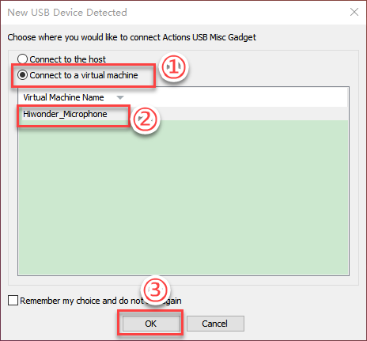

(3) Open settings.


(4) Click **"Sound\>Output device\>Test"**.

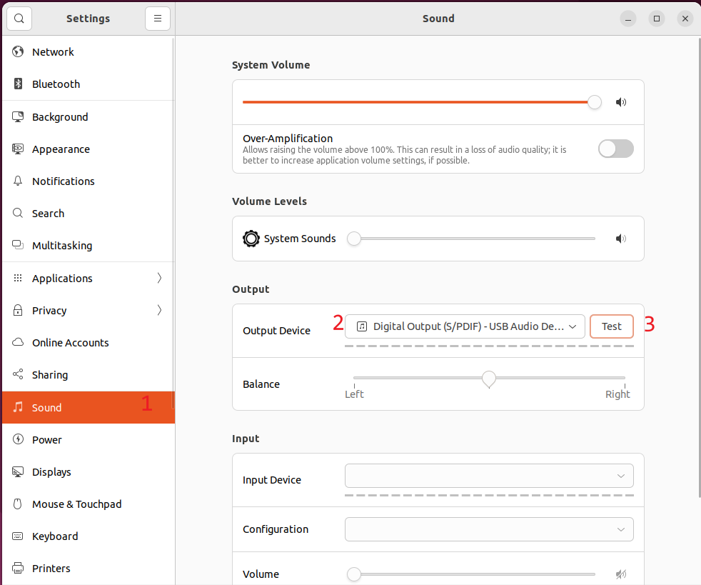

(5) Once opened, users should connect the wires to the SPK- and SPK+ ports correctly. Since the speaker is mono, you can test it by selecting **'Front Right.'** For detailed information on wiring connections, please refer to ["**9.1.2 Wiring**"](#anchor_9_1_2)


If the speaker plays English voice, it means that the speaker functions normally.

* **Import External Music File**

Virtual machine only supports audio file of the format of wav. Abundant materials are available on the Internet teaching you how to convert the format into wav.

(1) Copy the converted audio file (e.g., **'test_sound.wav'**) to the same directory as this document. You can also download WAV format files from the internet for import, which will be used as an example for demonstration.


(2) Next, switch back to the virtual machine and click on the file manager  located on the left side of the screen. Select the **'test_sound'** file by left-clicking on it, then drag it into the file manager. This will save it in the home directory of the user group.


(3) Double-click the test_sound.wav file to play the music.

(4) Run the following command in sequence to play music:

```bash
sudo apt-get install sox -y
```

```bash
play test_sound.wav
```

(5) If you want to pause the music, press **"Ctrl+C"**.

## 9.2 Voice Interaction Application

<p id="anchor_9_2_1"></p>

### 9.2.1 6-Channel Microphone Array Configuration (Must Read)

* **Apply for Offline Voice Resources and ID**

As the robot utilizes offline voice recognition, you will require offline voice resources available exclusively on the iFLYTEC Chinese website. Please note that you need to switch the language to Chinese and follow the provided instructions for the process.

(1) Enter iFLYTEC website, **https://www.xfyun.cn/,** then click "**sign in**" to create an account.


(2) Choose "**Sign up with phone number**", and fill in the required information. (select corresponding country code)


(3) After registration, click '**console-\>my application**' to add new application.

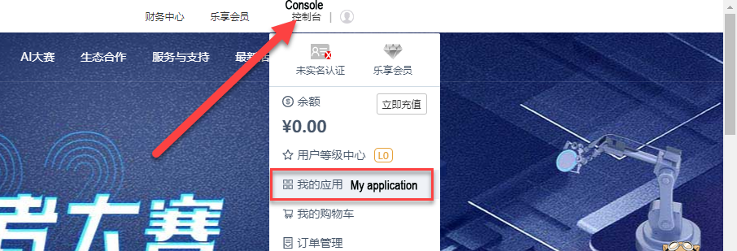

(4) Fill in the required information, and click **"Submit"**.


(5) Open the application you just added.


(6) Then select **Speech Recognition → Offline Command Recognition** (New Version)


(7) Download Linux AIKit.


(8) Choose **'OK'** to start downloading.


:::{Note}

Each new application can only be used for free for ninety days. Subsequent use requires payment. When our application expires, we can apply for a new one up to five times per person. The method for applying for a new application is the same as mentioned above.

:::

(9) Next, select your created username and Linux platform. After selecting, choose the '**Standard Version**' below, check '**Offline Command Recognition**' and '**Voice Wake-up**' functions, then click '**SDK Download**'.


(10) Tick **'I agree'** and choose **'OK'** to confirm the download.


* **Replace Offline Voice Resources and ID**

(1) Extract the following file.


:::{Note}

The file is downloaded to the path you have set.

:::

(2) Open the extracted folder "**Linux_aitalk_exp1227_01997b6c**" **(The version ID 1227_216da28f is not a fixed version and is distributed by the official source**). Click "**\bin\msc\res\asr**" to find "**common.jet**". Use the SSH remote connection tool MobaXterm to drag the file to the desktop of the image, placing it in the path '**/home/pi/docker/tmp**'.


For detailed instructions on connecting with the SSH remote connection tool, please refer to '[**1. Quick Start Guide(JetAuto User Manual)-\> 1.6 Development Environment Setup and Configuration**](https://docs.hiwonder.com/projects/JetAutoPi/en/latest/docs/1.quick_start_guide.html#development-environment-setup-and-configuration)'.

(3) Access the robot system desktop using the remote control software VNC according to the instructions provided in: [**1. Quick Start Guide(JetAuto User Manual)-\> 1.6 Development Environment Setup and Configuration**](https://docs.hiwonder.com/projects/JetAutoPi/en/latest/docs/1.quick_start_guide.html#development-environment-setup-and-configuration)

(4) Click-on  to initiate the command-line terminal.

(5) Enter the command and press Enter to replace the common.jet file:

```bash
cp /home/ubuntu/Desktop/common.jet /home/ubuntu/ros2_ws/src/xf_mic_asr_offline/config/msc/res/asr/
```

(6) Run the following command and hit Enter key to revise APPID.

```bash
vim ./ros2_ws/src/xf_mic_asr_offline/launch/mic_init.launch.py
```

(7) Locate the following code.


(8) Press the **'i'** key to enter edit mode. Change '**01997b6c**' to the obtained APPID.

(9) After modifying the APPID and replacing the common.jet file, connect to the robot's remote desktop and double-click  to open it. Locate the **'Voice Function'** option and set it to **'English'** to enable English language support for subsequent voice interactions.


### 9.2.2 Voice-Controlled Car Movement

* **Program Logic**

Initially, subscribe to the speech recognition service provided by the microphone array node. This involves positioning, noise reduction, recognition, and other operations on the speech data to obtain the recognized sentence and the angle of the sound source. Subsequently, open the robot's chassis movement control service to facilitate the direct implementation of subsequent voice commands.

Next, wake up the robot using a specific wake word. Upon hearing the wake-up word, the robot will respond with corresponding voice feedback.

Finally, perform statement matching, and based on the matching results, the robot will execute the corresponding action.

* **Preparation**

(1) Please ensure the microphone array, sound card and speaker are connected to the corresponding port of USB hub.

(2) Confirm that the '**APPID**' in the configuration file has been modified and the '**Common.jet**' file has been replaced. You can refer to the document '**6-Channel Microphone Array Configuration**' for the application of APPID and file replacement process.

<p id="anchor_9_2_2_3"></p>

* **Operation Steps**

:::{Note}

The input command should be case sensitive, and keywords can complemented using Tab key.

:::

(1) Start the robot, and access the robot system desktop using remote control software VNC.

(2) Click-on  to open the command-line terminal.

(3) Run the command, and hit Enter to disable the app auto-start service.

```bash
~/.stop_ros.sh
```

(4) Execute the command, and hit Enter to enable the voice control function.

```bash
ros2 launch xf_mic_asr_offline voice_control_move.launch.py
```

(5) After the program has successfully loaded, start by saying the wake-up command "**Hello Hiwonder**" and wait for the speaker to reply with "**I'm here.**" Then, give your voice command. For example, if you say "**Go forward,**" the robot will recognize the command and the speaker will respond with "**Copy that. Start going forward**," after which the robot will perform the corresponding movement.

The voice command and their corresponding control actions are as follows:

|                   |                                      |
| :---------------: | :----------------------------------: |
| **Voice Command** |      **Corresponding Movement**      |
|    Go forward     | Control the robot car to go forward  |
|    Go backward    | Control the robot car to go backward |
|     Turn left     |  Control the robot car to turn left  |
|    Turn right     | Control the robot car to turn right  |

:::{Note}

* For best results, please perform the test in a quiet environment.

* It is advisable to say the wake-up command before issuing each voice command.

* Ensure that your voice commands are clear and loud.

* Issue one voice command at a time, and wait for the robot to complete the action and provide feedback before giving the next command.

:::

(6) To disable this feature, open a new command-line terminal and enter the following command.

```bash
~/.stop_ros.sh
```

(7) Close all the open terminals.

* **Program Analysis**

Voice-controlled robot movement involves establishing a connection between the voice control node and the underlying driver node of the robot. Subsequently, the car is controlled to execute corresponding actions based on the commands issued through voice input.

(1) launch File

This launch file is saved in:[/home/ubuntu/ros2_ws/src/xf_mic_asr_offline/launch/voice_control_move.launch.py](../_static/source_code/voice_control_move.launch.zip)


- **Launch File**


**controller_launch** is used to start the chassis control node, allowing control of the servo motor after startup.

**lidar_launch** starts the radar node, which will publish radar data.

**mic_launch** activates the microphone functionality.

- **Initiate the Node**


**voice_control_move_node** is used to call the voice control movement source code and start the program.

(2) Python Launch File


The source code of the program is saved in [/home/ubuntu/ros2_ws/src/xf_mic_asr_offline/scripts/voice_control_move.py](../_static/source_code/voice_control_move.zip)

**Function:**

Main:


Enable the voice-controlled motion.

**Class:**


**Init:**


Initialize various parameters, call the chassis node, buzzer node, radar node, and voice recognition node, and finally start the main function.

get_node_state:


Initialize the status of the node.

Play:


Play the audio

words_callback:


The voice recognition callback function reads data returned by the microphone through the node.

angle_callback:


The sound source recognition callback function will determine the angle of the sound source relative to the microphone based on the wake-up signal.

lidar_callback:


The Lidar callback function processes data based on Lidar input. The follow mode is also handled here. It calculates the angular velocity using the angle identified by the microphone sound source localization and PID. The function then begins tracking the object closest to the robot, adjusting linear and angular velocities based on the Lidar-detected object's position using PID control.

Main：


After receiving commands, the execution strategy adjusts the linear and angular velocities differently based on each command, thereby controlling the robot for various movements.

*  **Function Extension**

(1) Change Wake-Up Command

The default wake-up command is '**Hello Hiwonder**', which can be changed by revising the configuration file. For example, change it to '**小爱小爱**'.

:::{Note}

The input command should be case sensitive, and keywords can be complemented using Tab key.

:::

(1) Start the robot, and access the robot system using the remote control software VNC.

(2) Click-on  to initiate the command-line terminal.

(3) Execute the command below:

```bash
vim ./ros2_ws/src/xf_mic_asr_offline/launch/mic_init.launch.py
```

(4) Find the code shown in the following image:


(5) Press the 'i' key to enter edit mode. Change the value of **'chinese_awake_words'** to **'xiao3 ai4 xiao3 ai4'**.


(6) After making the changes, press the '**Esc**' key, type '**:wq**' and press Enter to save and exit the file.

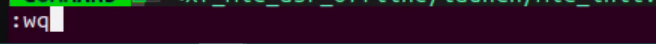

(7) Execute the following command to set the wake-up command.

```bash
ros2 launch xf_mic_asr_offline mic_init.launch.py enable_setting:=true
```

It should take about 30 seconds to complete the setup. For subsequent startups, you won't need to add the **enable_setting** parameter.

(8) Refer to "[**9.2.2 Voice-Controlled Robot Arm ->Operation Steps**](#anchor_9_2_2_3)" to re-enable the function and observe the effects of the changes.

### 9.2.3 Voice-Controlled Robot Arm

* **Program Logic**

This section of the experiment demonstrates how to use the robot's voice recognition feature together with a visual robotic arm to control the arm's movements.

The program design involves subscribing to the voice recognition service provided by the microphone array node. The system processes the voice input for localization, noise reduction, and recognition to determine the recognized phrases and the angle of the sound source. Once the robot is activated by a specific phrase, it will respond with appropriate voice feedback. Additionally, after detecting a specific color, the robot will use voice commands to direct the robotic arm to perform the corresponding actions.

Refer to the "**Preparation**" section to complete the necessary setup for this experiment. Then, follow the "**Operation Steps**" section to carry out and experience the experiment.

* **Preparation**

(1) Please ensure the microphone array, sound card and speaker are connected to the corresponding port of USB hub.

(2) Confirm that the '**APPID**' in the configuration file has been modified and the '**Common.jet**' file has been replaced. You can refer to section 1 '**6-Channel Microphone Array Configuration**' for the application of APPID and file replacement process.

* **Operation Steps**

:::{Note}

The input command should be case sensitive, and keywords can be complemented using Tab key.

:::

(1) Power on the robot and connect it to the VNC remote control software.

(2) Click-on  to start the command-line terminal.

(3) Run the following command to terminate the app auto-start service.

```bash
~/.stop_ros.sh
```

(4) Execute the command below to initiate voice-controlled car movement function:

```bash
ros2 launch xf_mic_asr_offline voice_control_arm.launch.py
```

(5) Once the program has successfully loaded, say the wake word "**Hello Hiwonder**" and wait for the speaker to respond with "**I'm here**." Then, give the command "**Pick a carrot**," and the robotic arm will grab the object in front of it. When you say "**Pass me please**," the robotic arm will pass the object to you from the side.


:::{Note}

* For the best experience, conduct the experiment in a quiet environment.

* It's advisable to say the wake word before each voice command.

* Speak clearly and loudly when giving voice commands.

* Issue voice commands one at a time, and wait for the robot to finish responding before giving the next command.

:::

(6) To disable this feature, open a new command line terminal and enter the following command:

```bash
~/.stop_ros.sh
```

(7) Next, simply close all the open terminals.

* **Program Analysis**

Voice control of the robotic arm involves connecting the voice control node with the robot's lower-level driver nodes. This setup allows voice commands to control the robotic arm and execute the specified actions.

(1) launch File

The launch file is located in: [/home/ubuntu/ros2_ws/src/xf_mic_asr_offline/launch/voice_control_arm.launch.py](../_static/source_code/voice_control_arm.launch.zip)


① Launch File


`controller_launch` starts the chassis control node, enabling control of the servo motors.

`mic_launch` activates the microphone functionality.

② Initiate Node


`voice_control_move_node` is used to launch the voice control source code for movement, starting the program.

(2) Python Launch File


The source code is saved in:[/home/ubuntu/ros2_ws/src/xf_mic_asr_offline/scripts/voice_control_move.py](../_static/source_code/voice_control_move.zip)

① Function:

Main：


Start voice-controlled movement.

② Class:


Init：


Initialize all parameters. Then, activate the servo node, buzzer node, and voice recognition node. Finally, start the main function.

get_node_state:


Initiate node status.

Play:


Play audio

words_callback:


The voice recognition callback function processes data received from the microphone through the node and performs the appropriate action set based on the recognized speech.

### 9.2.4 Voice-Controlled Color Recognition

* **Program Logic**

This experiment combines the robot's voice recognition capabilities with a vision-enabled robotic arm to identify objects in red, green, and blue.

In the program, we use the voice recognition service from the microphone array node, which processes voice commands for localization, noise reduction, and recognition, and provides the recognized phrases and sound source direction. After successfully awakening the robot with a specific phrase, it will respond with appropriate voice feedback. The robot's camera will then identify and differentiate objects based on their colors—red, green, and blue.

Please refer to the "**Preparation**" section later in this document to set up for the experiment, and then follow the "**Operation Steps**" to perform and learn from the experiment.

* **Preparation**

(1) Please ensure the microphone array, sound card and speaker are connected to the corresponding port of USB hub.

(2) Ensure that you have remotely modified the configuration file to replace the APPID and the "**Common.jet**" file obtained from the installation of iFlytek, according to section 1: 6-Channel Microphone Array Configuration (Must Read)

* **Operation Steps**

:::{Note}

* When identifying color blocks, ensure that objects with colors similar or identical to the color blocks in the background are avoided to prevent interference.

* If the recognition result is inaccurate, you need to adjust the color threshold according to the instructions provided in '[**6. ROS2+OpenCV Course**](https://docs.hiwonder.com/projects/JetAutoPi/en/latest/docs/6.ROS2%2BOpenCV.html)'.

:::

(1) Start the robot, and access the robot system desktop using remote control software VNC.

(2) Click-on  to open the command-line terminal.

(3) Run the command, and hit Enter to disable the app auto-start service.

```bash
~/.stop_ros.sh
```

(4) Enter the command and press Enter key to activate the voice-controlled car function:

```bash
ros2 launch xf_mic_asr_offline voice_control_color_detect.launch.py
```

(5) To initiate  game, begin by stating the wake-up word "**Hello Hiwonder**," followed by the command "**Start color recognition**" to prompt the robot to start recognizing colors. The recognizable colors for this activity are red, green, and blue. Upon recognizing a color, such as red, position a red square within the camera's field of view. Once the color block is identified, the robot will announce the color name, such as "**red**."

If you wish to cease color recognition, please state the wake-up word "**Hello Hiwonder**" followed by the command "**Stop recognition**".

:::{Note}

* For optimal performance, ensure you are in a relatively quiet environment.

* Before issuing each voice command, start by saying the wake-up word.

* Speak loudly and clearly when giving voice commands.

* Give voice commands one at a time and wait for the robot to provide feedback before issuing additional commands.

:::

If you need to disable this feature, open a new command line terminal and enter the following command.

```bash
~/.stop_ros.sh
```

(6) Then, close all previously opened terminals. 

* **Program Analysis**

Voice-controlled color recognition enables the voice control node to establish communication with the camera node. Subsequently, it commands the robot to identify and track color blocks based on voice-issued commands.

(1) Launch File


The launch file is located in: [/home/ubuntu/ros2_ws/src/xf_mic_asr_offline/launch/voice_control_color_detect.launch.py](../_static/source_code/voice_control_color_detect.launch.zip)

① Launch Files

{lineno-start=1}

```python
import os
from ament_index_python.packages import get_package_share_directory

from launch_ros.actions import Node
from launch import LaunchDescription, LaunchService
from launch.actions import IncludeLaunchDescription, OpaqueFunction
from launch.launch_description_sources import PythonLaunchDescriptionSource

def launch_setup(context):
    compiled = os.environ['need_compile']

    if compiled == 'True':
        example_package_path = get_package_share_directory('example')
        controller_package_path = get_package_share_directory('controller')
        xf_mic_asr_offline_package_path = get_package_share_directory('xf_mic_asr_offline')
    else:
        example_package_path = '/home/ubuntu/ros2_ws/src/example'
        controller_package_path = '/home/ubuntu/ros2_ws/src/driver/controller'
        xf_mic_asr_offline_package_path = '/home/ubuntu/ros2_ws/src/xf_mic_asr_offline'

    controller_launch = IncludeLaunchDescription(
        PythonLaunchDescriptionSource(
            os.path.join(controller_package_path, 'launch/controller.launch.py')),
    )

    color_detect_launch = IncludeLaunchDescription(
        PythonLaunchDescriptionSource(
            os.path.join(example_package_path, 'example/color_detect/color_detect_node.launch.py')),
        launch_arguments={
            'enable_display': 'true',
        }.items(),       
    )

    mic_launch = IncludeLaunchDescription(
        PythonLaunchDescriptionSource(
            os.path.join(xf_mic_asr_offline_package_path, 'launch/mic_init.launch.py')),
    )

    voice_control_color_detect_node = Node(
        package='xf_mic_asr_offline',
        executable='voice_control_color_detect.py',
        output='screen',
    )

    init_pose_launch = IncludeLaunchDescription(
        PythonLaunchDescriptionSource(os.path.join(controller_package_path, 'launch/init_pose.launch.py')),
        launch_arguments={
            'namespace': '',  
            'use_namespace': 'false',
            'action_name': 'horizontal',
        }.items(),
    )
```

`controller_launch` starts the chassis control node, enabling control of the servo motor.

`color_detect_launch` initiates the color recognition node.

`mic_launch` activates the microphone functionality.

`init_pose_launch` initializes the movements.

- **Initiate Node**

{lineno-start=39}

```python
  voice_control_color_detect_node = Node(
      package='xf_mic_asr_offline',
      executable='voice_control_color_detect.py',
      output='screen',
  )
```

voice_control_color_track_node: Used to invoke the voice-controlled color tracking source code and start the program.

(2) Python Program


The source code is located at: [/home/ubuntu/ros2_ws/src/xf_mic_asr_offline/scripts/voice_control_color_detect.py](../_static/source_code/voice_control_color_detect.zip)

**Function:**

Main:

{lineno-start=142}

```python
def main():
    node = VoiceControlColorDetectNode('voice_control_color_detect')
    executor = MultiThreadedExecutor()
    executor.add_node(node)
    executor.spin()
    node.destroy_node()
```

Start voice-controlled color recognition.

**Classes:**

VoiceControlColorDetectNode:

{lineno-start=22}

```python
class VoiceControlColorDetectNode(Node):
    def __init__(self, name):
        rclpy.init()
        super().__init__(name, allow_undeclared_parameters=True, automatically_declare_parameters_from_overrides=True)
        
        self.count = 0
        self.color = None
        self.running = True
        self.last_color = None
        signal.signal(signal.SIGINT, self.shutdown)
```

Init：

{lineno-start=24}

```python
        rclpy.init()
        super().__init__(name, allow_undeclared_parameters=True, automatically_declare_parameters_from_overrides=True)
        
        self.count = 0
        self.color = None
        self.running = True
        self.last_color = None
        signal.signal(signal.SIGINT, self.shutdown)

        self.language = os.environ['ASR_LANGUAGE']
        
        self.buzzer_pub = self.create_publisher(BuzzerState, '/ros_robot_controller/set_buzzer', 1)
        timer_cb_group = ReentrantCallbackGroup()
        self.create_subscription(String, '/asr_node/voice_words', self.words_callback, 1, callback_group=timer_cb_group)
        self.create_subscription(ColorsInfo, '/color_detect/color_info', self.get_color_callback, 1)
        self.client = self.create_client(Trigger, '/asr_node/init_finish')
        self.client.wait_for_service()
        self.client = self.create_client(Trigger, '/color_detect/init_finish')
        self.client.wait_for_service() 
        self.set_color_client = self.create_client(SetColorDetectParam, '/color_detect/set_param', callback_group=timer_cb_group)
        self.set_color_client.wait_for_service()
        self.play('running')
        self.get_logger().info('唤醒口令: 小幻小幻(Wake up word: hello hiwonder)')
        self.get_logger().info('唤醒后15秒内可以不用再唤醒(No need to wake up within 15 seconds after waking up)')
        self.get_logger().info('控制指令: 开启颜色识别 关闭颜色识别(Voice command: start color recognition/stop color recognition)')

        threading.Thread(target=self.main, daemon=True).start()
        self.create_service(Trigger, '~/init_finish', self.get_node_state)
        self.get_logger().info('\033[1;32m%s\033[0m' % 'start')
```

Initialize all parameters, call the chassis node, buzzer node, radar node, voice recognition node, and color recognition node, and finally start the main function.

get_node_state:

{lineno-start=54}

```python
    def get_node_state(self, request, response):
        response.success = True
        return response
```

Set the current node state.

Play:

{lineno-start=58}

```python
    def play(self, name):
        voice_play.play(name, language=self.language)
```

Play audio.

Shutdown

{lineno-start=61}

```python
    def shutdown(self, signum, frame):
        self.running = False
```

The callback function that executes after closing the program sets the parameter running to False, which stops the program.

get_color_callback:

{lineno-start=64}

```python
    def get_color_callback(self, msg):
        data = msg.data
        if data != []:
            if data[0].radius > 30:
                self.color = data[0].color
            else:
                self.color = None
        else:
            self.color = None
```

This function retrieves the current color recognition results based on the information published by the color recognition node.

send_request:

{lineno-start=74}

```python
    def send_request(self, client, msg):
        future = client.call_async(msg)
        while rclpy.ok():
            if future.done() and future.result():
                return future.result()
```

This function is responsible for publishing service requests.

words_callback:

{lineno-start=80}

```python
    def words_callback(self, msg):
        words = json.dumps(msg.data, ensure_ascii=False)[1:-1]
        if self.language == 'Chinese':
            words = words.replace(' ', '')
        self.get_logger().info('words: %s'%words)
        if words is not None and words not in ['唤醒成功(wake-up-success)', '休眠(Sleep)', '失败5次(Fail-5-times)',
                                               '失败10次(Fail-10-times']:
            if words == '开启颜色识别' or words == 'start color recognition':
                msg_red = ColorDetect()
                msg_red.color_name = 'red'
                msg_red.detect_type = 'circle'
                msg_green = ColorDetect()
                msg_green.color_name = 'green'
                msg_green.detect_type = 'circle'
                msg_blue = ColorDetect()
                msg_blue.color_name = 'blue'
                msg_blue.detect_type = 'circle'
                msg = SetColorDetectParam.Request()
                msg.data = [msg_red, msg_green, msg_blue]
                res = self.send_request(self.set_color_client, msg)
                if res.success:
                    self.play('open_success')
                else:
                    self.play('open_fail')
            elif words == '关闭颜色识别' or words == 'stop color recognition':
                msg = SetColorDetectParam.Request()
                res = self.send_request(self.set_color_client, msg)
                if res.success:
                    self.play('close_success')
                else:
                    self.play('close_fail')
        elif words == '唤醒成功(wake-up-success)':
            self.play('awake')
```

This is the voice recognition callback function. It controls whether recognition is enabled based on the detected speech. If recognition is enabled, it provides feedback according to the information received from the color recognition node.

Main：

{lineno-start=121}

```python
    def main(self):
        while self.running:
            if self.color == 'red' and self.last_color != 'red':
                self.last_color = 'red'
                self.play('red')
                self.get_logger().info('\033[1;32m%s\033[0m' % 'red')
            elif self.color == 'green' and self.last_color != 'green':
                self.last_color = 'green'
                self.play('green')
                self.get_logger().info('\033[1;32m%s\033[0m' % 'green')
            elif self.color == 'blue' and self.last_color != 'blue':
                self.last_color = 'blue'
                self.play('blue')
                self.get_logger().info('\033[1;32m%s\033[0m' % 'blue')
            else:
                self.count += 1
                time.sleep(0.01)
                if self.count > 50:
                    self.count = 0
                    self.last_color = self.color
```

This function announces a voice message corresponding to the recognized color.

### 9.2.5 Voice-Controlled Color Tracking

* **Program Logic**

This experiment combines the robot's voice recognition capabilities with a visual robotic arm to identify three colors: red, green, and blue.

In the program design, we subscribe to the voice recognition service from the microphone array node. This process includes steps such as localizing the voice, reducing background noise, and recognizing the spoken input. As a result, we can obtain the recognized phrases and the direction of the sound source. After successfully waking up the robot with a specific command, it will respond with appropriate voice feedback. When the robot identifies a specific color, its camera (or the camera mounted on the robotic arm in the Pro version) will track the colored object.

To proceed, we need to complete the preparations detailed in the "[**Preparation**](#anchor_9_2_5_2)" section below and then follow the "[**Operation Steps**](#anchor_9_2_5_3)" to fully engage with this experiment.

<p id="anchor_9_2_5_2"></p>

* **Preparation**

(1) Please ensure the microphone array, sound card and speaker are connected to the corresponding port of USB hub.

(2) Ensure that you have remotely modified the configuration file to replace the APPID and the **"Common.jet"** file obtained from the installation of iFlytek according to ["**9.2.1 6-Channel Microphone Array Configuration**"](#anchor_9_2_1).

<p id="anchor_9_2_5_3"></p>

* **Operation Steps**

:::{Note}

* When identifying color blocks, ensure that objects with colors similar or identical to the color blocks in the background are avoided to prevent interference.

* If the recognition result is inaccurate, you need to adjust the color threshold according to the instructions provided in '[**6. ROS2+OpenCV Course**](https://docs.hiwonder.com/projects/JetAutoPi/en/latest/docs/6.ROS2%2BOpenCV.html)'.

:::

(1) Start the robot, and access the robot system desktop using remote control software VNC.

(2) Click-on  to open the command-line terminal.

(3) Run the command, and hit Enter to disable the app auto-start service.

```bash
~/.stop_ros.sh
```

(4) Enter the command and press Enter to activate the voice-controlled color tracking function.

```bash
ros2 launch xf_mic_asr_offline voice_control_color_track.launch.py
```

(5) Once the program is running, you can start issuing commands. The program can recognize three colors: red, green, and blue. For instance, place a red object within the camera's field of view. First, say the wake word 'Hello Hiwonder,' then follow it with the tracking command '**Track Red**' (to **track blue**, say '**Track Blue**'; for green, say '**Track Green**'). After the robot recognizes red (the color linked to your command), it will rotate the pan-tilt servo. In the Pro version, the robotic arm's camera will also follow the target color in real-time. As you move the colored block, the pan-tilt will adjust to keep the object in view.

:::{Note}

* For optimal performance, ensure you are in a relatively quiet environment.

* Before issuing each voice command, start by saying the wake-up word.

* Speak loudly and clearly when giving voice commands.

* Give voice commands one at a time and wait for the robot to provide feedback before issuing additional commands.

:::

(6) If you need to terminate this program, you need to create a command-line terminal, and enter the following command:

```bash
~/.stop_ros.sh
```

(7) Terminate all the opened terminals.

* **Program Analysis**

Voice-controlled color tracking enables the voice control node to establish communication with the camera node. Subsequently, it commands the robot to identify and track color blocks based on voice-issued commands.

(1) Launch File


The launch file is located in:[/home/ubuntu/ros2_ws/src/xf_mic_asr_offline/launch/voice_control_color_track.launch.py](../_static/source_code/voice_control_color_track.launch.zip)

① Launch Files

{lineno-start=19}

```python
    color_track_launch = IncludeLaunchDescription(
        PythonLaunchDescriptionSource(
            os.path.join(example_package_path, 'example/color_track/color_track_node.launch.py')),
        launch_arguments={'start': 'false'}.items()
    )
```

`color_track_launch`: Start the color tracking node

`mic_launch`: Start the microphone functionality

② Initiate Node

{lineno-start=30}

```python
    voice_control_color_track_node = Node(
        package='xf_mic_asr_offline',
        executable='voice_control_color_track.py',
        output='screen',
    )
```

`voice_control_color_track_node`: Used to invoke the voice-controlled color tracking source code and start the program.

(2) Python Program

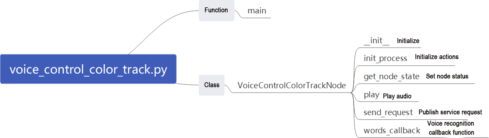

The source code is located at: [/home/ubuntu/ros2_ws/src/xf_mic_asr_offline/scripts/voice_control_color_track.py](../_static/source_code/voice_control_color_track.zip)

**Function:**

Main:

{lineno-start=115}

```python
def main():
    node = VoiceControlColorTrackNode('voice_control_color_track')
    executor = MultiThreadedExecutor()
    executor.add_node(node)
    executor.spin()
    node.destroy_node()
```

Start voice-controlled color tracking.

**Classes:**

VoiceControlColorTrackNode:

{lineno-start=18}

```python
class VoiceControlColorTrackNode(Node):
    def __init__(self, name):
        rclpy.init()
        super().__init__(name, allow_undeclared_parameters=True, automatically_declare_parameters_from_overrides=True)
```

Init：

{lineno-start=18}

```python
class VoiceControlColorTrackNode(Node):
    def __init__(self, name):
        rclpy.init()
        super().__init__(name, allow_undeclared_parameters=True, automatically_declare_parameters_from_overrides=True)

        self.language = os.environ['ASR_LANGUAGE']
        timer_cb_group = ReentrantCallbackGroup()
        self.buzzer_pub = self.create_publisher(BuzzerState, '/ros_robot_controller/set_buzzer', 1)
        self.create_subscription(String, '/asr_node/voice_words', self.words_callback, 1, callback_group=timer_cb_group)
        self.client = self.create_client(Trigger, '/asr_node/init_finish')
        self.client.wait_for_service()
        self.client = self.create_client(Trigger, '/color_track/init_finish')
        self.client.wait_for_service()
        self.start_client = self.create_client(Trigger, '/color_track/start')
        self.start_client.wait_for_service()
        self.set_color_client = self.create_client(SetString, '/color_track/set_color', callback_group=timer_cb_group)
        self.set_color_client.wait_for_service()

        self.timer = self.create_timer(0.0, self.init_process, callback_group=timer_cb_group)
```

Initialize various parameters, invoke the buzzer node, speech recognition node, and color tracking node, and finally initialize actions.

init_process:

{lineno-start=38}

```python
    def init_process(self):
        self.timer.cancel()

        res = self.send_request(self.start_client, Trigger.Request())
        if res.success:
            self.get_logger().info('open color_track')
        else:
            self.get_logger().info('open color_track fail')
        self.play('running')
        self.get_logger().info('唤醒口令: 小幻小幻(Wake up word: hello hiwonder)')
        self.get_logger().info('唤醒后15秒内可以不用再唤醒(No need to wake up within 15 seconds after waking up)')
        self.get_logger().info('控制指令: 追踪红色 追踪绿色 追踪蓝色 停止追踪(Voice command: track red/green/blue object)')

        self.create_service(Trigger, '~/init_finish', self.get_node_state)
        self.get_logger().info('\033[1;32m%s\033[0m' % 'start')
```

Start the color tracking mode, provide command prompts, and initialize marker nodes.

get_node_state:

{lineno-start=54}

```python
    def get_node_state(self, request, response):
        response.success = True
        return response
```

Set the current node state.

Play:

{lineno-start=58}

```python
    def play(self, name):
        voice_play.play(name, language=self.language)
```

Play audio.

send_request:

{lineno-start=61}

```python
    def send_request(self, client, msg):
        future = client.call_async(msg)
        while rclpy.ok():
            if future.done() and future.result():
                return future.result()
```

Publish service requests.

words_callback:

{lineno-start=67}

```python
    def words_callback(self, msg):
        words = json.dumps(msg.data, ensure_ascii=False)[1:-1]
        if self.language == 'Chinese':
            words = words.replace(' ', '')
        self.get_logger().info('words: %s'%words)
        if words is not None and words not in ['唤醒成功(wake-up-success)', '休眠(Sleep)', '失败5次(Fail-5-times)',
                                               '失败10次(Fail-10-times']:
            if words == '追踪红色' or words == 'track red object':
                msg = SetString.Request()
                msg.data = 'red'
                res = self.send_request(self.set_color_client, msg)
                if res.success:
                    self.play('start_track_red')
                else:
                    self.play('track_fail')
            elif words == '追踪绿色' or words == 'track green object':
                msg = SetString.Request()
                msg.data = 'green'
                res = self.send_request(self.set_color_client, msg)
```

Speech recognition callback function. Based on recognized speech, control whether to start color tracking. Announce the corresponding voice based on the recognized result, pass the color to be tracked to the color tracking node, and the tracking is implemented within the color tracking node.

<p id="anchor_9_2_6"></p>

### 9.2.6 Voice-Controlled Color Sorting

* **Program Logic**

This experiment combines the robot's voice recognition capabilities with a visual robotic arm (available only in the JetAuto Pro version) to identify three colors—red, green, and blue—and perform actions such as grasping and sorting these colored blocks.

In the program design, we subscribe to the voice recognition service from the microphone array node. This includes processes like localizing the voice, reducing background noise, and recognizing spoken input to capture the recognized phrases and the direction of the sound source. After successfully waking up the robot with a specific command, it will provide appropriate voice feedback. Once a specific color is recognized, the robotic arm will lower to the designated position to grasp the colored block and then place it in the specified location.

To get started, refer to the "[**Preparation**](#anchor_9_2_6_2)" section below to complete the necessary setup for this experiment. After that, follow the "[**Operation Steps**](#anchor_9_2_6_3)" to fully engage with the experiment.

<p id="anchor_9_2_6_2"></p>

* **Preparation**

(1) Please ensure the microphone array, sound card and speaker are connected to the corresponding port of USB hub.

(2) Ensure that you have remotely modified the configuration file to replace the APPID and the **"Common.jet"** file obtained from the installation of iFlytek according to ["**9.2.1 6-Channel Microphone Array Configuration**"](#anchor_9_2_1).

(3) Prepare a red, green and blue block.

<p id="anchor_9_2_6_3"></p>

* **Operation Steps**

:::{Note}

* When identifying color blocks, ensure that objects with colors similar or identical to the color blocks in the background are avoided to prevent interference.

* If color recognition is inaccurate, you can visit '[**9.2.6 ROS+OpenCV Course**](#anchor_9_2_6) ' to adjust the color thresholds.

:::

(1) Start the robot, and access the robot system desktop using remote control software VNC.

(2) Click-on  to start the command-line terminal.

(3) Run the command, and hit Enter to disable the app auto-start service.

```bash
~/.stop_ros.sh
```

(4) Run the command to initiate the voice-controlled color sorting function.

```bash
ros2 launch xf_mic_asr_offline voice_control_color_sorting.launch.py debug:=true
```

(5) After starting the program, the visual robotic arm on the robot will position itself correctly. Place the colored block to be recognized in the center of the gripper, as shown in the image below.


(6) The robotic arm will then lift upward to prepare for color recognition. During this time, there is no need to move the colored block.


(7) Once the program identifies the specific position of the colored block, the camera feed will highlight it with a yellow box. The recognition and grasping actions will be based on this highlighted position.


(8) To initiate the sorting action, say the wake word **'Hello Hiwonder,'** followed by the command 'Start Color Sorting.' The robotic arm will then grasp the colored block.


(9) The robot will place the colored block in the corresponding color area, as shown in the image below.


(10) After placing the block, the robotic arm will return to the waiting position (as in step 6). To sort another block, simply place it within the yellow box on the camera feed for recognition.


(11) To stop the color sorting, say the wake word 'Hello Hiwonder' followed by the command '**Stop Color Sorting**'.

(12) To disable this feature, open a new command line terminal and enter the following command:

```bash
~/.stop_ros.sh
```

Then, close all previously opened terminals.

* **Program Analysis**

Voice-controlled color tracking involves establishing a connection between the voice control node and the camera node. Subsequently, it enables control over the robot's execution of game by issuing commands through voice.

(1) launch File


The launch file is saved in: [/home/ubuntu/ros2_ws/src/xf_mic_asr_offline/launch/voice_control_color_track.launch.py](../_static/source_code/voice_control_color_track.launch.zip)

① Launch File


`color_sorting_launch`: Start the color sorting node

`mic_launch`: Start the microphone functionality

② Initiate Node


`voice_control_color_track_node`: Used to invoke the voice-controlled color sorting source code and start the program.

(2) Python Program


The source code of this program is saved in: [/home/ubuntu/ros2_ws/src/xf_mic_asr_offline/scripts/voice_control_color_detect.py](../_static/source_code/voice_control_color_detect.zip)

**Functions:**

Main：


Start voice-controlled color sorting.

**Classes:**

VoiceControlColorSortingNode:


Init:


Initialize various parameters, invoke the speech recognition node, and color sorting node.

get_node_state:


Set the current node state.

Play:


Play audio.

send_request:


Used to publish service requests.

words_callback:

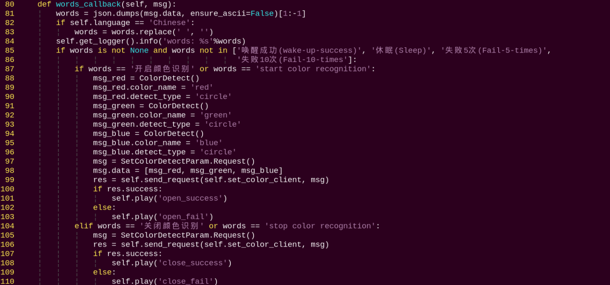

Speech recognition callback function. Based on recognized speech, control whether to start sorting. Announce the corresponding voice based on the recognized result, with sorting operations implemented within the color sorting node.

### 9.2.7 Voice-Controlled Waste Sorting

* **Program Logic**

This experiment leverages the robot's voice recognition capabilities along with the vision-enabled robotic arm (available only in the JetAuto Pro version) to identify different types of trash cards. For ease of handling, these cards are represented as trash blocks. The experiment supports the identification of four waste categories: recyclable waste, food waste, hazardous waste, and residual waste.

The program design involves subscribing to the voice recognition service from the microphone array node. This service processes voice input for localization, noise reduction, and recognition to determine the spoken phrases and the direction of the sound source. After successfully awakening the robot with a specific phrase, it will provide appropriate voice feedback. The camera mounted on the robotic arm will then identify the trash blocks. The robotic arm will move to the designated position to grasp the block and place it in the correct area.

Please refer to the "**Preparation**" section later in the document to complete the setup for this experiment, and then follow the "**Operation Steps**" to conduct and learn from the experiment.

* **Preparation**

(1) Please ensure the microphone array, sound card and speaker are connected to the corresponding port of USB hub.

(2) Ensure that you have remotely modified the configuration file to replace the APPID and the "**Common.jet**" file obtained from the installation of iFlytek according to the ["**9.2.1 6-Channel Microphone Array Configuration**"](#anchor_9_2_1).

(3) Prepare waste cards.

* **Operation Steps**

:::{Note}

The input command should be case sensitive, and keywords can be complemented using Tab key.

:::

(1) Start the robot, and access the robot system desktop using remote control software VNC.

(2) Click-on  to start the command-line terminal.

(3) Run the command, and hit Enter to disable the app auto-start service.

```bash
~/.stop_ros.sh
```

(4) Run the following command to initiate the waste sorting game.

```bash
ros2 launch xf_mic_asr_offline voice_control_garbage_classification.launch.py debug:=true
```

(5) After starting the program, the visual robotic arm on the robot will assume a calibrated position. Place the waste block to be recognized in the center of the gripper, as shown in the image below.


(6) Afterwards, the robotic arm will lift upwards and enter a standby state for recognition (there is no need to move the trash blocks during this process).


(7) After the program identifies the exact location of the trash block at its current position, the camera feed will display a yellow box around the location. This box will serve as the reference for subsequent recognition and gripping actions.


(8) Say the wake-up command **"Hello Hiwonder,"** and then give the command **"Start waste sorting."** The robot will initiate the sorting process, with the robotic arm picking up the trash blocks based on their colors and placing them in their designated locations.


(9) The robot will place the waste block in the corresponding color area, as shown in the image below.


<table  class="docutils-nobg" style="text-align: center;" border="1">
<colgroup>
<col style="width: 49%" />
<col style="width: 50%" />
</colgroup>
<tbody>
<tr>
<td>Name</td>
<td>category</td>
</tr>
<tr>
<td>food_waste</td>
<td><p>BananaPeel</p>
<p>BrokenBones</p>
<p>Ketchup</p></td>
</tr>
<tr>
<td>hazardous_waste</td>
<td><p>Marker</p>
<p>OralLiquidBottle</p>
<p>StorageBattery</p></td>
</tr>
<tr>
<td>recyclable_waste</td>
<td><p>PlasticBottle</p>
<p>Toothbrush</p>
<p>Umbrella</p></td>
</tr>
<tr>
<td>residual_waste</td>
<td><p>Plate</p>
<p>CigaretteEnd</p>
<p>DisposableChopsticks</p></td>
</tr>
</tbody>
</table>


(10) After placing the trash blocks, the robotic arm will return to the ready-to-recognize position. As described in step 6, simply place the trash blocks back into the yellow box on the live feed screen for re-recognition. The robot will then be able to perform the color sorting function again.


(11) Say the wake-up command "**Hello Hiwonder**," followed by the command "**Stop waste sorting**" to halt the trash sorting process of the vision-enabled robotic arm.

(12) To disable this feature entirely, open a new command line terminal and enter the following command:

```bash
~/.stop_ros.sh
```

(13) Then, close all previously opened terminals.

* **Program Analysis**

(1) launch File

Voice-controlled garbage sorting establishes communication between the voice control node and the camera node. Commands are issued through sound to control whether the robot starts or stops this gameplay. After grasping the corresponding garbage card, the robot announces its classification.

The launch file for this setup is located at: [/home/ubuntu/ros2_ws/src/xf_mic_asr_offline/launch/voice_control_garbage_classification.launch.py](../_static/source_code/voice_control_garbage_classification.launch.zip)


The launch file for this setup is located at: [/home/ubuntu/ros2_ws/src/xf_mic_asr_offline/launch/voice_control_color_track.py.launch](../_static/source_code/voice_control_color_track.launch.zip)

- **Launch File**

{lineno-start=19}

```python
    garbage_classification_launch = IncludeLaunchDescription(
        PythonLaunchDescriptionSource(
            os.path.join(example_package_path, 'example/garbage_classification/garbage_classification.launch.py')),
        launch_arguments={'start': 'false',
                          'broadcast': 'true'}.items()
    )
```

`garbage_classification_launch`: Start the garbage classification node

`mic_launch`: Start the microphone functionality

- **Initiate Node**

{lineno-start=31}

```python
  voice_control_garbage_classification_node = Node(
      package='xf_mic_asr_offline',
      executable='voice_control_garbage_classification.py',
      output='screen',
  )
```

`voice_control_garbage_classification_node`: Used to invoke the voice-controlled garbage classification source code and start the program.

(2) Python Program


The source code is located at: [/home/ubuntu/ros2_ws/src/xf_mic_asr_offline/scripts/voice_control_garbage_classification.py](../_static/source_code/voice_control_garbage_classification.zip)

Function:

Main:

{lineno-start=80}

```python
def main():
    node = VoiceControlGarbageClassificationNode('voice_control_garbage_classification')
    executor = MultiThreadedExecutor()
    executor.add_node(node)
    executor.spin()
    node.destroy_node()
```

Start voice-controlled garbage classification.

Class:

VoiceControlColorSortingNode:

{lineno-start=17}

```python
class VoiceControlGarbageClassificationNode(Node):
    def __init__(self, name):
        rclpy.init()
        super().__init__(name, allow_undeclared_parameters=True, automatically_declare_parameters_from_overrides=True)
```

Init:

{lineno-start=18}

```python
    def __init__(self, name):
        rclpy.init()
        super().__init__(name, allow_undeclared_parameters=True, automatically_declare_parameters_from_overrides=True)
        self.running = True
        self.language = os.environ['ASR_LANGUAGE']
        timer_cb_group = ReentrantCallbackGroup()
        self.buzzer_pub = self.create_publisher(BuzzerState, '/ros_robot_controller/set_buzzer', 1)
        self.create_subscription(String, '/asr_node/voice_words', self.words_callback, 1, callback_group=timer_cb_group)
        self.client = self.create_client(Trigger, '/asr_node/init_finish')
        self.client.wait_for_service()
        self.start_client = self.create_client(Trigger, '/garbage_classification/start', callback_group=timer_cb_group)
        self.start_client.wait_for_service()
        self.play('running')

        self.get_logger().info('唤醒口令: 小幻小幻(Wake up word: hello hiwonder)')
        self.get_logger().info('唤醒后15秒内可以不用再唤醒(No need to wake up within 15 seconds after waking up)')
        self.get_logger().info('控制指令: 开启垃圾分类 关闭垃圾分类(Voice command: sort waste/stop sort waste)')
        self.create_service(Trigger, '~/init_finish', self.get_node_state)
        self.get_logger().info('\033[1;32m%s\033[0m' % 'start')
```

Initialize various parameters, invoke the buzzer node, speech recognition node, and garbage classification node.

get_node_state:

{lineno-start=38}

```python
    def get_node_state(self, request, response):
        response.success = True
        return response
```

Set the current node state.

Play:

{lineno-start=42}

```python
    def play(self, name):
        voice_play.play(name, language=self.language)
```

Play audio.

send_request:

{lineno-start=45}

```python
    def send_request(self, client, msg):
        future = client.call_async(msg)
        while rclpy.ok():
            if future.done() and future.result():
                return future.result()
```

Used to publish service requests.

words_callback：

{lineno-start=51}

```python
    def words_callback(self, msg):
        words = json.dumps(msg.data, ensure_ascii=False)[1:-1]
        if self.language == 'Chinese':
            words = words.replace(' ', '')
        self.get_logger().info('words: %s'%words)
        if words is not None and words not in ['唤醒成功(wake-up-success)', '休眠(Sleep)', '失败5次(Fail-5-times)',
                                               '失败10次(Fail-10-times']:
            if words == '开启垃圾分类' or words == 'sort waste':
                res = self.send_request(self.start_client, Trigger.Request())
                if res.success:
                    self.play('open_success')
                else:
                    self.play('open_fail')
            elif words == '关闭垃圾分类' or words == 'stop sort waste':
                res = self.send_request(self.start_client, Trigger.Request())
                if res.success:
                    self.play('close_success')
                else:
                    self.play('close_fail')
        elif words == '唤醒成功(wake-up-success)':
            self.play('awake')
        elif words == '休眠(Sleep)':
            msg = BuzzerState()
            msg.freq = 1900
            msg.on_time = 0.05
            msg.off_time = 0.01
            msg.repeat = 1
            self.buzzer_pub.publish(msg)
```

Speech recognition callback function. Based on recognized speech, control whether to start garbage classification. Announce the corresponding voice based on the recognized result, with classification operations implemented within the garbage classification node.

### 9.2.8 Voice-Controlled Multi-Point Navigation

* **Program Logic**

This experiment uses the robot's voice recognition feature to control the car and navigate a pre-built map.

In the program design, we subscribe to the voice recognition service provided by the microphone array node. This service handles voice localization, noise reduction, and recognition to obtain the recognized phrases and the direction of the sound source. Once the robot is successfully awakened and a specific phrase is spoken, it will respond with appropriate voice feedback and navigate to the three designated points (A, B, and C) as programmed.

Please refer to the "**Preparation**" section later in the document to complete the setup for this experiment, and then follow the "**Operation Steps**" to experience and learn from the experiment.

* **Preparation**

(1) Before starting this lesson, ensure that the microphone array module, sound card, and speakers are installed on the robot and connected to the USB interface of the hub. If they are already installed, you can skip this step.

(2) Make sure you have modified the APPID in the configuration file through remote desktop and replaced the "**Common.jet**" file downloaded and decompressed from iFlytek referring to the section 1 "[**9.2.1 6-Channel Microphone Array Configuration**](#anchor_9_2_1)".

(3) Construct a map of the area where the robot is currently located. If you need guidance on how to build a map, refer to the documents under the "[**5.Mapping & Navigation Course\5.1 Mapping**](https://docs.hiwonder.com/projects/JetAutoPi/en/latest/docs/5.mapping_and_navigation.html#mapping) ".

(4) Place the robot on an open platform and ensure that there is sufficient movement range within 3 meters around the robot.

<p id="anchor_9_2_8_3"></p>

* **Operation Steps**

:::{Note}

The input command should be case sensitive, and keywords can be complemented using Tab key.

:::

(1) Start the robot, and access the robot system desktop using remote control software VNC.

(2) Click-on  to start the command-line terminal.

(3) Run the command, and hit Enter to disable the app auto-start service.

```bash
~/.stop_ros.sh
```

(4) Type the command to initiate the voice-controlled car movement game.

```bash
ros2 launch xf_mic_asr_offline voice_control_navigation.launch.py map:=map_01
```

The `map_01` at the end of the command is the name of the map, which users can modify according to their needs. The map is stored at the path:`/home/ubuntu/ros2_ws/src/slam/maps`.

(5) After initiating the game, begin by saying the wake-up word "**Hello Hiwonder**," followed by the command statement to control the robot's movement.

For instance, start by saying "**Hello Hiwonder**" and the robot will respond with "**I'm here**." Then, proceed to announce "**Go to A point**," and the robot will navigate to the upper right of the starting position.

Below are the command statements and their corresponding functions (with the robot as the first perspective):

|  **Voice command**   |                         **Function**                         |
| :------------------: | :----------------------------------------------------------: |
|    Go to A point     | Control the robot to move to point A: Upper right of the starting position |
|    Go to B point     | Control the robot to move to point B: Upper left of the starting position |
|    Go to C point     |     Control the robot to move to point C: Below point A      |
| Go back to the start | Control the robot to move to the origin point: Starting position |

(6) To disable this function, open a new command line terminal and enter the following command:

```bash
~/.stop_ros.sh
```

(7) Then, close all previously opened terminals.

* **Program Analysis**

(1) launch File


The launch file is saved in:

[/home/ubuntu/ros2_ws/src/xf_mic_asr_offline/launch/voice_control_color_track.launch.py](../_static/source_code/voice_control_color_track.launch.zip)

① Launch File

{lineno-start=}

```python
    color_track_launch = IncludeLaunchDescription(
        PythonLaunchDescriptionSource(
            os.path.join(example_package_path, 'example/color_track/color_track_node.launch.py')),
        launch_arguments={'start': 'false'}.items()
    )
```

`navigation_launch`: Start navigation

`mic_launch`: Start microphone functionality

② Initiate Node

{lineno-start=30}

```python
    voice_control_color_track_node = Node(
        package='xf_mic_asr_offline',
        executable='voice_control_color_track.py',
        output='screen',
    )
```

`voice_control_navigation_node`: Used to invoke the voice-controlled multi-point navigation source code and start the program.

(2) Python Program


The source code of the program is saved in:[/home/ubuntu/ros2_ws/src/xf_mic_asr_offline/scripts/voice_control_navigation.py](../_static/source_code/voice_control_navigation.zip)

**Function:**

Main：

{lineno-start=128}

```python
def main():
    node = VoiceControlNavNode('voice_control_nav')
    rclpy.spin(node)
    node.destroy_node()
    rclpy.shutdown()
```

Start voice-controlled multi-point navigation.

**Class:**

VoiceControlColorSortingNode:

{lineno-start=18}

```python
class VoiceControlNavNode(Node):
    def __init__(self, name):
        rclpy.init()
        super().__init__(name)
```

Init:

{lineno-start=23}

```python
        self.angle = None
        self.words = None
        self.running = True
        self.haved_stop = False
        self.last_status = Twist()

        self.language = os.environ['ASR_LANGUAGE']
        self.declare_parameter('costmap', '/local_costmap/costmap')
        self.declare_parameter('map_frame', 'map')
        self.declare_parameter('goal_pose', '/goal_pose')
        self.declare_parameter('cmd_vel', '/controller/cmd_vel')

        self.costmap = self.get_parameter('costmap').value
        self.map_frame = self.get_parameter('map_frame').value
        self.goal_pose = self.get_parameter('goal_pose').value
        self.cmd_vel = self.get_parameter('cmd_vel').value

        self.clock = self.get_clock()
        self.mecanum_pub = self.create_publisher(Twist, self.cmd_vel, 1)
        self.goal_pub = self.create_publisher(PoseStamped, self.goal_pose, 1)
        self.create_subscription(String, '/voice_control/voice_words', self.words_callback, 1)
        self.create_subscription(Int32, '/awake_node/angle', self.angle_callback, 1)
        
        self.client = self.create_client(Trigger, '/asr_node/init_finish')
        self.client.wait_for_service()

        self.mecanum_pub.publish(Twist())
        self.buzzer_pub = self.create_publisher(BuzzerState, '/ros_robot_controller/set_buzzer', 1)
        self.play('running')

        self.get_logger().info('唤醒口令: 小幻小幻(Wake up word: hello hiwonder)')
        self.get_logger().info('唤醒后15秒内可以不用再唤醒(No need to wake up within 15 seconds after waking up)')
        self.get_logger().info('控制指令: 去A点 去B点 去C点 回原点(Voice command: go to A/B/C point go back to the start')
```

Initialize various parameters, set parameters required for navigation, call speech recognition node, buzzer node, and start the main function.

get_node_state:

{lineno-start=61}

```python
    def get_node_state(self, request, response):
        response.success = True
        return response
```

Set the current node state.

Play:

{lineno-start=65}

```python
    def play(self, name):
        voice_play.play(name, language=self.language)
```

Play audio

words_callback:

{lineno-start=69}

```python
        self.words = json.dumps(msg.data, ensure_ascii=False)[1:-1]
        if self.language == 'Chinese':
            self.words = self.words.replace(' ', '')
        self.get_logger().info('words:%s' % self.words)
        if self.words is not None and self.words not in ['唤醒成功(wake-up-success)', '休眠(Sleep)', '失败5次(Fail-5-times)',
                                                         '失败10次(Fail-10-times']:
            pass
        elif self.words == '唤醒成功(wake-up-success)':
            self.play('awake')
        elif self.words == '休眠(Sleep)':
            msg = BuzzerState()
            msg.freq = 1000
            msg.on_time = 0.1
            msg.off_time = 0.01
            msg.repeat = 1
            self.buzzer_pub.publish(msg)
```

Speech recognition callback function. Control whether garbage classification is activated based on recognized speech. Announce corresponding speech based on recognition result, with classification handled within garbage classification node.

angle_callback：

{lineno-start=86}

```python
    def angle_callback(self, msg):
        self.angle = msg.data
        self.get_logger().info('angle:%s' % self.angle)
```

Sound source recognition callback function. Handle sound sources awakened relative to microphone angle.

Main:

{lineno-start=90}

```python
    def main(self):
        while True:
            if self.words is not None:
                pose = PoseStamped()
                pose.header.frame_id = self.map_frame
                pose.header.stamp = self.clock.now().to_msg()
                if self.words == '去\'A\'点' or self.words == 'go to A point':
                    self.get_logger().info('>>>>>> go a')
                    pose.pose.position.x = 1.0
                    pose.pose.position.y = -1.0
                    pose.pose.orientation.w = 1.0
                    self.play('go_a')
                    self.goal_pub.publish(pose)
                elif self.words == '去\'B\'点' or self.words == 'go to B point':
                    self.get_logger().info('>>>>>> go b')
                    pose.pose.position.x = 2.0
                    pose.pose.position.y = 0.0
                    pose.pose.orientation.w = 1.0
                    self.play('go_b')
                    self.goal_pub.publish(pose)
                elif self.words == '去\'C\'点' or self.words == 'go to C point':
                    self.get_logger().info('>>>>>> go c')
                    pose.pose.position.x = 1.0
                    pose.pose.position.y = 1.0
                    pose.pose.orientation.w = 1.0
                    self.play('go_c')
                    self.goal_pub.publish(pose)
                elif self.words == '回原点' or self.words == 'go back to the start':
                    self.get_logger().info('>>>>>> go origin')
                    pose.pose.position.x = 0.0
                    pose.pose.position.y = 0.0
                    pose.pose.orientation.w = 1.0
```

Publish navigation points to navigation node based on voice-recognized nodes and announce through audio.

(5) Function Expansion

The default point A in the program corresponds to the upper right corner of the robot's starting position map, with coordinates (1, -1) in meters. To change the position of point A, follow these steps, using the example of relocating point A to the lower right of the starting position:

:::{Note}

* Users can refer to this section to adjust the positions of point B and point C as needed.

* Please ensure strict case sensitivity when entering commands, and feel free to use the "**Tab**" key for auto-completion of keywords.

:::

(1) Start the robot, and access the robot system desktop using the remote control software VNC.

(2) Click-on  to start the command-line terminal.

(3) Execute the following command to disable the app auto-start service.

```bash
~/.stop_ros.sh
```

(4) Execute the command, and hit Enter to navigate to the directory containing program files.

```bash
vim ./ros2_ws/src/xf_mic_asr_offline/scripts/voice_control_navigation.py
```

(5) Find the code indicated in the image below.

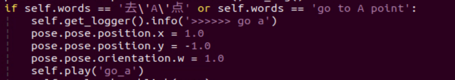

(6) Press the **"i"** key to enter edit mode and change the value from "**1**" to "**-1**".


In the robot's first-person view, the positive direction of the X-axis points forward, and the positive direction of the Y-axis points to the left. Changing point A's X-axis coordinate from a positive to a negative value will position it in the robot's lower right area.

(7) After making the changes, press the "**Esc**" key, type "**:wq**," and hit Enter to save and exit the file.

(8) Follow the instructions in "[**9.2.8 Voice-Controlled Muti-Point Navigation ->Operating Steps**](#anchor_9_2_8_3)" to re-enable the function and see the effects of your changes.

### 9.2.9 Voice-Controlled Navigation and Transport

* **Program Logic**

In this section, the experiment involves using the robot's voice recognition feature to control a car with voice commands and navigate on a pre-built map.

The program subscribes to the microphone array node's speech recognition service to process tasks such as voice localization, noise reduction, and recognition. It retrieves the recognized voice command and the direction of the sound. Once the robot is activated by a wake-up command, it provides a voice response and navigates to the corresponding location on the map based on the command. The navigation starts with global planning, and if obstacles are detected during movement, it switches to local planning. Upon reaching the first destination, the robot activates the alignment and gripping service; at the second destination, it activates the placement service.

To set up this experiment, refer to the "**Preparation**" section, then follow the "**Operation Step**" to perform the experiment.

* **Preparation**

(1) Before starting this lesson, make sure the microphone array module, sound card, and speaker are installed on the robot. If they are already set up, you can skip this step. Additionally, connect them to the USB ports on the hub.

(2) Refer to  "[**9.2.1 6-Channel Microphone Array Configuration**](#anchor_9_2_1)" to apply for the APPID and replace the language resource file common.jet.

(3) Prior to conducting the experiment, ensure that the map is built in advance. You can find guidance in "[**5. Mapping and Navigation Course/ 5.1 Mapping**](https://docs.hiwonder.com/projects/JetAutoPi/en/latest/docs/5.mapping_and_navigation.html#mapping)".

(4) It is advisable to position the robot on an open platform, allowing for ample movement space within a 3-meter radius around it.

<p id="anchor_9_2_9_3"></p>

* **Operation Steps**

:::{Note}

When entering commands, please pay careful attention to case sensitivity, and you can use the **"Tab"** key to autocomplete keywords.

:::

(1) Start the robot and connect it to the remote control software, VNC.

(2) Click  on the system desktop to open the command line terminal.

(3) Enter the following command to stop the app's auto-start service:

```bash
~/.stop_ros.sh
```

(4) To enable the voice-controlled car feature, enter the following command and press Enter:

```bash
ros2 launch xf_mic_asr_offline voice_control_navigation_transport.launch.py map:=map_01
```

The "**map_01**" at the end of the command is the map name, which you can modify as needed. The map is stored at the following path: \`**/home/ubuntu/ros2_ws/src/slam/maps**\`.

(5) After activating the feature, say "**Hello Hiwonder**" will prompt the robot to respond with "**I'm here**". Following this, if you give the command "**Navigate and transport**", the robot will move to the coordinates (0, 0.5, 0) on the map to pick up an object. Once the object is picked up, the robot will proceed to coordinates (1.5, 0, 0) to place it.

(6) To disable this function, open a new command line terminal and enter the following command:

```bash
~/.stop_ros.sh
```

(7) Afterward, you can close all previously opened terminals.

* **Program Analysis**

(1) launch File


The path for the launch file is located at:

[/home/ubuntu/ros2_ws/src/xf_mic_asr_offline/launch/voice_control_navigation_transport.launch.py](../_static/source_code/voice_control_navigation_transport.launch.zip)

(1) Launch Files

{lineno-start=23}

```python
    navigation_transport_launch = IncludeLaunchDescription(
        PythonLaunchDescriptionSource(
            os.path.join(example_package_path, 'example/navigation_transport/navigation_transport.launch.py')),
        launch_arguments={
            'map': map_name,
            'broadcast': 'true',
            'place_position': "[0.0, 0.5, 0.0, 0.0, 0.0]",
        }.items(),
    )
```


navigation_transport_launch: Starts the navigation and transportation feature

mic_launch: Activates the microphone functionality

(2) Launch Nodes

{lineno-start=38}

```python
    voice_control_navigation_transport_node = Node(
        package='xf_mic_asr_offline',
        executable='voice_control_navigation_transport.py',
        output='screen',
        parameters=[{
            'pick_position': [1.5, 0, 0.0, 0.0, 0.0],
        }]
    )
```

`voice_control_navigation_node`: Invokes the source code for voice-controlled multi-point navigation and starts the program.

(2) Python Program


The source code is saved in

[/home/ubuntu/ros2_ws/src/xf_mic_asr_offline/scripts/voice_control_navigation_transport.py](../_static/source_code/voice_control_navigation_transport.zip)

Function:

Main：

{lineno-start=84}

```python
def main():
    node = VoiceControlNavigationTransportNode('voice_control_navigation_transport')
    executor = MultiThreadedExecutor()
    executor.add_node(node)
    executor.spin()
    node.destroy_node()
```

Start voice-controlled multi-point navigation.

**Class:**

VoiceControlNavigationTransportNode**：**

{lineno-start=18}

```python
class VoiceControlNavigationTransportNode(Node):
    def __init__(self, name):
        rclpy.init()
```

Init:

{lineno-start=20}

```python
        rclpy.init()
        super().__init__(name, allow_undeclared_parameters=True, automatically_declare_parameters_from_overrides=True)
        self.running = True

        self.language = os.environ['ASR_LANGUAGE']
        self.pick_position = self.get_parameter('pick_position').value
        timer_cb_group = ReentrantCallbackGroup()
        self.buzzer_pub = self.create_publisher(BuzzerState, '/ros_robot_controller/set_buzzer', 1)
        self.create_subscription(String, '/asr_node/voice_words', self.words_callback, 1, callback_group=timer_cb_group)
        self.set_pose_client = self.create_client(SetPose2D, '/navigation_transport/pick', callback_group=timer_cb_group)
        self.set_pose_client.wait_for_service()
        self.client = self.create_client(Trigger, '/asr_node/init_finish')
        self.client.wait_for_service()
        self.play('running')

        self.get_logger().info('唤醒口令: 小幻小幻(Wake up word: hello hiwonder)')
        self.get_logger().info('唤醒后15秒内可以不用再唤醒(No need to wake up within 15 seconds after waking up)')
        self.get_logger().info('控制指令: 导航搬运(Voice command: navigate and transport)')
        self.create_service(Trigger, '~/init_finish', self.get_node_state)
        self.get_logger().info('\033[1;32m%s\033[0m' % 'start')
```

Initialize the necessary parameters for navigation and transportation, invoke the speech recognition node and the navigation transportation node, and start the main function.

get_node_state:

{lineno-start=41}

```python
    def get_node_state(self, request, response):
        response.success = True
        return response
```

Set the current status of the node

send_request:

{lineno-start=48}

```python
    def send_request(self, client, msg):
        future = client.call_async(msg)
        while rclpy.ok():
            if future.done() and future.result():
                return future.result()
```

This section is used to publish service requests.

Play:

{lineno-start=45}

```python
    def play(self, name):
        voice_play.play(name, language=self.language)
```

Play audio

words_callback:

{lineno-start=54}

```python
    def words_callback(self, msg):
        words = json.dumps(msg.data, ensure_ascii=False)[1:-1]
        if self.language == 'Chinese':
            words = words.replace(' ', '')
        self.get_logger().info('words: %s'%words)
        if words is not None and words not in ['唤醒成功(wake-up-success)', '休眠(Sleep)', '失败5次(Fail-5-times)',
                                               '失败10次(Fail-10-times']:
            if words == '导航搬运' or words == 'navigate and transport':
                msg = SetPose2D.Request()
                msg.data.x = self.pick_position[0]
                msg.data.y = self.pick_position[1]
                msg.data.roll = self.pick_position[2]
                msg.data.pitch = self.pick_position[3]
                msg.data.yaw = self.pick_position[4]
                self.get_logger().info(str(msg))
                res = self.send_request(self.set_pose_client, msg)
                if res.success:
                    self.play('start_navigating')
                else:
                    self.play('open_fail')
        elif words == '唤醒成功(wake-up-success)':
            self.play('awake')
        elif words == '休眠(Sleep)':
```

The speech recognition callback function determines whether to initiate navigation based on the recognized speech.

* **Gripping Calibration**

The program is set to recognize and grasp objects in the center of the frame by default, so adjustments are typically unnecessary. However, if the robotic arm has difficulty grasping the colored blocks during operation, you can modify the recognition area using program commands. Follow these steps:

(1) Start the robot and connect it to the remote control software, VNC.

(2) Click  on the system desktop to open the command line terminal.

(3) Enter the following command to stop the app's auto-start service:

```bash
~/.stop_ros.sh
```

(4) Enter the command to begin calibrating the grasping position

```bash
ros2 launch example automatic_pick.launch.py debug:=true
```

(5) Once the robotic arm reaches the grasping position, place the colored block in the center of the robotic claw. Wait for the arm to reset and attempt to grasp the block again. Calibration is complete when the terminal displays the pixel coordinates of the colored block along with a completion message.

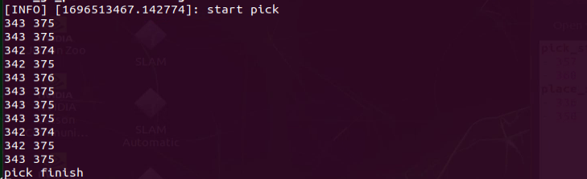

The data from the automatic calibration will be saved in the file:`/home/ros2_ws/src/example/config/automatic_pick_rol.yaml`.

The `pick_stop_pixel_coordinate` refers to the pixel coordinates of the grasping position in the frame. The first value is the X-axis coordinate: decreasing this value shifts the grasping position to the left, while increasing it shifts the position to the right. The second value is the Y-axis coordinate: decreasing this value moves the grasping position closer, while increasing it moves the position farther away. You can generally use the automatic calibration results but feel free to adjust them based on your needs.

The `place_stop_pixel_coordinate` indicates the pixel coordinates of the placement position in the frame. The first value is the X-axis coordinate: decreasing it shifts the position to the left, and increasing it shifts to the right. The second value is the Y-axis coordinate: decreasing it moves the position closer, while increasing it moves it farther away. (Note: Automatic calibration only adjusts the grasping position; the placement position coordinates will not be automatically calibrated. If you have set a placement target and the results are unsatisfactory, manual adjustment will be necessary.)


After making these modifications, refer to ["**9.2.9 Voice-Controlled Navigation and Transport -> Operation Steps**"](#anchor_9_2_9_3) for the operating steps to test the functionality.